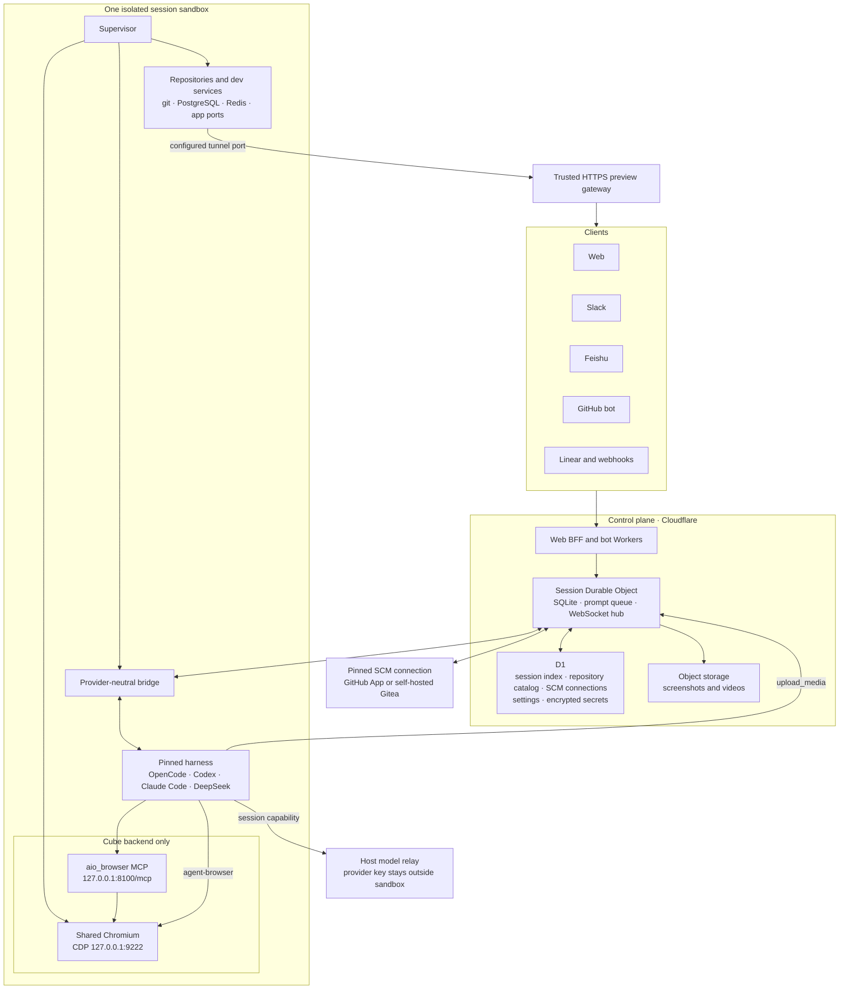
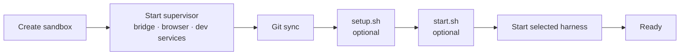
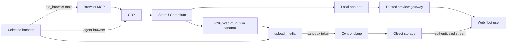
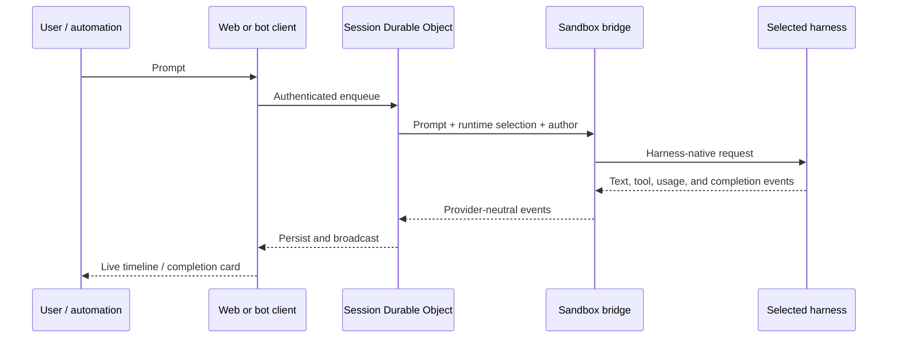

# How Open-Inspect Works

Open-Inspect is a background coding agent system. Unlike interactive coding assistants where you
watch the AI work in real-time, Open-Inspect runs sessions in the cloud independently of your
connection. You send a prompt, optionally close your laptop, and check the results later.

This guide covers the core architecture, how sessions work, and what happens when you send a prompt.
For deployment instructions, see [GETTING_STARTED.md](./GETTING_STARTED.md).

---

## The Background Model

The key insight behind Open-Inspect is that coding sessions don't need your constant attention.

**Traditional coding assistants** require you to stay connected:

```
You type → AI responds → You watch → You respond → Repeat
```

**Open-Inspect** decouples your presence from the work:

```
You send prompt → Session runs in background → You check results when ready
```

This enables workflows that aren't possible with interactive tools:

- **Fire and forget**: Notice a bug before bed, kick off a session, review the PR in the morning
- **Parallel sessions**: Run multiple approaches simultaneously without tying up your machine
- **Multiplayer**: Share a session URL with a colleague and collaborate in real-time
- **Unlimited concurrency**: Your laptop isn't the bottleneck—spin up as many sessions as you need

---

## Sessions

A **session** is the core unit of work in Open-Inspect. Each session is:

- **Tied to a workspace**: The agent works in clones of the repositories you selected — a single
  repository, an ad-hoc set of up to 10, a saved [environment](#environments), or no repository at
  all
- **Persistent**: State survives across connections—close the browser, come back later
- **Multiplayer**: Multiple users can join, send prompts, and see events in real-time
- **Stateful**: Contains messages, events, artifacts, and sandbox state
- **Pinned**: Repository IDs, SCM connection, Harness, and launch settings do not follow later
  deployment-default changes

### Session Targets

When creating a session from the web picker you choose what the sandbox works on:

| Target                    | What you get                                                                 |
| ------------------------- | ---------------------------------------------------------------------------- |
| **A single repository**   | Today's classic flow: one clone, one branch selector                         |
| **Multiple repositories** | An ad-hoc ordered set (up to 10) cloned side by side                         |
| **An environment**        | A saved, reusable repository set — with optional prebuilt images and secrets |
| **No repository**         | An empty sandbox for scratch work                                            |

In multi-repository sessions each repository is cloned into its own directory under `/workspace`
(named after the repository), and the **first repository is the primary** — it drives defaults like
which settings apply. The agent sees all clones side by side and can make coordinated changes across
them; pushes and pull requests are per-repository, so one session can produce PRs in several
repositories. All repositories in one session must belong to the same SCM connection; mixed-forge
workspaces are rejected. The session sidebar lists every repository with its branch and any PR
created for it.

GitHub-bot sessions open the webhook's repository, unless that repository's metadata names a default
environment (`defaultEnvironmentId` via the repo-metadata API) — then a PR review or @mention opens
that environment's full workspace, provided the environment still contains the trigger repository.
Slack sessions can target an environment three ways: a routing rule (Settings › Integrations ›
Slack) launches it from a keyword; a channel association (`channelAssociations` on the environments
API, like repository metadata) routes messages in that channel to it automatically; and the LLM
classifier considers environments alongside repositories, using their names and descriptions as
signals — its clarification picker lists both kinds when it has to ask. Linear sessions can target
an environment through the team and project mappings (`{"environmentId": "env_…"}` entries alongside
repository entries).

### Session Lifecycle

```
Created → Active → Archived
            ↑
            └── Can be restored from archive
```

Sessions start when you create one through Web, Slack, Feishu, GitHub, Linear, an automation, or a
service-authenticated API. They remain active as long as there's work happening or recent activity.
You can archive sessions to clean up your list, and restore them later if needed.

### What's Stored in a Session

| Data               | Description                                       |
| ------------------ | ------------------------------------------------- |
| Messages           | Prompts you've sent and their metadata            |
| Prompt attachments | Images uploaded with web or Slack prompts         |
| Events             | Tool calls, token streams, status updates         |
| Artifacts          | PRs, screenshots, videos, and visual reports      |
| Participants       | Users who have joined the session                 |
| Sandbox state      | Reference to the current sandbox and its snapshot |

Each session gets its own SQLite database in a Cloudflare Durable Object, ensuring isolation and
high performance even with hundreds of concurrent sessions.

---

## Environments

An **environment** is a named, reusable set of repositories — the thing you reach for when the same
multi-repository workspace comes up again and again (a frontend + its API, a service + its shared
library). Environments are managed under **Settings > Environments** and appear at the top of the
new-session picker.

An environment defines:

- **An ordered repository list** (up to 10) with a base branch per repository; the first repository
  is the primary
- **Environment secrets** — sessions launched from the environment receive global secrets plus the
  environment's secrets (repository secrets do not flow in; see
  [Secrets Management](./SECRETS.md#which-secrets-a-session-receives))
- **Optional prebuilt images** — the whole environment (all clones + all setup scripts) is built
  ahead of time so sessions boot in seconds (see [Pre-Built Images](./IMAGE_PREBUILD.md))

Sessions snapshot the environment at creation time: editing or deleting an environment never changes
what an existing session works on (the session page shows "Environment deleted" if the source is
gone). Ad-hoc "Multiple repositories" selections are the unsaved counterpart — same workspace shape,
but no environment-scoped secrets or prebuilds; the picker offers to save the set as an environment.

---

## Architecture

Open-Inspect uses three logical tiers plus explicit source-control, model-relay, preview, and media
boundaries. A session's durable state belongs to the control plane; code, browser processes, and
development services belong to its sandbox.



### Control Plane (Cloudflare Workers)

The control plane is the coordinator. It doesn't execute code—it manages state and routes messages.

**Responsibilities:**

- Session state management (SQLite in Durable Objects)
- WebSocket connections for real-time streaming
- Sandbox lifecycle orchestration (spawn, snapshot, restore)
- Connection-pinned source control (repository catalog, clone/push authorization, PR creation)
- Screenshot/video metadata and authenticated object-storage streaming
- Authentication and access control

**Why Cloudflare?** Durable Objects provide per-session isolation with SQLite storage. Each session
gets its own lightweight database that can handle hundreds of events per second without impacting
other sessions. The WebSocket Hibernation API keeps connections alive during idle periods without
incurring compute costs.

Sandbox lifecycle state is authoritative across WebSocket reconnects. Losing the sandbox WebSocket
does not stop the sandbox: the bridge reconnects while the control plane schedules a heartbeat check
in case the process is actually gone. Explicit lifecycle paths such as inactivity and stale
heartbeat persist `stopped` or `stale` before closing the connection, which prevents reconnection.

### Source-Control Connections

A **provider** implements forge behavior; a **connection** identifies one configured forge origin
and credential authority. Repositories have stable internal IDs, while owner/name and web/clone URLs
are mutable location snapshots. Sessions, Environments, Automations, images, and PRs pin the
connection and internal repository ID that resolved at creation time.

| Connection | Server-side authority                   | Sandbox Git path                                                        |
| ---------- | --------------------------------------- | ----------------------------------------------------------------------- |
| GitHub     | Shared App plus optional user OAuth     | Short-lived App authorization and credential-helper/proxy paths         |
| Gitea      | Dedicated encrypted service-account PAT | Repository- and session-authorized smart-HTTP proxy; PAT never released |

Generic features gate on connection capabilities rather than provider-name conditionals. Truly
GitHub-specific login, commit-signing, and webhook behavior stays inside GitHub boundaries. See
[ADR 0004](./adr/0004-multi-connection-source-control.md).

### Data Plane (Sandbox Backends)

The data plane is where code actually runs. Each session gets an isolated sandbox with a full
development environment.

**What's in a sandbox:**

- Debian Linux with common dev tools
- Node.js 22, Python 3.12, git, curl
- Package managers: npm, pnpm, pip, uv
- a provider-neutral Python bridge that normalizes all harness events into the session protocol
- agent-browser CLI and, on the maintained Cube image, one supervisor-owned Chromium/CDP/Browser-MCP
  process tree
- OpenCode, Codex, Claude Code, and DeepSeek CodeWhale harness runtimes
- optional PostgreSQL, Redis, repository processes, code-server, web terminal, and noVNC desktop

Open-Inspect supports these sandbox backends:

- **Modal**: near-instant startup plus filesystem snapshot restore
- **Daytona**: persistent stop/start sandboxes via direct REST API calls
- **Vercel Sandboxes**: filesystem snapshot restore and prebuilt-image builds via the Vercel Sandbox
  API
- **OpenComputer**: template-based sandboxes with checkpoint-backed prebuilt-image builds via the
  OpenComputer REST API
- **E2B**: template-based sandboxes with persistent pause/resume via direct E2B REST API calls
- **Self-hosted CubeSandbox**: selected through the E2B-compatible provider; Cube supplies the VM,
  envd, code-interpreter compatibility, networking, and template lifecycle

The Cube template copies only the browser runtime from the pinned ByteDance Agent Infra AIO Sandbox
image. It does **not** replace Cube with AIO or copy AIO's Jupyter, terminal, code-server, or
language stacks. Chromium listens on loopback CDP port `9222`; the Browser MCP listens on loopback
port `8100`. The runtime injects that MCP as `aio_browser` into every supported harness and
configures agent-browser to reuse the same Chromium instead of launching a second browser tree. See
[ADR 0005](./adr/0005-cube-aio-browser-runtime.md).

Prebuilt-image builds are supported on Modal, Vercel, and OpenComputer. Saved filesystem state can
be restored on those same providers for session resumes; Daytona and E2B use persistent sandboxes
instead. For Daytona and E2B, the control plane stops or pauses the sandbox on inactivity or stale
heartbeat, then resumes that same sandbox later.

### Clients

Clients are how users interact with sessions. The architecture is client-agnostic—any client that
can make HTTP requests and maintain WebSocket connections can participate.

**Current clients:**

- **Web**: Next.js app with real-time streaming, session management, and settings
- **Slack**: Bot that responds to @mentions and direct messages, forwards supported image
  attachments, classifies repos, and posts results
- **Feishu**: Bot with mobile-safe GitHub/Gitea repository cards, thread-bound sessions, completion
  receipts, preview links, visual-verification status, and screenshot delivery
- **GitHub**: Bot that reviews PRs and responds to PR `@mentions`
- **Linear**: Agent workflow that starts sessions from Linear issue activity

All clients see the same session state. Send a prompt from Slack or GitHub, watch the results on
web. This works because state lives in the control plane, not the client.

---

## The Sandbox Lifecycle

Understanding the sandbox lifecycle explains why Open-Inspect can be fast despite running in the
cloud.

### Fresh Start (No Snapshot)

When you create a session for a repo without an existing snapshot:



1. **Sandbox created**: The selected backend creates a fresh sandbox from its base runtime
2. **Git sync**: Clones your repository using brokered SCM credentials from the git credential
   helper
3. **Setup script**: Runs `.openinspect/setup.sh` for provisioning (if present)
4. **Start script**: Runs `.openinspect/start.sh` for runtime startup (if present)
5. **Agent start**: The bridge starts the session-pinned OpenCode, Codex, Claude Code, or DeepSeek
   adapter and connects back to the control plane
6. **Ready**: Sandbox accepts prompts

For multi-repository sessions, steps 2–4 run per repository in position order: every repository is
cloned into its own `/workspace` directory and each repository's setup and start scripts run in
sequence.

### Restore (From Snapshot)

When restoring from a previous snapshot:

```
┌─────────────┐    ┌────────────┐    ┌─────────────┐    ┌───────┐
│  Restore    │───▶│ Quick Sync │───▶│ Start Script│───▶│ Ready │
│  Snapshot   │    │ (git pull) │    │ (optional)  │    │       │
└─────────────┘    └────────────┘    └─────────────┘    └───────┘
```

1. **Restore snapshot**: The selected snapshot-capable provider restores the filesystem from a saved
   snapshot or checkpoint
2. **Quick sync**: Pulls latest changes (usually just a few commits)
3. **Start script**: Runs `.openinspect/start.sh` for runtime startup (if present)
4. **Ready**: Sandbox is ready almost instantly

Snapshots include installed dependencies, built artifacts, and workspace state. This is why
follow-up prompts in an existing session are much faster than the first prompt.

### Prebuilt Image Start

When starting from a pre-built image (built for the session's repository or, for sessions launched
from a prebuild-enabled environment, the environment's whole repository set):

1. **Incremental git sync**: Fast fetch + hard reset to latest branch head (per repository for
   multi-repository sets)
2. **Setup skipped**: `.openinspect/setup.sh` already ran when the image was built
3. **Start script runs**: `.openinspect/start.sh` executes for per-session runtime startup
4. **Ready**: Agent starts once runtime hook succeeds

If `start.sh` exists and fails, startup fails fast instead of continuing with a broken runtime.

### When Snapshots Are Taken

- **After successful prompt completion**: Preserves the workspace state
- **Before sandbox timeout**: Saves state before the sandbox shuts down due to inactivity
- **On explicit save**: Can be triggered by the control plane

### Sandbox Warming

To minimize perceived latency, sandboxes warm proactively:

- When you start typing a prompt, the control plane begins warming a sandbox
- By the time you hit enter, the sandbox may already be ready
- If restore is fast enough, you won't notice any delay

### Tunnel URLs Inside the Sandbox

When a session uses the `tunnelPorts` sandbox setting, its provider resolves a URL for every
configured port. The control plane stores that map in the session Durable Object and broadcasts it
to Web and bot clients. Repository-backed boots also wait for `/workspace/.tunnels.env` when the
provider can materialize the file, so `.openinspect/start.sh` and the agent can read the URLs
locally.

```dotenv
# /workspace/.tunnels.env
TUNNEL_SANDBOX_ID=sandbox-acme-app-1783614336426
TUNNEL_3000=https://abc123-3000.modal.host
TUNNEL_5173=https://abc123-5173.modal.host
```

This dotenv shape works directly with tools that accept an env-file path — `node --env-file=...`,
`bun --env-file=...`, `docker compose --env-file=...`. The format is plain `KEY=value`, so any other
dotenv consumer can read it without parsing. The `TUNNEL_SANDBOX_ID` line names the sandbox the URLs
were resolved for; the supervisor uses it to tell a fresh write from a snapshot leftover.

**Boot ordering.** On every non-build boot, the supervisor:

1. Clears a file left by a previous sandbox (its `TUNNEL_SANDBOX_ID` doesn't match), such as one
   inherited from a snapshot. A file already written for _this_ sandbox is kept — the backend's
   write can land before the supervisor starts.
2. Waits up to `TUNNEL_WAIT_TIMEOUT_SECONDS` (default `30`) for fresh URLs.
3. Runs `.openinspect/start.sh`.

If the wait times out (for example, because the backend has not resolved tunnel URLs yet),
`start.sh` proceeds without fresh local URLs and the supervisor logs `tunnel.env_file_wait_timeout`.
The control plane still receives and broadcasts the URLs to clients on a separate path. The file is
not written when `tunnelPorts` is empty or in build mode. A repo-less session currently skips the
repository boot phase that waits for this file, so its external URL remains available through the
session API and clients but `/workspace/.tunnels.env` may be absent. Agents must not infer that a
missing file means the preview gateway is unavailable.

On the self-hosted Cube path, `E2B_PREVIEW_BASE_URL` identifies a trusted HTTPS gateway. The control
plane produces URLs in the form `/sandbox/{providerObjectId}/{port}/`; the gateway maps the exact
sandbox and configured port to Cube's private network. Application servers must listen on `0.0.0.0`.
CDP `9222` and Browser MCP `8100` are runtime-private services and are never added as user preview
ports.

### Browser Automation, Preview, and Media

On the maintained Cube runtime, the browser, preview, and screenshot paths are intentionally
separate:



- The supervisor owns Xvfb, Fluxbox, Chromium, and Browser MCP lifecycle. When AIO browser support
  is enabled, failure to reach either private endpoint fails sandbox startup rather than silently
  advertising a broken browser.
- Native harnesses receive the loopback MCP as `aio_browser`; OpenCode receives the same endpoint in
  its server configuration. User-defined MCP entries cannot overwrite the runtime-owned name.
- `agent-browser` auto-connects to the same CDP browser. This preserves one page/profile/download
  state and avoids the resource cost and inconsistent results of a second Chromium tree.
- `upload_media` validates size, MIME type, and file signature, stores the object outside the
  sandbox, persists artifact metadata in the session, and emits `artifact_created`. The Web client
  renders the media artifact; Feishu can fetch it through a service-authenticated route, upload it
  to Feishu, and reply in the originating topic.
- A preview URL exposes a running application; an uploaded screenshot is a durable session artifact.
  Neither mechanism exposes the browser's CDP or MCP endpoint.

---

## How Prompts Flow Through the System

Here's what happens when you send a prompt:



### Step by Step

1. **You send a prompt** via Web, Slack, Feishu, GitHub, Linear, or an automation

2. **Control plane queues it**: The prompt goes to the session's Durable Object and is added to the
   message queue. If a sandbox isn't running, one is spawned or restored.

3. **Sandbox receives the prompt**: Via WebSocket, the control plane sends the prompt to the sandbox
   along with author information (for commit attribution).

4. **The selected harness processes it**: OpenCode, Codex, Claude Code, or DeepSeek reads files,
   makes edits, and runs commands. The bridge translates the harness-native event stream.

5. **Events stream back**: Tool calls, token streams, and status updates flow back through the
   WebSocket to the control plane.

6. **Control plane broadcasts**: Events are stored in the session database and broadcast to all
   connected clients in real-time.

7. **Artifacts are created**: PRs, screenshots, videos, and visual-verification reports are stored
   as session artifacts and announced to clients.

### Prompt Queuing

If you send a prompt while the agent is still working on a previous one, it's queued:

```
Prompt 1 (processing) ──▶ Prompt 2 (queued) ──▶ Prompt 3 (queued)
```

This lets you send follow-up thoughts while the agent works. Prompts are processed in order.

You can also stop the current execution if the agent is going down the wrong path.

### Parent-to-Child Follow-Ups

An agent that created a child with `spawn-child` can continue that same child session with
`send-child-prompt`. The follow-up enters the child's normal durable queue:

```text
Child prompt 1 (processing) ──▶ Parent follow-up (queued) ──▶ Child continues
```

The follow-up does not interrupt active work. Completed and failed children can resume, restoring
their compatible sandbox snapshot when available. Cancelled children remain terminal, and archived
children must be explicitly unarchived before they can accept prompts.

The parent token is never exchanged for the child's sandbox token. The control plane authenticates
the parent session, verifies the direct parent-child relationship in D1, verifies it again in the
child Durable Object, and attributes the queued prompt to the child owner with source `agent`.

`send-child-prompt` returns after the prompt is durably queued. The parent calls `get-child-status`
when it needs the follow-up result. An earlier completed response is labeled as such while newer
child work is still running.

The runtime tool is installed when a sandbox starts from a runtime image that includes it. A parent
restored from a snapshot created before this capability shipped keeps the older captured runtime and
will not see `send-child-prompt` until it starts in a fresh sandbox built from the newer runtime.

---

## The Agent

Open-Inspect keeps the upstream WebSocket event contract and selects a provider inside the sandbox
bridge. OpenCode remains the default; native adapters translate Codex app-server, the Claude Agent
SDK, and DeepSeek CodeWhale app-server events into the same client-facing stream. This keeps the web
client and bot integrations independent of the selected harness.

When the selected model is DeepSeek, all four harnesses use a Host-side model relay: OpenCode and
CodeWhale use Chat Completions, Codex uses Responses, and Claude Code uses Anthropic Messages. Each
sandbox authenticates to the relay with its existing per-session sandbox token. The relay validates
the token with the session Durable Object and only then injects the Host-only DeepSeek provider key.
The provider key is never part of the sandbox environment, repository image, or snapshot.

The adapter preserves every structured event its native API exposes. The pinned CodeWhale 0.9.8
stdio stream currently provides assistant text and turn completion but not structured tool-call or
token-usage events, so DeepSeek sessions still show live text and repository diffs while their
tool-by-tool timeline and usage detail are less complete than Codex or Claude sessions.

### What the Agent Can Do

| Capability              | Description                              |
| ----------------------- | ---------------------------------------- |
| **Read files**          | Explore the codebase, understand context |
| **Edit files**          | Make changes, refactor code              |
| **Run commands**        | Execute tests, builds, scripts           |
| **Git operations**      | Commit changes, create branches          |
| **Web browsing**        | Look up documentation, research errors   |
| **Visual verification** | Use Playwright to check UI changes       |

### How Changes Are Attributed

When the agent makes commits, they're attributed to the user who sent the prompt:

```
Author: Jane Developer <jane@example.com>
Committer: Open-Inspect <bot@open-inspect.dev>
```

This ensures your contributions are properly credited in git history.

### Creating Pull Requests

When you ask the agent to create a PR:

1. The runtime resolves the exact stable repository ID and connection pinned to the session.
2. The control plane authorizes that repository, constructs a push spec, and asks the sandbox to
   push the branch. Long-lived forge credentials remain server-side.
3. The connection adapter creates or updates one open PR per head branch and stores the normalized
   PR artifact in the session.
4. For GitHub, a prompting user's OAuth token is preferred when available; otherwise the shared App
   creates the PR or returns a manual completion URL. Gitea PRs are created by the connection's
   dedicated service account.

The connection ID, provider, internal repository ID, source branch, base branch, and forge PR ID are
part of the durable identity. Renaming or transferring a repository therefore does not silently
retarget an existing session or PR.

See [ADR 0004](./adr/0004-multi-connection-source-control.md) for source-control boundaries and
migration rules.

---

## Real-time Events

Sessions stream events to all connected clients via WebSocket.

### Event Types

| Event              | Description                                   |
| ------------------ | --------------------------------------------- |
| `sandbox_spawning` | Sandbox is being created                      |
| `sandbox_ready`    | Sandbox is ready to accept prompts            |
| `sandbox_event`    | Tool call, token stream, or other agent event |
| `artifact_created` | PR created, screenshot captured               |
| `presence_update`  | User joined or left the session               |
| `session_status`   | Session state changed                         |

### Multiplayer

Multiple users can connect to the same session:

- **Presence**: See who else is watching
- **Shared stream**: Everyone sees the same events
- **Attributed prompts**: Each prompt is tagged with who sent it
- **Collaborative**: One person can start a task, another can refine it

This makes sessions useful for pair programming, live debugging, or teaching.

---

## Snapshots and Performance

Speed is critical for background agents. If sessions are slow, people won't use them.

### The Cold Start Problem

Without optimization, starting a session would require:

1. Spinning up a container (~5-10s)
2. Cloning the repository (~10-30s for large repos)
3. Installing dependencies (~30s-5min)
4. Starting the agent (~5s)

That's potentially minutes before the agent can start working.

### How Snapshots Solve This

Provider snapshots and checkpoints let us capture a sandbox's state after setup:

```
First session:  Clone ─▶ Install/Build ─▶ Start Runtime ─▶ [Snapshot] ─▶ Work
                              (slow)

Later sessions: [Restore Snapshot] ─▶ Quick sync ─▶ Start Runtime ─▶ Work
                     (fast)
```

The first session for a repo pays the setup cost. Subsequent sessions restore in seconds when the
active provider supports saved filesystem state.

For Vercel, Terraform builds a base-runtime snapshot from the local checkout and wires a
deterministic snapshot name into `VERCEL_BASE_SNAPSHOT_NAME`. Fresh Vercel sandboxes resolve that
name to the newest created snapshot instead of cloning and installing the sandbox runtime on every
session. OpenComputer uses a managed template plus checkpoints for the same prebuilt-image
lifecycle. See [Vercel Sandbox Provider](VERCEL_SANDBOX_PROVIDER.md) and
[OpenComputer Sandbox Provider](OPENCOMPUTER_PROVIDER.md) for provider-specific details.

### Image Prebuilding

For frequently-used repositories — and for [environments](#environments) — images can be prebuilt on
a schedule:

- Clone the repository (or every repository of the environment), install dependencies, run initial
  build
- Save as a provider image artifact
- Sessions start from this artifact, only syncing recent changes

This means even "cold" sessions (no previous snapshot) start from a recent baseline. See
[Pre-Built Images](./IMAGE_PREBUILD.md) for details.

---

## Security Model

Open-Inspect is designed for **single-tenant deployment** where all users are trusted members of the
same organization.

### Why Single-Tenant?

The installation owns shared GitHub and/or self-hosted Gitea connections. This means:

- Any admitted user can access repositories visible to an enabled connection
- There is no per-user forge permission check at session creation
- The trust boundary is the organization and its configured connections, not individual users

This follows
[Ramp's original design](https://builders.ramp.com/post/why-we-built-our-background-agent), which
was built for internal use where all employees have access to company repositories.

### Token Architecture

| Token / credential            | Purpose                                      | Scope                            |
| ----------------------------- | -------------------------------------------- | -------------------------------- |
| GitHub App installation token | GitHub API and upstream Git authorization    | App installation, short-lived    |
| Gitea service-account PAT     | Gitea API and Git proxy upstream             | One connection, server-side only |
| User OAuth token              | Sign-in, identity, GitHub PR attribution     | User and provider scopes         |
| Sandbox auth token            | Sandbox → control plane and Host relay calls | One session                      |
| Sandbox Git proxy capability  | Clone/fetch/push through the SCM proxy       | One repository and session/build |
| WebSocket token               | Authenticate a client connection             | One session                      |
| Managed LLM token             | Short-lived OpenAI or xAI model access       | Provider account + secret scope  |

Fresh and prebuilt-image sandboxes do not rely on a long-lived credential embedded in an environment
or Git remote. GitHub credentials are minted on demand. Connection-pinned Gitea sessions receive a
short-lived sandbox proxy capability, while the PAT stays encrypted in D1 and is attached only to
the upstream request inside the control plane. The credential helper scopes HTTPS matching by host
and repository path. Legacy snapshots may receive compatibility fallbacks until their migration path
is retired.

### Secrets

You can configure environment variables (API keys, credentials) at global, per-repository, or
per-environment scope. A session receives global secrets plus its **session target's** secrets:

- **Global secrets** apply to all sessions (e.g., `ANTHROPIC_API_KEY`, `ZHIPU_API_KEY`); the
  self-hosted Cube DeepSeek key is a Host-relay credential and is deliberately not a sandbox secret
- **Repository secrets** apply to sessions launched from that repo (including all bot-created
  sessions) and override global secrets with the same key; ad-hoc multi-repository sessions receive
  each selected repository's secrets, with the primary winning collisions
- **Environment secrets** apply to sessions launched from that environment — its repositories'
  repository secrets do not flow in
- Stored encrypted (AES-256-GCM) in D1 database
- Injected into sandboxes at startup
- Never exposed to clients (only key names are visible)

Managed OpenAI and xAI OAuth refresh tokens are a stricter case: they remain control-plane-only and
are replaced with non-secret provider markers before sandbox creation. The sandbox uses its session
auth token to request short-lived model access from a provider-specific broker. Refresh-token
rotation is persisted back to the global, repository, or environment scope that supplied it. See
[Using OpenAI Models](./OPENAI_MODELS.md) and
[Using Grok with a SuperGrok Subscription](./GROK_MODELS.md).

Native Codex and Claude Code harness sessions may instead receive `CODEX_AUTH_JSON`,
`CODEX_ACCESS_TOKEN`, or `CLAUDE_CODE_OAUTH_TOKEN` when they use their own subscription backends.
DeepSeek provider access is different: its API key remains on the Host model relay, while sandboxes
use their revocable session token. The runtime excludes native login credentials from agent shell
commands and image builds and removes disk-backed login state before filesystem snapshots. Optional
`*_EXPIRES_AT` metadata drives rotation warnings.

> **Daytona and Vercel users**: LLM API keys (e.g., `ANTHROPIC_API_KEY` for Claude models) must be
> added as global secrets. Modal injects these automatically via its own secrets mechanism.
>
> **Opt-in model providers**: in the self-hosted Cube deployment, DeepSeek models require the
> Host-side model relay described in `packages/e2b-infra/README.md`; do not add the provider key as
> an Open-Inspect secret. Z.AI Coding Plan models still require `ZHIPU_API_KEY`. SuperGrok models
> require managed xAI OAuth credentials and must be enabled under **Settings > Models**.

See [Secrets Management](./SECRETS.md) for setup instructions.

Repository-local databases and application processes are described in
[Per-Sandbox Development Environments](./DEV_ENVIRONMENTS.md).

### Deployment Recommendations

1. **Deploy behind SSO/VPN**: Control who can access the web and bot entry points
2. **Limit GitHub App scope**: Only install on repositories you want accessible
3. **Use dedicated Gitea accounts**: Grant the minimum repositories and PAT permissions
4. **Allowlist self-hosted SCM origins**: Keep `SCM_ALLOWED_HOSTS` exact and HTTPS-only
5. **Keep browser services private**: Never publish CDP `9222` or Browser MCP `8100`

---

## What's Next

- **[Getting Started](./GETTING_STARTED.md)**: Deploy your own instance
- **[Managed Skills](./MANAGED_SKILLS.md)**: Create and select reusable agent instructions
- **[Debugging Playbook](./DEBUGGING_PLAYBOOK.md)**: Troubleshoot issues with structured logs
