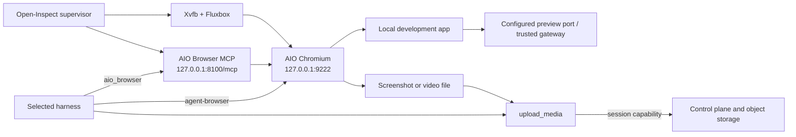

# ADR 0005: Cube-Owned Sandbox with an AIO Browser Runtime

## Status

Accepted and deployed.

## Context

Open-Inspect needs a real browser in every maintained Cube sandbox so any supported harness can
inspect a local application, take screenshots, and drive the same browser through either MCP or the
`agent-browser` CLI. The browser must coexist with CubeSandbox's E2B-compatible envd,
code-interpreter service, lifecycle, network, and 4-vCPU/8-GiB resource boundary.

ByteDance Agent Infra's AIO Sandbox image includes a Chromium build and
`@agent-infra/mcp-server-browser`, but also includes its own terminal, Jupyter, code-server,
language runtimes, and process model. Using the whole AIO image as the Cube base would duplicate
Open-Inspect services and blur the sandbox ownership and security boundaries.

## Decision

1. **Cube remains the sandbox foundation.** Cube owns VM isolation, resource limits, envd,
   code-interpreter compatibility, networking, template creation, lifecycle, and destruction.
2. **Reuse only AIO's browser slice.** `cube.Dockerfile` copies Chromium and
   `@agent-infra/mcp-server-browser` from an image pinned by tag and digest. AIO's Jupyter,
   terminal, code-server, and language stacks are not copied.
3. **The Open-Inspect supervisor owns browser lifecycle.** It starts Xvfb and Fluxbox, then one
   Chromium process tree and one Browser MCP process. Readiness failure is a sandbox boot failure.
4. **Browser control stays private.** Chromium CDP binds `127.0.0.1:9222`; Browser MCP binds
   `127.0.0.1:8100/mcp`. Neither port is a public tunnel or preview port.
5. **Every harness gets the same runtime-owned MCP.** OpenCode, Codex, Claude Code, and DeepSeek
   receive the endpoint under the reserved name `aio_browser`. Only a loopback HTTP URL with the
   exact `/mcp` path is accepted. User MCP configuration cannot replace that entry.
6. **CLI and MCP share Chromium.** `AGENT_BROWSER_AUTO_CONNECT=1` and the managed executable path
   make `agent-browser` attach to the supervisor-owned CDP endpoint instead of starting a second
   browser tree.
7. **Preview and media remain platform data paths.** Application ports use the existing
   provider/tunnel or trusted preview-gateway path. Screenshots and videos are uploaded through
   `upload_media` with the session's sandbox capability, validated by the control plane, stored in
   object storage, and returned to Web or bot clients as session artifacts.
8. **The browser version is an image capability.** Updating the AIO source digest requires a new
   Cube image/template, runtime tests, direct CDP/MCP checks, and a production Web E2E before the
   control plane switches template IDs.

## Runtime Topology

## Consequences

### Positive

- All harnesses use one browser profile, tab set, download directory, and visual state.
- Cube keeps one authoritative isolation and lifecycle model.
- Browser automation adds no public control port and no additional platform credential.
- AIO browser updates are independently reviewable and rollbackable by template ID.
- The same media artifacts can be rendered by Web and delivered by Slack/Feishu adapters without
  teaching those clients the browser protocol.

### Negative

- The Cube image is larger and must carry the browser's native libraries and fonts.
- Chromium currently runs with `--no-sandbox` inside the outer Cube VM boundary; exposing CDP would
  therefore be unacceptable.
- Browser readiness becomes part of sandbox readiness, so a browser regression can prevent a coding
  session from starting even when its harness is healthy.
- AIO's Browser MCP tool surface can change when the pinned source image is upgraded and must be
  covered by compatibility tests.

## Invariants

- Exactly one supervisor-owned Chromium browser tree exists per Cube session sandbox.
- CDP and Browser MCP listen only on loopback.
- `aio_browser` always resolves to the runtime-owned loopback endpoint.
- No AIO API key or control port is returned to a client.
- A screenshot is not durable until the authenticated media upload succeeds.
- A preview URL exposes only a configured application port, never CDP or Browser MCP.
- The production control plane references an immutable, tested Cube template ID; existing sandboxes
  retain the template from which they were created.

## Verification Gate

A candidate template must pass:

1. sandbox-runtime unit and integration tests plus image build checks;
2. a real Cube boot with `/json/version` returning a CDP WebSocket URL;
3. Browser MCP initialization and tool discovery;
4. `agent-browser` navigation and a valid PNG from the same Chromium process tree;
5. a production session using a native harness, an uploaded Web media artifact, and an externally
   reachable application preview URL.
