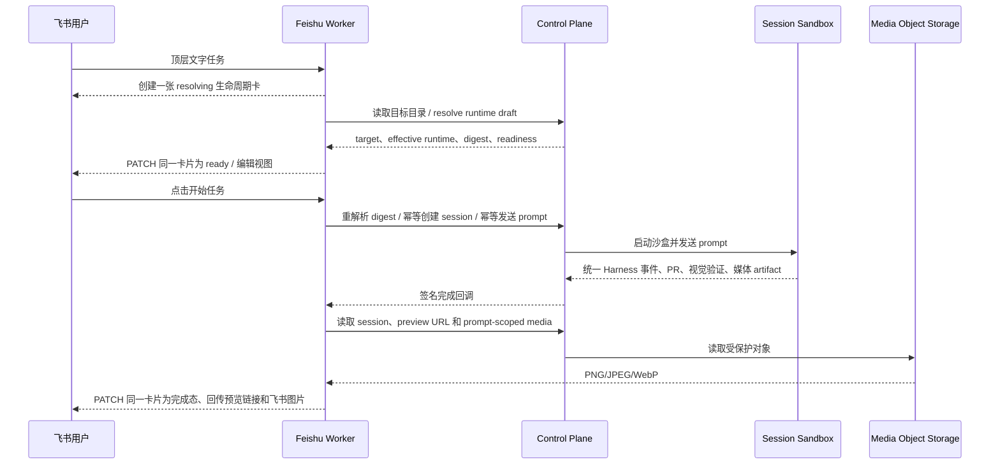

# 飞书集成

> 状态：生产入口已实现。代码源选择、会话续办、完成卡、预览链接和截图回传均走 Control
> Plane 的统一 session/artifact 协议。单卡片任务生命周期已经在源码中实现，由默认关闭的
> `FEISHU_SINGLE_CARD_LAUNCH_ENABLED` 灰度控制；生产启用和真实飞书 → VM 验收进度以
> [飞书单卡片任务启动与生命周期对齐方案](../plans/feishu-single-card-launch.md) 为准。
>
> 当前发布支持范围为飞书 Web（桌面浏览器及窄屏响应式视口）；原生手机 App 和第二个飞书身份的生产负向验收不属于本次发布条件。

Open-Inspect 的飞书集成是一个独立的 Cloudflare Worker。它不会将飞书 App Secret、飞书 tenant access
token、GitHub/Gitea PAT 或 sandbox capability 发送到浏览器或沙盒。

## 当前能力

- 私聊机器人发送文字请求，或在群聊中 @机器人发送文字请求。
- 默认关闭单卡片开关时，收到消息后立即回复“已收到，正在工作中”，并沿用分阶段选择卡。
- 启用 `FEISHU_SINGLE_CARD_LAUNCH_ENABLED=true` 后，每个新任务只创建一张 Card JSON
  2.0 生命周期卡：先显示解析状态，再在同一 message
  ID 内完成工作区、Harness、路由、模型、Effort 和用户可见启动设置的编辑；用户确认前不会创建 session 或 VM。
- 单卡片使用 Card JSON 2.0 原生 `column_set`、按钮 `behaviors` 和表单
  `form_action_type="submit"`；不混用 1.0 的 `action` 容器。卡片原消息和 replacement 都带
  `update_multi=true`，并在发出前检查飞书 30 KB 内容上限、200 组件上限及 V2 按钮/表单结构。
- 使用明确的 `owner/repo`
  自动定位仓库；否则在同一生命周期卡内选择 GitHub/Gitea 仓库、临时工作区、环境或同一代码源下的多仓库目标。
- 工作区编辑优先展示当前用户在该聊天中的最多 3 个最近仓库；代码源、环境和完整仓库目录都使用分组、分页按钮直接选择。桌面及窄屏 Web 不会打开可能被输入法遮挡的下拉搜索层。
- 每个顶层任务创建独立 session；发送“会话”“会话列表”或 `sessions`
  可以查看当前用户的近期会话，避免把一个聊天窗口强制绑定为单一任务。
- 后端用稳定的 `rootMessageId` 路由 session，`threadId` 只负责飞书话题展示。启用
  `FEISHU_THREAD_REPLIES_ENABLED=true`
  后，每个群顶层任务创建独立话题；回执、仓库卡、工作卡、完成卡和截图都携带 `reply_in_thread=true`
  回到同一话题。
- 普通群和飞书话题群的事件统一按群话题路由；事件中的 `chat_type=topic_group`
  会在入口归一化为群语义，不需要额外部署一个机器人。
- 同一群可以并行运行多个话题，每个话题固定一个 session、sandbox、仓库和分支；不设置 chat 级别的隐式“当前 session”。
- 只有原发起人可以续办。启用 `FEISHU_BOUND_THREAD_FOLLOWUPS_ENABLED=true`
  并授权群全部消息权限后，已绑定话题内无需重复 @机器人；未绑定且未 @ 的消息会在读取一次 KV 映射后立即忽略。
- 私聊顶层消息创建新 session；续办应引用回复对应任务。入口优先使用事件的 `root_id`，兼容仅携带
  `parent_id`
  的引用回复，不按最近活跃 session 猜测。工作/完成卡和会话列表显示 session 短编号、仓库、分支、Harness、模型和状态，避免多个任务混淆。
- 私聊也可以使用会话列表中的短编号显式续办：发送
  `#ABC123 继续检查登录页面`。短编号只在当前租户、当前聊天和当前用户的索引内解析；群聊仍应优先在原话题继续，未知或冲突编号不会创建新沙盒。
- 单卡片模式调用 Control Plane 的 target-aware Runtime
  Resolver，继承 installation、飞书 integration、用户、仓库和环境配置；不再根据模型名前缀猜 Harness。点击开始时重新解析并核对 draft
  digest，能力变化会要求再次确认。
- 单卡片模式为 session create 和 prompt 提供稳定 `clientRequestId`。Control Plane 在 D1 中将 create
  claim 与 session 行原子提交，重放不会创建第二个 session/VM；prompt 复用 Durable
  Object 的消息去重。Worker 对超时、429 和 5xx 使用同一个 key 做一次有界重试；若结果仍不确定，卡片要求先打开 Web 会话确认，不会诱导用户重复开始任务。
- 单卡片模式的启动、运行、完成和失败状态优先 PATCH 原消息；只有明确确认原卡不存在、不可编辑或 replacement 卡片无效时，才发送一张带稳定 UUID 的完成 fallback；replacement 内容被拒绝时改发已验证的 legacy 完成卡，不重复提交同一无效 V2
  payload。Worker 持久化完成卡投递状态，只在成功后 ACK
  Queue；网络超时等不确定结果重试同一 PATCH，不会同时无幂等地追加完成卡。每个 follow-up 使用自己的一张可更新 turn
  card。任务创建时会把 `cardLifecycle=single-card-v2`
  固化进签名回调；灰度开关只决定新任务入口，因此发布中途关闭开关不会把运行中的单卡任务改回追加完成卡，旧任务也不会因当前开关已开启而被误 PATCH。
- 旧模式仍由部署默认模型选择并映射兼容 Harness；session 创建后 Harness 锁定。
- 创建 session、将结果回传同一飞书主题，并提供 Web session、PR 和可用的沙盒预览链接。
- 完成卡展示视觉验证状态和截图数量。启用 `FEISHU_MEDIA_DELIVERY_ENABLED=true`
  后，Worker 通过服务认证读取本次 prompt 的截图 artifact、上传为飞书图片并回复原主题；图片 key 不持久化。
- 飞书没有独立的 Slack slash-command HTTP 入口；Worker 对独立的
  `/help`、`/status`、`/stop`、`/review`、`/new`、 `/model` 和 `/effort`
  消息做严格匹配，并把命令转发到 Control Plane 的 session command
  endpoint。命令先回复“已收到命令，正在处理”，再在同一话题返回结果；只有会话发起人可以执行。`/model`
  和 `/effort`
  在当前原生 Harness 会话不能在线切换时会给出 Web 会话链接，而不会把命令误发给 Harness。
- 机器人发出的回执、工作卡、完成卡、截图和媒体警告会登记短期消息别名；用户在私聊中引用机器人卡片时，即使飞书事件只带
  `parent_id`，也能恢复原 session 和话题坐标，不会误路由到最近会话。
- 事件与卡片回调的 verification token、加密载荷、签名、事件/action 去重与 Control
  Plane 回调签名验证。

当前只接受文字输入；用户发来的图片和文件会收到明确提示。运行偏好选择卡、状态/停止/`Review`
图形按钮、视频回传、主动通知和受管群自动化仍按
[飞书机器人入口方案](../plans/feishu-bot-integration.md)
的后续阶段实施。旧版本在命令路由上线前已经把 `/stop` 等文本排入 prompt 队列时，Control
Plane 会按来源识别并丢弃这类遗留命令，避免它们再次送入 Harness。

## 架构数据流



飞书 Worker 不连接沙盒浏览器，也不理解 Codex、Claude、DeepSeek 或 OpenCode 的原生协议。它只消费 Control
Plane 的 provider-neutral session、repository catalog、completion 和 media 接口，因此 Harness 或 SCM
connection 的变化不会分叉飞书消息协议。

## 部署前配置

1. 在飞书开放平台创建企业自建应用，启用机器人能力。
2. 在 Terraform 的安全变量后端（或 CI 的 `TF_VAR_…`）配置：

   ```text
   TF_VAR_enable_feishu_bot=true
   TF_VAR_feishu_app_id=cli_…
   TF_VAR_feishu_app_secret=…
   TF_VAR_feishu_verification_token=…
   TF_VAR_feishu_encrypt_key=…
   TF_VAR_feishu_media_delivery_enabled=true
   TF_VAR_feishu_thread_replies_enabled=true
   TF_VAR_feishu_bound_thread_followups_enabled=false
   TF_VAR_feishu_single_card_launch_enabled=false
   ```

   不要把这些值写进 `terraform.tfvars` 并提交，也不要通过前端 Settings 保存。

3. 部署后从 Terraform output 获得 `feishu_bot_url`，在飞书开发者后台配置：

   | 飞书配置             | Open-Inspect URL                    |
   | -------------------- | ----------------------------------- |
   | 事件订阅 Request URL | `https://<feishu-bot>/events`       |
   | 消息卡片回调 URL     | `https://<feishu-bot>/card-actions` |

4. 使用飞书后台生成/保存的 verification token 与 Encrypt Key 更新上述 Worker secret，然后执行 URL
   challenge。订阅接收消息事件 `im.message.receive_v1`，并申请最小的机器人收发消息权限。
5. 先只将应用发布给测试用户和测试群。保持 `feishu_single_card_launch_enabled=false`
   部署兼容代码并完成健康检查，再只为测试环境设为 `true`。Worker 默认通过飞书 `bot/v3/info`
   自动解析自己的 Open ID；也可以用 `TF_VAR_feishu_bot_open_id` 显式覆盖。先使用
   `feishu_thread_replies_enabled=true`、 `feishu_bound_thread_followups_enabled=false`
   验证每条 follow-up 都 @机器人的原生话题模式。GitHub Actions 手动运行 Terraform workflow 时，可把
   `feishu_single_card_launch_enabled` 设为 `true`；选择 `inherit` 时读取仓库 secret
   `FEISHU_SINGLE_CARD_LAUNCH_ENABLED`，未配置则保持 `false`。
6. 如果希望已绑定话题无需重复 @机器人，在飞书权限管理中申请当前租户版本的“获取群组中所有消息”应用权限（通常为
   `im:message.group_msg`），发布新的应用版本后再设置
   `TF_VAR_feishu_bound_thread_followups_enabled=true`。该权限会让机器人接收所在群的全部消息；Open-Inspect 对未绑定且未 @ 的消息不读取正文到业务日志，也不调用 catalog、Control
   Plane 或模型。

## 真实 E2E 验收

必须在真实飞书测试租户完成以下操作，浏览器自动化不能替代这些验证：

1. 事件 URL challenge 成功，错误 token 和伪造签名返回 401。
2. 开启单卡片开关后与机器人私聊；确认只出现一张 resolving 卡，随后同一 message
   ID 更新为 ready；在点击“开始任务”前确认没有 session 或 VM。
3. 在原卡内编辑工作区和 Runtime，再点击一次“开始任务”；确认卡片依次更新为 starting、active 和 completed/failed，且 session、VM、prompt 均只有一个。
4. 分别完成 GitHub 和 Gitea 任务；确认 clone、commit、push、PR 和结果链接全程使用该 session 固定的 connection。
5. 创建两个群顶层任务，发送“会话列表”确认都能打开；按
   [并行线程 E2E Runbook](../plans/feishu-threaded-sessions.md#9-真实飞书-e2e-runbook)
   验证两个话题、两个 session、两个沙盒和两个分支。分别在两个话题 follow-up，确认不会串线；另一测试用户点击旧卡片或续办的验证为可选项。
6. 发起“视觉验证”任务；确认完成卡显示验证状态和截图数量、截图图片回复原主题、预览按钮打开正确的沙盒和端口。重复投递完成回调，确认不重复发送图片。
7. 将机器人加到测试群，在配置 bot open ID 后启用群 @；确认未绑定普通消息不触发。分别验证 mention
   follow-up 模式和授权后的 bound-thread follow-up 模式。
8. 在飞书 Web（桌面浏览器及窄屏响应式视口）分别选择代码源、仓库和翻页；确认卡片按钮和工作卡可见。原生手机 App 不在本次发布验收范围。
9. 在已绑定话题发送独立的 `/status` 和 `/stop`；确认先收到命令回执，Control
   Plane 事件记录正确，`/stop` 不会作为 Harness
   prompt 执行。由非发起人发送同一命令应被拒绝；在未绑定话题发送 `/help` 应只收到使用说明。
10. 在同一私聊中创建两个顶层任务，发送 `sessions` 获取短编号；分别用 `#短编号 请求`
    续办，确认每条消息回到对应 session，且不会按最近 session 猜测。

飞书官方资料：[接收消息](https://open.feishu.cn/document/server-docs/im-v1/message/events/receive)、
[发送消息](https://open.feishu.cn/document/server-docs/im-v1/message/create)、
[回复消息](https://open.feishu.cn/document/server-docs/im-v1/message/reply)、
[更新消息卡片](https://open.feishu.cn/document/server-docs/im-v1/message-card/patch)、
[Card JSON 2.0](https://open.feishu.cn/document/uAjLw4CM/ukzMukzMukzM/feishu-cards/card-json-v2-structure)、
[Card JSON 2.0 按钮](https://open.feishu.cn/document/feishu-cards/card-json-v2-components/interactive-components/button)、
[Card JSON 2.0 表单](https://open.feishu.cn/document/feishu-cards/card-json-v2-components/containers/form-container)、
[Request URL 配置](https://open.feishu.cn/document/server-docs/event-subscription-guide/event-subscription-configure-/request-url-configuration-case)。
