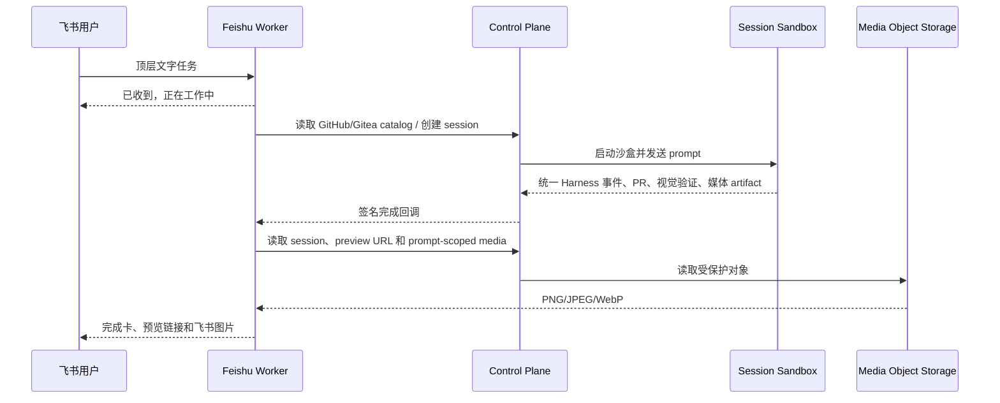

# 飞书集成

> 状态：生产入口已实现。代码源选择、会话续办、完成卡、预览链接和截图回传均走 Control
> Plane 的统一 session/artifact 协议。

Open-Inspect 的飞书集成是一个独立的 Cloudflare Worker。它不会将飞书 App Secret、飞书 tenant access
token、GitHub/Gitea PAT 或 sandbox capability 发送到浏览器或沙盒。

## 当前能力

- 私聊机器人发送文字请求，或在群聊中 @机器人发送文字请求。
- 收到消息后立即回复“已收到，正在工作中”，仓库发现、建会话和执行在后台继续。
- 使用明确的 `owner/repo` 自动定位仓库；否则通过飞书消息卡片选择 GitHub 或 Gitea 仓库。
- 代码源和仓库使用分页按钮直接选择；移动端不会打开可能被输入法遮挡的下拉搜索层。
- 每个顶层任务创建独立 session；发送“会话”“会话列表”或 `sessions`
  可以查看当前用户的近期会话，避免把一个聊天窗口强制绑定为单一任务。
- 在同一主题继续 session；只有原发起人可以继续该 session。
- 模型由飞书 Worker 的部署默认值选择，并映射到兼容 Harness；session 创建后 Harness 锁定。
- 创建 session、将结果回传同一飞书主题，并提供 Web session、PR 和可用的沙盒预览链接。
- 完成卡展示视觉验证状态和截图数量。启用 `FEISHU_MEDIA_DELIVERY_ENABLED=true`
  后，Worker 通过服务认证读取本次 prompt 的截图 artifact、上传为飞书图片并回复原主题；图片 key 不持久化。
- 事件与卡片回调的 verification token、加密载荷、签名、事件/action 去重与 Control
  Plane 回调签名验证。

当前只接受文字输入；用户发来的图片和文件会收到明确提示。运行偏好选择卡、状态/停止/`Review`
按钮、视频回传、主动通知和受管群自动化仍按 [飞书机器人入口方案](../plans/feishu-bot-integration.md)
的后续阶段实施。

## 架构数据流



飞书 Worker 不连接沙盒浏览器，也不理解 Codex、Claude、DeepSeek 或 OpenCode 的原生协议。它只消费 Control
Plane 的 provider-neutral session、repository catalog、completion 和 media 接口，因此 Harness 或 SCM
connection 的变化不会分叉飞书消息协议。

## 部署前配置

1. 在飞书开放平台创建企业自建应用，启用机器人能力。
2. 在 Terraform 的安全变量后端（或 CI 的 `TF_VAR_…`）配置：

   ```text
   TF_VAR_enable_feishu_bot=true
   TF_VAR_feishu_app_id=cli_…
   TF_VAR_feishu_app_secret=…
   TF_VAR_feishu_verification_token=…
   TF_VAR_feishu_encrypt_key=…
   TF_VAR_feishu_media_delivery_enabled=true
   ```

   不要把这些值写进 `terraform.tfvars` 并提交，也不要通过前端 Settings 保存。

3. 部署后从 Terraform output 获得 `feishu_bot_url`，在飞书开发者后台配置：

   | 飞书配置             | Open-Inspect URL                    |
   | -------------------- | ----------------------------------- |
   | 事件订阅 Request URL | `https://<feishu-bot>/events`       |
   | 消息卡片回调 URL     | `https://<feishu-bot>/card-actions` |

4. 使用飞书后台生成/保存的 verification token 与 Encrypt Key 更新上述 Worker secret，然后执行 URL
   challenge。订阅接收消息事件 `im.message.receive_v1`，并申请最小的机器人收发消息权限。
5. 先只将应用发布给测试用户和测试群。群 @ 功能还需要设置
   `TF_VAR_feishu_bot_open_id`；在完成群聊 E2E 前保持 `TF_VAR_feishu_triggers_enabled=false`。

## 真实 E2E 验收

必须在真实飞书测试租户完成以下操作，浏览器自动化不能替代这些验证：

1. 事件 URL challenge 成功，错误 token 和伪造签名返回 401。
2. 与机器人私聊；确认先收到工作回执，再收到代码源/仓库卡或工作卡，而不是等待后台操作后才响应。
3. 分别完成 GitHub 和 Gitea 任务；确认 clone、commit、push、PR 和结果链接全程使用该 session 固定的 connection。
4. 创建两个顶层任务，发送“会话列表”确认都能打开；在各自主题发送 follow-up，确认不会串 session。让另一测试用户点击旧卡片，确认被拒绝。
5. 发起“视觉验证”任务；确认完成卡显示验证状态和截图数量、截图图片回复原主题、预览按钮打开正确的沙盒和端口。重复投递完成回调，确认不重复发送图片。
6. 将机器人加到测试群，在配置 bot open ID 后启用群 @；确认普通消息不触发，只有 @机器人触发。
7. 在手机飞书 App 中分别选择代码源、仓库和翻页；确认全程使用卡片按钮，不会唤起输入法或遮挡操作区。

飞书官方资料：[接收消息](https://open.feishu.cn/document/server-docs/im-v1/message/events/receive)、
[发送消息](https://open.feishu.cn/document/server-docs/im-v1/message/create)、
[Request URL 配置](https://open.feishu.cn/document/server-docs/event-subscription-guide/event-subscription-configure-/request-url-configuration-case)。
