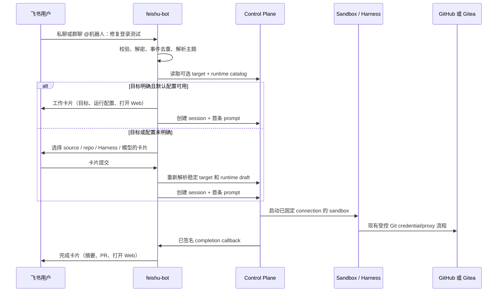
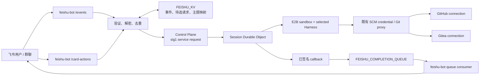

# 飞书机器人入口方案

## 状态

**Implemented in part — 通用入口已上线，后续能力分阶段实施。**

生产代码已经包含独立 Feishu
Worker、私聊/群 @ 入口、GitHub/Gitea 仓库选择、根消息到 session 映射、完成卡、预览和截图投递。原生话题及多个并行沙盒/分支的交互隔离已经实现并受灰度开关控制，以
[飞书并行线程会话实施方案](./feishu-threaded-sessions.md) 为生产验收依据。

本方案把飞书作为与 Slack 并列的 Open-Inspect 入口：用户可以在飞书私聊或群聊中发起、配置、跟进和控制 coding
session。它复用既有的 Control Plane、会话、Harness、GitHub/Gitea
connection 和沙盒能力；它不是另一套 agent、SCM 或沙盒实现。

本文件继续作为飞书通用入口和后续功能的架构依据。实施标为“待平台联调”的飞书 API 字段前，应以目标租户开发者后台的当前版本文档复核一次。

## 1. 决策摘要

1. 新建独立的 `packages/feishu-bot` Cloudflare Worker，不在 `slack-bot`
   中增加平台分支。二者可以调用相同的 Control
   Plane 合约，但消息、卡片、鉴权和会话线程语义各自由适配器拥有。
2. 使用飞书**企业自建应用 + 机器人能力**，而非“群自定义 Webhook 机器人”。后者只能主动推送，无法可靠接收私聊、@ 提及、消息卡片操作或维持会话。
3. 在 Cloudflare Workers 中采用飞书 HTTP Request
   URL 事件投递及独立卡片回调地址，不依赖常驻长连接。收到事件先校验/去重并快速应答，再以 `waitUntil`
   处理，与当前 Slack Worker 的可靠性模型一致。
4. 飞书只处理“人和会话”的入口。仓库选择始终传递 `repositoryKey` 或 `environmentId`，从不自行拼接
   `owner/repo`、推断 provider，也不持有 GitHub/Gitea PAT。
5. Gitea、GitHub 或后续 SCM
   connection 在同一选择器中展示。session 创建后仓库、connection、分支按现有系统规则固定；继续同一会话不能换仓库。
6. 不试图逐像素复制 Slack App Home 和 Block
   Kit。飞书使用其原生消息卡片、机器人菜单、私聊/群聊回复和 Web 链接，保持飞书用户预期。

飞书官方的 Node SDK 展示了自建应用的消息发送、`im.message.receive_v1`
事件与消息卡片能力；它也明确支持飞书和 Lark 两个域。SDK 默认依赖 Node/axios/流对象，Worker 实现应使用原生
`fetch` 和 Web Crypto，或仅在经过 Worker
bundle 验证后引入其中无 Node 依赖的部分。[官方维护 SDK](https://github.com/larksuite/node-sdk)

## 2. 目标、范围和非目标

### 目标

- 在私聊中直接发请求，在群聊中 @Open-Inspect 发请求。
- 用自然语言推断目标；不确定时让用户选择 environment 或跨 GitHub/Gitea connection 的 repository。
- 新会话中选择 Harness、模型、effort、分支（可选），并保存飞书用户的默认偏好。
- 在同一飞书对话主题中继续已有 session；给出工作中、开始、完成、失败、PR 和 Web 会话链接。
- 提供 `status`、`stop`、`review` 和帮助等会话控制，不占用 Slack 的 slash-command 命名空间。
- 对齐 Slack 的图片、附件、转发上下文、完成媒体、主动通知和频道自动触发能力；对没有飞书直接等价物的功能给出明确的飞书原生体验。
- 保持 Gitea/GitHub provider-neutral，且不扩大 sandbox 中的 Git 或 LLM 凭据暴露面。

### 非目标

- 不在 V1 让飞书成为 Open-Inspect 的浏览器登录提供者；飞书身份用于入口审计和偏好，不等同于 GitHub/Gitea 身份或 Git 凭据。
- 不把 GitHub/Gitea Webhook 事件改投递给飞书机器人。
- 不允许用户在飞书配置、读取或导出 SCM PAT、Harness auth token、LLM key 或飞书 `app_secret`。
- 不在 V1 建立一个泛化“所有聊天平台通用 UI SDK”。先以相同 Control
  Plane 合约实现两套小而清晰的适配器，确认共同点后再抽取纯逻辑。
- 不把实时 token 流直接刷入聊天。Slack 当前也以状态/完成消息为主；细粒度日志、终端和可视化仍在 Web
  session。

## 3. 当前 Slack 基线与飞书对齐矩阵

现有 `packages/slack-bot` 已有事件入口、线程续聊、目标澄清、用户运行偏好、App
Home、图片与转发消息、完成队列、媒体投递、agent 通知、可选频道自动触发和 `/inspect`
控制命令。飞书实现按下表逐项对齐：

| Slack 能力             | 飞书体验与实现                                                                             | 首发   |
| ---------------------- | ------------------------------------------------------------------------------------------ | ------ |
| DM 直接发起            | 与机器人私聊，收到 `im.message.receive_v1` 后开始或续接                                    | 是     |
| 频道 `@mention`        | 机器人已在群中时仅处理 @机器人消息；普通群消息默认忽略                                     | 是     |
| Slack thread           | 用 `tenantKey + chat_id + root_id`（无 root 时使用首消息 ID）映射 session；后续 reply 续接 | 是     |
| 猜测/选择仓库或环境    | 飞书消息卡片：推荐项 + source → repo/environment 的渐进式选择；始终传稳定 key              | 是     |
| App Home 运行偏好      | 机器人菜单 **偏好设置** 打开私聊卡片；保存 Harness、模型、effort、全局/仓库分支偏好        | 是     |
| 当次运行配置           | 发起卡片中显示/修改 Harness、模型、effort、分支；提交前走现有 runtime draft 解析           | 是     |
| `/inspect` 原生命令    | 不注册飞书原生 slash command；支持文本 `/inspect …` 兼容，并提供状态卡按钮与菜单           | 是     |
| 工作中/开始/完成回复   | 工作卡片 → 已创建 session 卡片 → 完成/失败卡片；卡片内有打开 Web、PR、状态/停止/Review     | 是     |
| 图片                   | 下载飞书消息资源、规范化为现有 session attachment；失败时不创建 image-only session         | 是     |
| 转发消息               | 首发解析可获取的引用/转发内容并附带明确来源；无法读取时提示用户粘贴文本                    | 是     |
| 完成媒体               | 发送小型图片/视频或给出 Web session 链接；保留 Slack 的大小/数量等价限制                   | 第二期 |
| agent 主动通知         | 仅向预先登记且机器人已加入的 `chat_id` 投递；不接受 agent 任意 chat ID                     | 第二期 |
| watched-channel 自动化 | 以受管群 `chat_id` 作为 trigger，默认关闭；复用 automation 事件规范                        | 第二期 |
| App Home 的 Web 入口   | 机器人菜单提供 **打开 Open-Inspect**；完整设置和实时日志仍在 Web                           | 是     |

飞书的消息事件、发消息、事件 Request URL、租户 token 分别以官方文档为准：
[接收消息](https://open.feishu.cn/document/server-docs/im-v1/message/events/receive)、
[发送消息](https://open.feishu.cn/document/server-docs/im-v1/message/create)、
[Request URL 配置](https://open.feishu.cn/document/server-docs/event-subscription-guide/event-subscription-configure-/request-url-configuration-case)、
[tenant access token](https://open.feishu.cn/document/server-docs/authentication-management/access-token/tenant_access_token_internal)。

## 4. 用户体验

### 4.1 首次安装与发现

飞书管理员创建“Open-Inspect”企业自建应用并启用机器人。机器人自定义菜单包含：

- **新建会话**：向操作者私聊发送新的请求卡片。
- **偏好设置**：打开或更新该用户的偏好卡片。
- **我的会话**：打开 Web session 列表，使用带登录态的普通 Web 链接。
- **帮助**：发送使用说明及 `status` / `stop` / `review` 文本示例。

菜单事件通过
`application.bot.menu_v6`（待平台联调确认订阅名称）进入相同的事件端点。菜单并不是安全边界；每个动作仍要检查操作者和目标 session 的授权。

### 4.2 一次请求的流程



**群聊策略**：默认只接受明确 @机器人 的用户消息；忽略机器人、系统消息和其他应用消息。群中同一
`root_id` 的回复由同一 session 接收，超出映射 TTL 或 session 已终止时说明原因并给出“新建会话”按钮。

**会话不可变性**：运行后的卡片显示当前 source/repository/branch，但不允许更改。用户要换仓库必须从“新建会话”发起，这与 Web 和 Slack 规则一致。

### 4.3 目标与运行配置卡片

卡片不把所有仓库一次性放进静态下拉框。推荐的逐步体验是：

1. 若分类器有高置信目标，先展示目标摘要和 **开始** / **更换目标**。
2. “更换目标”先选 `Source`（如
   `GitHub · summersmile`、`Gitea · aotsea`），再用关键词搜索或分页选择 repository/environment。后端每一步重新验证 key 是否仍可访问。
3. “运行配置”展示有效的 Harness、模型、effort 和分支；选项来自 Control Plane 的 `resolve-draft` /
   enabled catalog，而不是在飞书 Worker 中硬编码模型列表。
4. **开始** 按钮只带短生命周期的 opaque pending-request ID 与 action；真实 repositoryKey、runtime
   draft
   digest、操作者与过期时间保留在 KV。提交时再次读取并校验，防止篡改或旧卡片选中已撤销权限的仓库。

卡片使用版本化的 TypeScript builder 和 JSON snapshot
test，不依赖开发者后台手工维护模板 ID。卡片内链接均为 HTTPS，所有用户可控文本按飞书卡片/Markdown 规则转义和限长。

### 4.4 偏好、命令和状态

飞书没有 Slack App Home 的等价物，因此机器人菜单中的“偏好设置”在私聊中呈现卡片：

| 偏好                  | 作用域                     | 优先级                                               |
| --------------------- | -------------------------- | ---------------------------------------------------- |
| Harness、模型、effort | 飞书用户                   | 单次卡片覆盖 > 飞书用户偏好 > 安装默认               |
| 全局 branch           | 飞书用户                   | repository branch 覆盖 > 全局 branch > repo 默认分支 |
| repository branch     | 飞书用户 + `repositoryKey` | 仅新 session 使用                                    |

偏好写入现有 canonical agent-runtime preference 存储，actor 使用
`feishu:<tenantKey>:<openId>`，而不是只写飞书 Worker KV。这样 Harness/模型有效性仍由 Control
Plane 决定。没有登录 Web 的飞书用户也能管理飞书偏好；之后若要与 Web 账户共享偏好，应新增显式账号绑定流程，不能通过相同显示名猜测绑定。

文本 `/inspect help`、`/inspect status <session>`、`/inspect stop <session>`、
`/inspect review <session>` 仅是机器人消息内容约定；飞书输入框不会与 Slack 的 slash
command 冲突。更常用的入口应是完成/工作卡片上的 **状态**、**停止**、**Review** 按钮。飞书没有 Slack
ephemeral reply 时，结果更新原卡或在同一主题中正常回复，且不得把私密错误细节发到群。

### 4.5 附件、上下文和完成内容

- 文字与图片首发同 Slack。资源下载必须由 Worker 以 tenant token 获取，转换为现有
  `ResolvedSessionAttachment`；只把必要的已规范化字节/引用发送给 Control Plane。
- 文件、音频、视频、聊天记录转发在第二期扩展。无法获取的资源必须清晰说明，不能静默丢失或启动空 prompt。
- 完成卡片包括：成功/失败、精简 final response、关键工件、PR/分支、Harness/模型、Web
  session 链接。长输出截断并链接 Web；用户可以在 Web 看完整事件和媒体。
- 卡片更新只在明确里程碑发生（排队、sandbox 已连接、完成/失败），限流、合并同类更新。它不是 agent 的 token
  streaming 通道。

## 5. 目标架构与数据流



### 外部 HTTP 面

| 路径                       | 用途                       | 必须行为                                                                                                       |
| -------------------------- | -------------------------- | -------------------------------------------------------------------------------------------------------------- |
| `POST /events`             | 飞书事件与 URL 校验        | 原始 body 校验/解密；challenge 立即返回；按 event ID 去重；`waitUntil` 投递业务处理                            |
| `POST /card-actions`       | 消息卡片回调               | 验证回调；按 action ID 去重；校验 actor、pending request 和 session 所属关系；同步返回允许的卡片响应或快速 ACK |
| `GET /healthz`             | 运维检查                   | 不泄露 app/tenant/凭据；只返回部署状态                                                                         |
| `POST /callbacks/complete` | Control Plane 内部完成回调 | 仅 Cloudflare service binding；校验 callback body HMAC；入 completion queue                                    |

飞书事件验证 URL 和卡片回调 URL 应使用飞书 Worker 专属域名（例如
`feishu.open-inspect.example`）。它们与 Gitea 的 `gitea.aotsea.com`
完全无关：前者是飞书调用 Open-Inspect 的公网回调地址，后者是 Open-Inspect 及 sandbox 访问的 SCM
connection。

### 会话与回调数据

新增并严格校验如下形状，字段名可在实现中微调，但语义不得丢失：

```ts
type FeishuCallbackContext = {
  source: "feishu";
  tenantKey: string;
  chatId: string;
  rootMessageId: string;
  workingMessageId?: string;
  targetLabel: string;
  model: string;
  reasoningEffort?: string;
};

type FeishuConversationKey = `${tenantKey}:${chatId}:${rootMessageId}`;
```

`workingMessageId` 仅用于更新 Open-Inspect 自己发送的卡片，不能从用户请求中信任。持久的 topic →
session KV 记录还保存
`sessionId`、`repositoryKey/environmentId`、有效 runtime 摘要、最后已转发消息位置、创建时间和版本；不保存 API
token、文件下载 URL、原始事件体或卡片密钥。

为支持此上下文，需要将以下 shared/control-plane union 和路由从 Slack-only 扩展为 discriminated
union，而非让未知 source 落入 Slack 默认分支：

- `ServiceName` 加入 `feishu-bot`，并在每个 service→actor 权限表中只允许 `feishu` namespace；
- `MessageSource` 加入 `feishu`，`SpawnSource` 加入 `feishu-bot`；
- `CallbackContext` 加入 `FeishuCallbackContext`，`CALLBACK_DESTINATIONS` 加入 `feishu-bot`；
- `CallbackNotificationService.resolveCallbackRoute`
  按 source 显式选择 Slack、Linear、Feishu，对未知交互 source 拒绝并记录，而不是默认发给 Slack；
- 运行 launch spec 的 caller channel 加入 `feishu`，以便审计与分析可区分入口。

飞书用户 identity 采用 `feishu:<tenantKey>:<openId>`。`openId` 前必须带 tenant
key，防止未来多个飞书租户/ISV 安装时碰撞。SCM 的 `github:` / `gitea:`
身份仍是独立概念，不能因为用户从飞书发消息就授予对应 repository 的 Git 写权限。

## 6. 安全和可靠性

### 6.1 飞书应用凭据与事件

- Terraform/Worker secret 仅保存 `FEISHU_APP_ID`、`FEISHU_APP_SECRET`、事件 verification
  token、encrypt key、服务签名 secret 和加密 token-cache key。禁止出现在 Web
  API、日志、D1 普通列、Queue 消息、卡片 `value`、异常 body 或浏览器 bundle 中。
- 必须在解析业务字段前按照当前飞书事件/卡片规范验证原始请求、时间窗口、verification
  token 和（开启后）加密载荷。实现以官方 SDK 的已验证语义为参照，但用 Web Crypto 写独立测试向量。
- event header ID 和 card
  action 的唯一标识进入 KV 去重；推荐事件 24 小时、动作 1 小时。KV 故障记录降级事件但不接受未验证请求；关键创建操作另以 Control
  Plane idempotency key 防重。
- 事件挑战不做数据库、模型或 SCM 调用；挑战响应路径保持最短。业务处理抛错不会把秘密写回飞书。
- 所有控制按钮重新检查：callback actor 与 pending request
  owner 是否一致、topic 是否归属该 session、session 是否仍可控。按钮 value 只有 action/pending
  ID/随机 nonce，绝不含 PAT、session capability、repository URL 或可复用签名。

### 6.2 token 与出站 API

- 用 `app_id + app_secret` 换取 tenant access
  token；按官方返回的过期时间提前刷新。若跨 isolate 缓存，必须在 `FEISHU_KV`
  中应用层加密、带过期时间；不可把 bearer token 放 Cloudflare
  Cache 或一般日志。缓存失效时安全地重新换取。
- 每个请求设置超时、有限重试和飞书返回的限流退避；不能在事件 ACK 之后无限重试导致重复消息。
- 出站 `chat_id`、message ID 与 URL 采用 schema 验证。agent 通知必须从受管 channel
  store 解析，不允许 agent prompt 直接指定任意接收者。

### 6.3 SCM、Harness 与隐私边界

- 飞书 Worker 只调用 Control Plane 受 sig1 保护的内部 API；它不直连 sandbox、不调用 GitHub/Gitea
  API、不传 `SANDBOX_AUTH_TOKEN`。
- 创建会话后，已有的 session-pinned SCM connection、credential broker/Git proxy 和 sandbox
  capability 流程保持不变。飞书 worker 不能以“飞书用户”身份替换 connection PAT 或 Git author。
- 群成员显示名、消息内容和文件名视为不可信用户输入；转义卡片文本、限制长度、避免日志记录完整 prompt/附件下载 URL。只记录 opaque
  ID、来源、结果码、耗时与计数。

## 7. 代码与 Terraform 改动清单

### 新增

```text
packages/feishu-bot/
  src/app.ts                         # Hono 入口
  src/routes/events.ts               # 验证、challenge、去重、调度
  src/routes/card-actions.ts         # 卡片 action 验证和 state machine
  src/events/dispatcher.ts           # DM、@mention、菜单事件
  src/messages/feishu-client.ts      # 原生 fetch 的 token、消息、更新、资源 API
  src/cards/{request,working,completion,preferences}.ts
  src/conversation/{store,pending-request}.ts
  src/sessions/{control-plane-client,launcher,prompt-delivery}.ts
  src/completion/{job,consumer,delivery,media-upload}.ts
  src/identity.ts
  src/types/index.ts
  src/**/*.test.ts
terraform/environments/production/workers-feishu.tf
docs/integrations/FEISHU.md
```

### 修改

| 文件/领域                                                                                    | 修改                                                                    |
| -------------------------------------------------------------------------------------------- | ----------------------------------------------------------------------- |
| `packages/shared/src/service-auth.ts`                                                        | 添加 `feishu-bot` service name 与 golden vectors/tests                  |
| `packages/shared/src/types/sessions.ts`                                                      | 添加 `feishu` message 与 `feishu-bot` spawn source                      |
| `packages/shared/src/types/session-api.ts`                                                   | 添加严格的 Feishu callback context 和 completion payload                |
| `packages/control-plane/src/auth/{principal,service/config}.ts`                              | actor namespace、assertion right、per-service secret                    |
| `packages/control-plane/src/auth/service/callback-signing.ts`                                | Feishu callback destination                                             |
| `packages/control-plane/src/session/callback-notification-service.ts`                        | source→destination 显式三分支，增加 `FEISHU_BOT` binding                |
| `packages/control-plane/src/routes/{session-create,session-commands}.ts`                     | source/launch caller channel 的 Feishu 归属与权限测试                   |
| `terraform/environments/production/{variables,locals,service-auth,workers-control-plane}.tf` | feature flag、hostname、secret、service binding、control-plane verifier |
| `terraform/environments/production/workers-feishu.tf`                                        | Worker、KV、completion queue、DLQ、consumer、环境变量和 secrets         |
| `docs/GETTING_STARTED.md`                                                                    | 飞书自建应用创建、回调 URL、权限、发布、测试租户步骤                    |

不修改以下边界：E2B/Modal sandbox image、Harness provider、SCM provider、Gitea
PAT/proxy 协议。飞书入口的实现不得为便利而绕过这些现有边界。

### Terraform 配置

建议变量如下（名称需和现有风格统一）：

```hcl
enable_feishu_bot                 = false
feishu_triggers_enabled           = false
cloudflare_feishu_custom_domain   = "feishu.example.com" # optional
feishu_app_id                     = "cli_…"              # sensitive in tfvars/secret backend
feishu_app_secret                 = "…"                  # sensitive
feishu_verification_token         = "…"                  # sensitive
feishu_encrypt_key                = "…"                  # sensitive
feishu_api_base                   = "https://open.feishu.cn"
```

`enable_feishu_bot` 为 false 时 Terraform 不创建 Worker、KV、queue、secrets 或 Control Plane service
binding；为 true 时校验所有必需秘密和 HTTPS hostname。`feishu_api_base` 不是用户消息参数；只允许
`https://open.feishu.cn`，未来兼容 Lark 时通过明确 allow-list 扩展。

## 8. 飞书开发者后台配置清单

1. 创建企业自建应用，启用机器人能力，设置名称、头像、权限可见范围和管理员。
2. 在事件订阅中配置 `https://<feishu-worker>/events`，完成 URL
   challenge 后订阅接收消息事件；如启用菜单，订阅机器人菜单事件。
3. 在消息卡片交互中配置 `https://<feishu-worker>/card-actions` 回调地址。
4. 最小化申请：接收机器人相关消息、以机器人身份发送消息；仅在实现图片/文件时申请相应消息资源读取权限。用户资料、通讯录、云文档等不得预先宽授权。
5. 将 verification token 和 encrypt key 写入 Terraform secret
   backend；在 worker 部署后再发布应用版本，并由租户管理员审核/限定可用范围。
6. 将机器人加入专用测试群和测试账号私聊，先验证事件、卡片、DM 和群 @ 提及，最后才扩大可见范围。

权限显示名与事件枚举会随飞书开发者后台迭代，实际提交前以该租户后台生成的最小权限清单为准；不得为解决单一报错而勾选通讯录全量读取或管理员权限。

## 9. 分阶段实施和发布

### 阶段 A：公共合约与部署骨架

- 新增 shared/control-plane 的 source、actor、service-auth、callback
  destination；所有 switch 穷尽处理，无 Slack fallback。
- 创建飞书 Worker、`FEISHU_KV`、completion queue/DLQ 和 Terraform feature flag，但默认关闭。
- 实现 HTTP 验证、解密、challenge、token client、事件/card schema 和 observability。
- 验收：Worker 不开启时生产行为零变化；开启后可通过飞书 URL 验证且未订阅消息时不会创建 session。

### 阶段 B：交互式会话 MVP

- DM/@mention 文字请求、目标分类、source/repository/environment 卡片选择、session 创建、首条prompt、主题续聊、工作/完成/失败卡片。
- Harness/model/effort 的单次选择及飞书用户持久偏好；状态/停止/Review 卡片动作和文本兼容。
- GitHub + Gitea 两个 connection 的真实目标目录测试。
- 验收：一个飞书用户在私聊和群 @ 中各完成一次不同 SCM 的 session，push/PR/完成回调正确回到原 chat/topic，且任意卡片均不能跨用户或跨 session 控制。

### 阶段 C：内容与通知对齐

- 图片/文件、转发上下文、完成媒体上传；agent 通知的受管 chat 选择。
- 可选受管群自动化 trigger，默认 off，增加 chat allowlist、频率限制、审计和 kill switch。
- 验收：附件成功传递或明确失败；禁用 trigger 时普通群消息不触发；拒绝未登记 chat 的主动通知。

### 阶段 D：体验打磨与运营

- 卡片更新节流、偏好卡全面对齐、可访问性/移动端测试、设置页连接健康和诊断、支持文档。
- 在 Web Settings → Integrations → Feishu 显示启用状态、callback
  URL、最近验证/事件/投递错误和管理员说明；只显示掩码凭据状态，绝不在浏览器编辑或回显 app secret。
- 验收：管理员可诊断连接，不可读取密钥；用户可以只使用飞书完成常见工作流。

### 发布策略与回滚

1. 先在测试租户、单一测试群和两个 allowlisted 用户上线；`feishu_triggers_enabled=false`。
2. 灰度扩大机器人可见范围，观察 401/验签失败、事件重复、卡片过期、completion 延迟、限流和 session 创建失败率。
3. 任一异常时先将 `enable_feishu_bot=false` 或调用 Worker kill
   switch。已创建的 session 不受影响，只停止新的飞书 ingress；Web 与 Slack 保持可用。
4. 保留 queue DLQ、事件 ID、trace ID 和 session ID 的关联诊断；不保留秘密或完整消息内容。

## 10. 测试与验收矩阵

| 层级                      | 覆盖                                                                                                                 | 证据                                   |
| ------------------------- | -------------------------------------------------------------------------------------------------------------------- | -------------------------------------- |
| Unit                      | Web Crypto 校验/解密、challenge、token 提前刷新、解析、转义、卡片 builder、卡片 state machine、KV key、重复事件/动作 | `packages/feishu-bot/src/**/*.test.ts` |
| Unit                      | ServiceName/actor assertion、callback context、source route、未知 source fail-closed                                 | shared + control-plane tests           |
| Worker integration        | Hono 原始请求、service binding、KV、queue、Control Plane callback HMAC、失败重试                                     | Miniflare/Workerd integration tests    |
| Control-plane integration | Feishu actor 建用户、偏好解析、session create、runtime draft、status/stop/review 权限                                | D1 + DO integration tests              |
| SCM contract              | 同一飞书入口选择 GitHub 和 Gitea repository；创建、clone、commit、push、PR 及 completion 归属                        | disposable test repos                  |
| 飞书真实 E2E              | URL challenge、DM、新 session、群 @、卡片选择、线程续聊、停止、完成卡片、过期卡片、重投事件                          | 测试租户人工录屏/截图 + trace IDs      |
| Web E2E                   | Integration Settings 的状态/掩码/帮助、session 启动后 Web 链接、Gitea repo 标签展示                                  | Playwright + deployed staging          |
| 安全回归                  | 错 token/加密、过期/重复事件、跨用户卡片、伪造 callback、未登记 chat、秘密扫描                                       | negative tests + CI secret scan        |

浏览器 E2E 不应被误称为“飞书验证”：Playwright 只能验证 Web settings 和 Web
session 跳转。真正的飞书端到端验证必须在飞书测试租户从真实 DM/群聊触发，并保留对应 event ID、session
ID 和卡片截图。两类测试都必须通过后才可以称为完整 E2E。

## 11. 风险和对应决策

| 风险                            | 处理                                                                            |
| ------------------------------- | ------------------------------------------------------------------------------- |
| 将飞书事件当普通公开 webhook    | 对原始 body 验证、加密、去重和时间窗；卡片动作也单独验证                        |
| 用户伪造/重放卡片操作           | opaque pending ID + nonce + TTL + actor/topic/session 三重检查 + CP idempotency |
| Gitea 仓库被错误当 GitHub       | 飞书只用 repositoryKey；展示的 provider/url 均由 catalog 返回                   |
| Worker SDK/长连接不兼容         | HTTP + 原生 fetch/Web Crypto；SDK 只作协议与测试参考，非运行依赖                |
| 大仓库目录塞爆卡片              | source-first、关键词搜索、分页；永不依赖全量静态下拉                            |
| 群聊中误触发或越权控制          | 默认 @ 才触发；受管 chat allowlist；控制动作检查 actor 与映射                   |
| 飞书 token/SCM PAT 被泄露到沙盒 | tenant token 仅 Worker 加密缓存；SCM 凭据路径完全不变且 server-side             |
| Slack 行为被 Feishu 改动破坏    | 共享类型扩展采用 discriminated union；Slack 回归套件和 feature flag 是发布门槛  |
| 平台 API 字段/权限变动          | 首发前用目标租户后台与官方文档做 contract probe；将 payload fixtures 版本化     |

## 12. 完成定义

只有同时满足以下条件，飞书入口才能标记为完成：

- 管理员能按文档创建、发布和安全配置飞书自建应用；秘密不暴露在 UI、日志或 sandbox。
- DM 和群 @ 都可从 GitHub 与 Gitea
  connection 选择 target，选择 Harness/模型/effort 后创建可工作的 session。
- 同一飞书主题能续聊；跨主题、过期主题与已结束 session 的行为明确且安全。
- 工作、完成、失败、PR 和 Web 链接正确返回原会话；`status`、`stop`、`review` 不能越权。
- 图片/文件等已承诺能力成功传递或显式报错，不静默降级；自动触发默认关闭。
- unit、Worker integration、Control Plane integration、GitHub/Gitea contract、真实飞书 E2E 与 Web
  E2E 均有可重复证据；Slack、Web、Gitea 既有回归保持通过。
