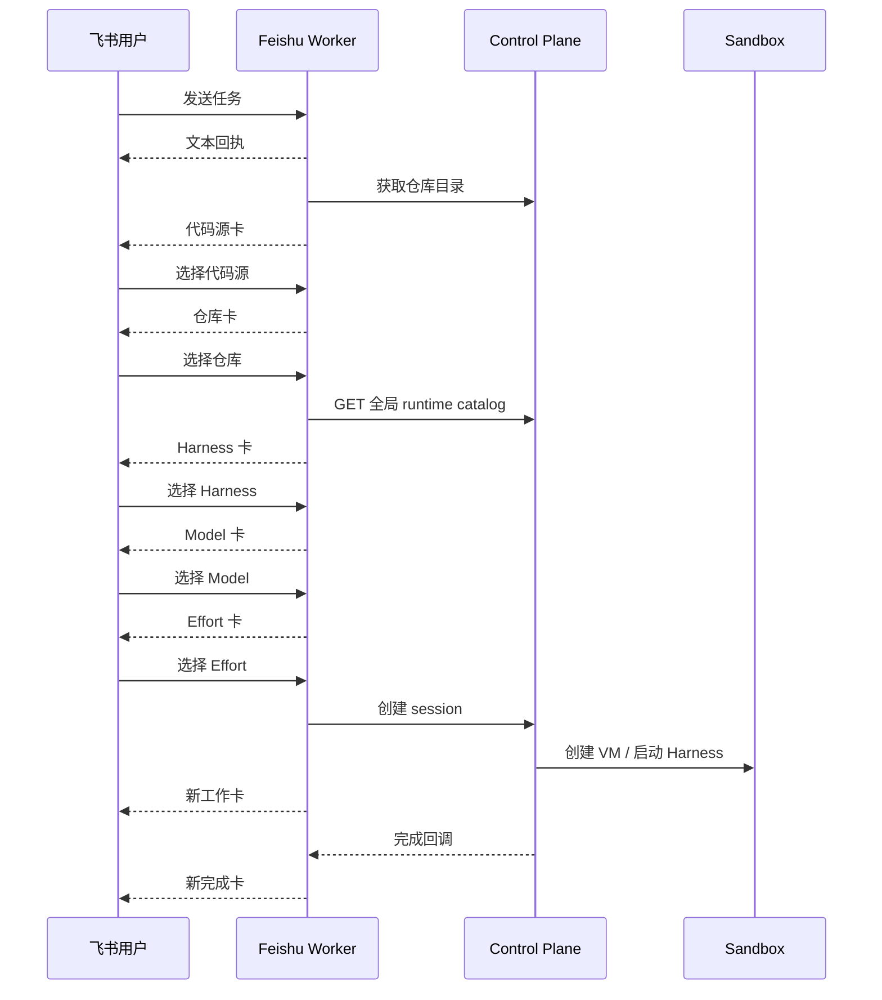
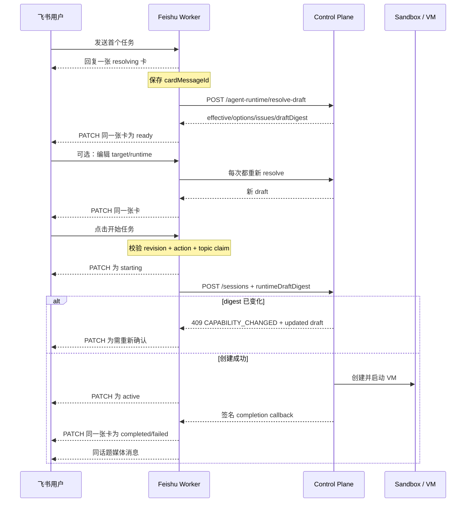

# 飞书单卡片任务启动与生命周期对齐方案

## 0. 文档状态

- 状态：源码实现、自动化验证和生产灰度已通过；真实生产已覆盖群话题 repo-less、明确 GitHub
  owner/repo 自动推断、私聊 GitHub 小仓库、双顶层任务隔离、真实双击幂等、Runtime 覆盖、同 session
  follow-up、窄屏启动及截图上传/飞书同话题媒体投递。完整 FSC-01～FSC-16 矩阵、preview 端口、八段 VM 可观测证据及负向/故障注入仍未齐全，因此尚未达到本文件的最终完成定义。
- 目标：把飞书入口从“逐步发送多张选择卡”升级为“每个用户回合一张、原位更新的交互卡”，并让飞书与 Web、其他入口共同使用 Control
  Plane 的目标感知 Runtime Resolver 和会话创建契约。
- 实施边界：修改 Open-Inspect 的
  `shared`、`control-plane`、`feishu-bot`、Terraform、测试和文档；**不修改 CubeSandbox 源码**，也不要求 CubeSandbox
  `0.7` 为此方案提供新的专用接口。
- 关联文档：
  - [Runtime Launch Configuration Alignment](./runtime-launch-alignment.md)
  - [飞书并行线程会话实施方案](./feishu-threaded-sessions.md)
  - [Open-Inspect 验证方案与边界矩阵](./verification-strategy.md)
  - [飞书集成](../integrations/FEISHU.md)
- 飞书官方契约：
  - [更新已发送的消息卡片](https://open.feishu.cn/document/server-docs/im-v1/message-card/patch)
  - [Card JSON 2.0 结构](https://open.feishu.cn/document/uAjLw4CM/ukzMukzMukzM/feishu-cards/card-json-v2-structure)
  - [输入框组件](https://open.feishu.cn/document/feishu-cards/card-components/interactive-components/input)

本文既是实施依据，也是验收记录。源码完成不等于生产完成；只有第 13 节的自动化门禁和第 14 节的真实飞书 E2E 都留下证据后，状态才能更新为 Implemented。

## 1. 结论

采用飞书交互卡，但不再复刻 Web 的表单，也不再强迫用户依次选择代码源、仓库、Harness、模型和 Effort。

目标交互是：

1. 用户发送任务后，机器人尽快回复一张“正在解析”的任务卡。
2. 后台解析工作区和 Runtime 默认值后，原位更新同一张卡。
3. 默认值可用时，卡片直接提供主按钮“开始任务”；大多数任务只需一次点击。
4. “更换工作区”和“调整 Runtime”在同一张卡内切换视图，保存后回到摘要，不立即启动。
5. 点击“开始任务”后，同一张卡依次显示创建会话、等待 VM、运行中、完成或失败。
6. 截图等媒体继续作为同一话题内的兄弟消息发送；不把二进制内容塞进主卡。
7. 同一 session 的后续 prompt 每回合新建一张状态卡并原位更新，保留对话历史；不会用一张卡覆盖整个 session 的所有历史。

这不是单纯的前端改版。飞书必须改用 `/agent-runtime/resolve-draft`，并在创建 session 时提交
`runtimeDraftDigest`，才能与 Control Plane 的目标、继承、readiness、provenance 和
`CAPABILITY_CHANGED` 语义真正一致。

## 2. 用户体验目标与验收指标

### 2.1 体验目标

- 默认路径短：明确仓库或可可靠推断仓库时，只展示摘要和“开始任务”，不要求重复确认每个 Runtime 字段。
- 信息透明：即使使用继承值，也显示最终 Harness、route、model、effort 以及来源摘要。
- 高级能力可达：用户可以调整目标、Harness、模型、Effort 和允许用户编辑的 session-start settings。
- 移动优先：常用目标采用少量按钮；大列表使用搜索/分页的受控降级，不展示数十个按钮。
- 状态稳定：选择、启动和完成都更新同一 message ID，避免一个任务产生一串相互矛盾的卡片。
- 失败可恢复：能力变化、目标失效、卡片过期、更新失败都有明确状态和下一步，不静默回退到另一模型或 Harness。

### 2.2 可量化指标

| 指标                      | 目标                                            | 证据                             |
| ------------------------- | ----------------------------------------------- | -------------------------------- |
| 明确目标的首次任务卡数量  | 1 张，不含媒体                                  | 飞书消息 ID 清单                 |
| 默认启动点击数            | 从 ready 到启动 1 次                            | 卡片 action 日志                 |
| 配置过程消息 ID           | 始终等于初始 `cardMessageId`                    | PATCH 日志与截图                 |
| 重复启动                  | 0 个额外 session                                | session index、action/claim 日志 |
| 跨 actor 启动             | 0                                               | 负向测试和 403/业务拒绝日志      |
| 能力变化后的静默替换      | 0                                               | `CAPABILITY_CHANGED` 测试        |
| 完成卡 PATCH 失败时的回退 | 最多 1 张新完成卡                               | delivery idempotency 证据        |
| 卡片操作到新状态可见延迟  | P95 小于 3 秒；Runtime 解析超时则进入可重试状态 | Worker 指标                      |
| 主流程卡片 PATCH 成功率   | 灰度期至少 99%，否则自动停止扩量                | 指标面板                         |

## 3. 当前代码审计

### 3.1 当前链路



这一流程每一步都能工作，但把一个任务拆成多张卡；旧卡仍留在话题里，用户需要判断哪张才是最新状态。在仓库已明确时仍强制经过 Runtime 多级选择，也违背了“继承默认值即可启动”的 Runtime 设计。

### 3.2 代码事实与缺口

| 位置                                                                  | 当前行为                                                                                             | 对目标设计的影响                                                                    |
| --------------------------------------------------------------------- | ---------------------------------------------------------------------------------------------------- | ----------------------------------------------------------------------------------- |
| `packages/feishu-bot/src/events/dispatcher.ts`                        | 先发送文本回执，再推送选择卡；推断到仓库后仍进入 Runtime 分步选择                                    | 初始任务至少两条消息，默认路径过长                                                  |
| `packages/feishu-bot/src/interactions/card-actions.ts`                | action 固定为 connection/repository/harness/model/effort 分步动作；每次 action 都 `replySessionCard` | 产生卡片瀑布，旧卡只能靠 revision 拒绝，不能原位失效                                |
| `packages/feishu-bot/src/cards.ts`                                    | 多个独立 V1 形态 builder，结构为 `config/header/elements`                                            | 不适合作为统一状态机；新主卡应迁移到 Card JSON 2.0                                  |
| `packages/feishu-bot/src/feishu/client.ts`                            | 只有发送、回复、图片上传，没有更新已发送卡片                                                         | 无法复用 message ID                                                                 |
| `packages/feishu-bot/src/conversation/delivery.ts`                    | 只提供 reply helpers                                                                                 | 缺少只允许更新已存 bot 消息的安全 helper                                            |
| `packages/feishu-bot/src/conversation/store.ts`                       | pending 只存 repo/connection/runtime/revision；thread session v2 强制单仓库                          | 无 `cardMessageId`、视图、卡片阶段、draft digest；目标不能表达 none/set/environment |
| `packages/feishu-bot/src/sessions/runtime-catalog.ts`                 | 调 `GET /agent-runtime/catalog`，得到全局 ready 目录                                                 | 没有目标感知配置继承、issues、effective/provenance 和 digest                        |
| `packages/feishu-bot/src/sessions/control-plane-client.ts`            | 只创建单仓库 session；根据 model 前缀猜 Harness；不发送 `runtimeDraftDigest`                         | 飞书可能与 authoritative resolver 得到不同结论                                      |
| `packages/control-plane/src/routes/agent-runtime.ts`                  | `POST /agent-runtime/resolve-draft` 只允许 human user                                                | Feishu 的签名 service principal 当前不能调用                                        |
| `packages/control-plane/src/routes/session-create.ts`                 | 稳定目标会重新 resolve；digest 变化返回 `CAPABILITY_CHANGED`                                         | 能力已存在，但飞书没有使用                                                          |
| `packages/shared/src/types/session-api.ts`                            | `FeishuCallbackContext` 已有可选 `workingMessageId`                                                  | 无需发明新的回调定位字段                                                            |
| `packages/feishu-bot/src/callbacks.ts`、`completion/job.ts`           | callback 解析后没有把 `workingMessageId` 放入 queue job                                              | 已有 message ID 在异步边界被丢弃                                                    |
| `packages/feishu-bot/src/completion/delivery.ts`                      | 完成时总是回复新卡                                                                                   | 无法把运行卡原位变成结果卡                                                          |
| `packages/control-plane/src/session/callback-notification-service.ts` | 注释承诺飞书采用有界 lifecycle card updates                                                          | 实际 Worker 尚未兑现，文档与实现不一致                                              |
| `terraform/environments/production/workers-feishu.tf`                 | 已有 Worker、KV、completion queue、service binding                                                   | 不需要新基础设施；需要一个新 feature flag                                           |

### 3.3 必须保留的正确设计

以下行为不能因 UI 重构而退化：

- `rootMessageId` 是稳定路由键，`threadId` 只决定飞书展示位置。
- 一个飞书话题只绑定一个 session；一个 session 在创建后固定 sandbox、目标、分支和 Runtime
  LaunchSpec。
- 卡片 action 必须先校验 actor、tenant、chat、topic、pending 和 revision，再消费 action 幂等键。
- 最终启动继续使用 topic selection claim，防止并发创建两个 session。
- 用户提供的 card value 不是权限凭证；仓库、环境和 Runtime 选项都必须由服务端重新加载并验证。
- completion、media 和 preview 继续走 Control Plane 的 provider-neutral 接口。
- CDP `9222` 和 Browser MCP `8100` 不暴露；飞书不直连 VM。

## 4. 目标交互模型

### 4.1 “每回合一张卡”，不是“每个 session 永远一张卡”

卡片的生命周期以 prompt 回合为单位：

- session 的首个回合：`配置卡 → 启动卡 → 工作卡 → 结果卡`，同一 `cardMessageId` 原位更新。
- 已绑定 session 的后续回合：收到 prompt 后创建一张新的回合状态卡，随后 `已接收 → 运行中 → 结果`
  原位更新。
- `/status`、`/stop` 等独立命令保留自己的轻量结果消息；不覆盖最近任务结果卡。
- 截图、视频、文件等媒体作为该回合结果卡的同话题兄弟消息；其 idempotency key 继续绑定 completion
  `deliveryId`。

这样既避免卡片瀑布，也不会丢失历史结果。

### 4.2 主卡默认视图

```text
┌──────────────────────────────────────┐
│ Open-Inspect · 准备开始              │
├──────────────────────────────────────┤
│ 任务                                 │
│ 检查登录页并完成端到端验证…          │
│                                      │
│ 工作区                               │
│ GitHub · summersmile1984/flow-pilot  │
│ 分支：main                           │
│                                      │
│ Runtime                              │
│ Codex · openai/gpt-5.6-luna · high   │
│ 继承：飞书集成默认                   │
│                                      │
│ [更换工作区] [调整 Runtime]          │
│ [              开始任务             ]│
└──────────────────────────────────────┘
```

规则：

- 任务摘要最多 160 个可见字符，完整 prompt 只保存在 pending record，不进入 action
  value 和结构化日志。
- 工作区显示 provider、稳定仓库标签、分支；多仓库显示主仓库加“等 N 个仓库”；repo-less 显示“临时工作区”。
- Runtime 显示 resolver 的 effective 值，不显示 Worker 自行猜测的值。
- provenance 面向用户转换为“安装默认 / 飞书默认 / 用户偏好 / 仓库默认 / 环境默认 / 本次覆盖”，不暴露内部敏感 ID。
- `launchable=false` 时不渲染可点击的“开始任务”，改为错误摘要和相应修复动作。

### 4.3 工作区编辑视图

首版布局优先满足最常见路径：

1. “最近使用”最多 3 个目标作为按钮，标签含 provider 与仓库简称。
2. “临时工作区（无仓库）”作为明确选项，不把缺省仓库误当错误。
3. 只有存在多个 connection 时才展示代码源过滤。
4. “更多仓库”进入同一张卡的搜索/分页视图：
   - Card JSON 2.0 搜索组件在飞书 Web 桌面和窄屏验证通过时使用；
   - 如果组件回调能力、移动键盘或选项上限不满足要求，回退到每页 6 个按钮和上一页/下一页；
   - 两种实现都只能更新当前卡，不能发送新卡。
5. “高级目标”承载 environment 和 2–10 个同 connection 仓库的 repository-set；跨 connection 组合由 resolver 拒绝并显示原因。
6. “取消”恢复进入编辑前的 draft；“应用”只保存 target 并重新 resolve，不创建 session。

首个灰度可只开放 `none | repository`，但内部状态和 action 协议从一开始使用完整
`RuntimeLaunchTarget`。`repository-set | environment`
未开放时必须显示为“暂未在飞书开放”，不得错误声称与 Web 完全对齐。最终验收要求四种 target 都有明确的支持或书面范围决定。

### 4.4 Runtime 编辑视图

Runtime 选择按依赖关系渲染，但不是强制向导：

- 初始 draft 为空或仅带用户明确覆盖，resolver 负责合并安装、integration、用户、仓库和环境配置。
- Harness 切换后，route/model/effort 的无效显式覆盖立即清理，再调用 resolver。
- Model 选项按可用 route 分组；disabled 选项显示服务端返回的
  `disabledReason`，不由飞书端复制 readiness 逻辑。
- Effort 只展示 resolver 对当前 model 返回的 options。
- settings 只展示 `visibility=user` 且 `mutability=session-start`
  的定义；敏感字段本来就不应出现在 schema。
- “恢复目标默认”清空本次 Runtime fragment，并重新 resolve。
- “应用”保存当前 fragment 和最新 digest，回到摘要；“取消”恢复进入编辑前的 fragment。
- 只有摘要视图的主按钮可以启动，避免用户点击一个 Effort 就意外创建 VM。

### 4.5 用户可见状态

| domain phase      | card view   | 标题/主要内容              | 可操作项                     |
| ----------------- | ----------- | -------------------------- | ---------------------------- |
| `resolving`       | `summary`   | 正在解析工作区和 Runtime   | 无或“重试”                   |
| `configuring`     | `summary`   | 准备开始                   | 编辑、开始                   |
| `configuring`     | `workspace` | 选择工作区                 | 应用、取消、翻页/搜索        |
| `configuring`     | `runtime`   | 调整 Runtime               | 应用、取消、字段选择         |
| `starting`        | `summary`   | 正在创建会话               | 全部配置控件禁用             |
| `active`          | `summary`   | VM 已启动/任务执行中       | 打开 Web、允许时停止         |
| `completed`       | `summary`   | 任务完成                   | Web、PR、Preview             |
| `failed`          | `summary`   | 任务失败                   | 查看 Web；仅安全阶段允许重试 |
| `delivery_failed` | `summary`   | 会话已创建但 prompt 未送达 | 打开 Web 重试                |
| `stale`           | `summary`   | 能力或会话状态已变化       | 重新解析或发起新任务         |
| `expired`         | `summary`   | 配置已过期                 | 重新发送任务                 |

`view` 与 `phase`
必须分开。用户在 workspace/runtime 之间导航只改变 view，不应该把业务状态伪装成新的生命周期阶段。

## 5. 目标数据流



Control Plane 仍是 session 和 LaunchSpec 的权威。飞书卡片只是用户意图和 resolver 结果的投影。

## 6. 状态与存储设计

### 6.1 Pending record

将 pending record 升级为显式版本化结构。推荐形态：

```ts
interface FeishuPendingRequestV2 extends FeishuConversationCoordinates {
  version: 2;
  pendingId: string;
  actorId: string;
  content: string;
  cardMessageId?: string;
  phase: "resolving" | "configuring" | "starting" | "active" | "failed" | "stale" | "expired";
  view: "summary" | "workspace" | "runtime";
  intent: {
    // null 仅存在于初始仓库推断尚未完成的 resolving 状态。
    target: RuntimeLaunchTarget | null;
    runtime?: RuntimeConfigFragment;
  };
  editor?: {
    kind: "workspace" | "runtime";
    // Cancel 恢复 base；字段选择只写 draft；Apply 才替换 intent。
    base: {
      target: RuntimeLaunchTarget | null;
      runtime?: RuntimeConfigFragment;
    };
    draft: {
      target: RuntimeLaunchTarget | null;
      runtime?: RuntimeConfigFragment;
    };
  };
  draft?: {
    draftDigest: string;
    resolverVersion: string;
    capabilityCatalogVersion: string;
    checkedAt: number;
    launchable: boolean;
    effectiveSummary: {
      targetLabel: string;
      provider: string | null;
      harness: AgentHarness | null;
      routeId: string | null;
      model: string | null;
      effort: string | null;
      provenance: Record<string, string>;
    };
    issues: RuntimeSelectionIssue[];
  };
  selectionRevision: number;
  createdAt: number;
  updatedAt: number;
}
```

约束：

- KV 不缓存完整 capability
  catalog；只存用户 intent、编辑事务、可审计摘要和 digest。每次 action 与启动前都重新调用 resolver。
- `cardMessageId` 只能来自飞书发送响应，绝不接受 card value 中的 message ID。
- 初始顺序为：创建 pending → 回复 resolving 卡 → 持久化 `cardMessageId` → resolve →
  PATCH。若保存 message ID 失败，则把卡更新为不可操作错误；不允许继续创建 session。
- pending
  TTL 继续默认 1 小时；每次有效配置 action 可以刷新 TTL，但总存活时间必须设置上限，避免永久卡。
- 读取继续兼容旧 pending schema至少一个 TTL 窗口；旧卡仍交给 legacy handler。
- workspace/runtime 编辑先把当前 intent 复制到 `editor.base` 和
  `editor.draft`；字段选择只更新 draft；Apply 原子替换 intent 并清空 editor；Cancel 从 base 恢复并清空 editor。这样不依赖客户端把旧值传回来。

### 6.2 Thread session record

`FeishuThreadSession` 下一版本应以目标快照为主，而不是强制 `repositoryKey`：

```ts
interface FeishuThreadSessionV3 {
  version: 3;
  sessionId: string;
  target: RuntimeLaunchTarget;
  targetLabel: string;
  launch: {
    draftDigest: string;
    harness: AgentHarness;
    routeId: string;
    model: string;
    effort: string | null;
  };
  actorId: string;
  coordinates: FeishuConversationCoordinates;
  state: "starting" | "active" | "delivery_failed" | "completed" | "failed" | "stale";
  createdAt: number;
  updatedAt: number;
  lastMessageId?: string;
  activeTurnCardMessageId?: string;
}
```

兼容策略：v2 单仓库记录读入时合成为
`{kind:"repository", repositoryKey, branch}`；写入只写 v3。会话列表使用
`targetLabel`，因此 UI 不必知道 target union 的细节。

### 6.3 Completion job

`FeishuCallbackContext` 已包含 `workingMessageId`。先做最小兼容扩展：

- `completion/job.ts` 给 v1 job 增加可选 `workingMessageId`，消费者先部署并接受“有/无该字段”。
- `callbacks.ts` 把签名 callback context 的字段传入 queue job。
- 旧 job 没有该字段时继续回复新完成卡。
- 新 job 有该字段时优先 PATCH；只有明确可回退的错误才发送一次新完成卡。

因为新增的是可选字段，暂无需仅为该字段升级 queue job
version。若随后把完整 target/launch 摘要放入 job，则再定义 v2 union，不能偷偷改变 v1 必填语义。

## 7. Card JSON 2.0 与 action 协议

### 7.1 迁移边界

- 新的 per-turn lifecycle card 使用 Card JSON 2.0：顶层 `schema: "2.0"`，内容位于 `body.elements`。
- 卡片配置使用 `config.width_mode="fill"`；原卡和每次 PATCH replacement 都显式设置
  `config.update_multi=true`。Card JSON 2.0 不再支持 `tag="action"`，按钮行使用
  `column_set/column`，按钮回调和链接分别使用 `behaviors.callback` 与 `behaviors.open_url`。
- 表单内输入框使用全局唯一的 `name`；提交按钮使用 `form_action_type="submit"` 和 callback
  behavior，不沿用旧版 `action_type="form_submit"`。
- 会话列表卡和 legacy fallback 完成卡第一阶段可以保留旧 builder，减少一次性迁移范围。
- 在 `cards.ts` 拆出纯函数 renderer；renderer 输入只能是服务端 card view
  model，不能读 KV、调用 API 或自行解析 Runtime readiness。
- 对生成 JSON 做 schema/fixture 测试、快照测试和飞书 staging contract probe。

### 7.2 Action value 最小化

统一 action envelope：

```ts
interface FeishuLaunchCardActionValue {
  schemaVersion: 2;
  action:
    | "open_workspace"
    | "select_target"
    | "target_page"
    | "open_runtime"
    | "set_runtime_field"
    | "reset_runtime"
    | "apply_editor"
    | "cancel_editor"
    | "retry_resolve"
    | "start_session";
  pendingId: string;
  selectionRevision: number;
  argument?: string;
}
```

`argument` 只能携带一个小型 enum 或 opaque ID。禁止携带：

- prompt；
- `cardMessageId`；
- tenant/chat/root/thread 坐标；
- 完整 repository 或 runtime 对象；
- token、secret、clone URL；
- 客户端计算的 `launchable` 或权限结论。

handler 从 pending 重建所有可信上下文，再确认 `argument` 仍存在于当前目录/resolver options 中。

### 7.3 Action 处理顺序

每个 action 必须按以下顺序执行：

1. 验证飞书 payload token/签名/加密封装。
2. 解析 schemaVersion、action、pendingId、revision 和 argument。
3. 读取 pending，校验 actor、tenant、chat、root topic 和 TTL。
4. 校验 revision；旧 revision 只 PATCH/提示当前状态，不改变 intent。
5. 消费 `actionId` 幂等键；未经授权的 action 不能先占用合法 actionId。
6. 对选择类 action 重新读取 catalog/resolver 并校验 option。
7. 使用 compare/revision 语义更新 pending；KV 不提供强 CAS 时，用现有 action one-shot 加 selection
   revision，并在最终启动继续使用 topic claim。并发测试必须证明不能丢失更新或双启动。
8. 重新 render，并 PATCH pending 中保存的 `cardMessageId`。
9. 对 `start_session` 额外获取 topic claim，再次检查既有 session，再创建。
10. 记录结构化结果，不记录完整 prompt 或敏感配置。

卡片 callback 路由继续快速返回并用 `executionCtx.waitUntil`
处理后台更新。响应文案从“正在处理，请稍候”调整为不暗示会产生下一张卡，例如“正在更新任务配置”。

## 8. Control Plane Runtime 对齐

### 8.1 允许受控 service principal 调用 resolve-draft

当前 `POST /agent-runtime/resolve-draft` 与凭据管理接口共用 human-user route
group。实施时把它单独移动到
`SCM_AGNOSTIC_USER_OR_SERVICE_ROUTE`，但不要把 preferences、credentials、readiness 管理或 host-relay
admin 接口一并开放给服务。

新 handler context 必须同时支持 human user 和签名 service：

- human user owner：`{scope:"user", id: principal.userId}`；
- `feishu-bot`：`{scope:"integration", id:"feishu"}` 加
  `{scope:"user", id: verifiedActor.participantUserId}`；
- 其他 first-party bot 是否允许必须显式测试，不能因 route group 改动后无意获得不正确的 integration
  scope；
- userless service principal 对需要用户作用域的 draft 应 fail closed。飞书请求始终发送
  `actor`，签名把 actor 绑定到请求。

把 `session-create.ts` 的 `callerChannel` 和 configuration
owner 计算提取成共享 helper，让 resolve 与 create 使用同一逻辑。否则 UI 预览出的 digest 仍可能因配置层顺序不同而在创建时立即失效。

### 8.2 Feishu resolve client

在 Feishu Worker 增加：

```ts
resolveFeishuRuntimeDraft({
  env,
  actorId,
  target,
  runtime,
  traceId,
}): Promise<ResolveRuntimeLaunchDraftResponse>
```

行为要求：

- 使用 `signedControlPlaneFetch("feishu-bot", ...)` 发送 actor 和 trace ID。
- `POST https://internal/agent-runtime/resolve-draft`，body 只含 shared schema 的
  `{target,runtime}`。
- 用 shared response schema 校验响应；如果当前 shared 只有 TypeScript interface，应新增 Zod response
  schema，并由 Web/Feishu 共用。
- 400/404/409 映射为不可启动的确定性错误；429/5xx/timeout 映射为可重试的 resolver unavailable。
- 不再用 `getRuntimeCatalog` 决定新卡默认值。旧 handler 在兼容窗口内仍可调用它。

### 8.3 创建 session

将 Feishu `createSession` 输入改为 shared target union：

- `none`：不发送 repositoryKey/repositoryKeys/environmentId；
- `repository`：发送 repositoryKey 与 branch；
- `repository-set`：发送 repositoryKeys；
- `environment`：发送 environmentId；
- 所有稳定 target 都发送用户 runtime fragment 与 `runtimeDraftDigest`。

删除新路径中的 `defaultHarnessForModel` 猜测。工作卡和 thread
session 中的 Harness、route、model、effort 应取创建前 resolver 的 effective 值，最终权威值以 Control
Plane 持久化的 LaunchSpec 为准。

当 session create 返回 `409 CAPABILITY_CHANGED`：

1. 不创建或绑定一个错误 session。
2. 读取响应中的 updated draft。
3. 保存新 digest、effective summary、issues，revision 加一。
4. PATCH 原卡为“能力已变化，请确认更新后的配置”。
5. 用户必须再次点击“开始任务”；不自动重试启动。

### 8.4 Session create 与 prompt 的端到端幂等

现有 action one-shot 和 topic claim 只能阻止同一个 Worker 执行窗口内的重复点击，不能解决“Control
Plane 已创建 session，但 Feishu
Worker 在收到响应前 timeout”的不确定结果。若此时再次点击，可能产生孤儿 VM。因此，单卡流程上线前必须补齐两个稳定幂等键：

- session create：`clientRequestId = feishu-session:<pendingId>`；
- 首个 prompt：`clientRequestId = feishu-prompt:<pendingId>`；
- follow-up prompt：以飞书 incoming `messageId` 派生稳定键，而不是每次重试生成 UUID。

实施要求：

1. shared session create schema 新增长度受限的可选 `clientRequestId`。
2. Control Plane 按“已验证 principal identity + clientRequestId”生成 create request
   key，并存 request fingerprint、session
   ID 和状态；同 key、同 fingerprint 返回同一 session，同 key、不同 fingerprint 返回 409 idempotency
   conflict。
3. create claim 必须在初始化 sandbox 前持久化；重试先查询 claim/session 状态，不再分配第二个 session
   ID。
4. 对长期停留在 pending 的 claim 提供可审计修复/过期策略，不能直接创建第二个 VM。
5. shared prompt schema和 `enqueue-prompt-contract.ts` 新增 `clientRequestId`，`session-prompt.ts`
   透传到 Durable Object；底层 message repository 已有 client request
   ID、fingerprint 和唯一索引，应复用它们，不另做一套 prompt 去重。
6. Feishu client 遇到 create/prompt
   timeout 时使用相同键重试或查询结果；不把未知结果立即展示为普通“失败，可重新开始”。

如果团队决定不在本阶段增加 Control Plane create idempotency，则必须把 session create
timeout 标成 release blocker；仅依靠 KV lock 不能满足“重复启动为零”的验收指标。

## 9. 飞书消息更新与失败语义

### 9.1 Client API

在 `feishu/client.ts` 增加
`updateFeishuCard(env, messageId, card)`，按飞书官方“更新已发送的消息卡片”契约调用
`PATCH /open-apis/im/v1/messages/:message_id`。请求 body 和响应 schema 必须通过官方 staging
probe 固定为测试 fixture，避免凭经验猜字段。

实现要求：

- 复用 tenant access token 缓存和 10 秒 outbound timeout。
- 对 429、5xx 只做有界重试，并尊重可用的 `Retry-After`。
- PATCH 是替换到一个确定 card state；同一 revision 的重试必须幂等。
- 网络 timeout 视为 ambiguous：先重新读取 pending 当前 revision/phase，只有目标状态仍相同才允许重发同一 payload。
- 扩展 `FeishuApiFailure`，至少区分
  `permission`、`rate_limited`、`target_missing`、`not_editable/expired`、`transient`、`ambiguous`、`invalid_card`。
- 错误日志包含 HTTP status、飞书 code 的安全摘要、message ID、revision 和 trace
  ID，不含 token 和 card 中的 prompt。

### 9.2 Delivery helper

增加 `updateSessionCard`，输入为已从 pending/job 读取的 message ID。它不得接受来自 action
payload 的任意 message ID，也不能改变 thread/root 路由关系。

### 9.3 回退矩阵

| 场景                                       | 行为                                                                        | 是否发新消息           |
| ------------------------------------------ | --------------------------------------------------------------------------- | ---------------------- |
| 配置阶段 PATCH 短暂失败                    | 状态留在 pending；最多有界重试，下一 action 先重绘最新状态                  | 否                     |
| 配置卡不存在/不可编辑                      | pending 标记 expired，action 返回“请重新发送任务”                           | 否，避免不受控启动     |
| starting PATCH 失败但 session 尚未创建     | 不创建 session，允许重试                                                    | 否                     |
| session 已创建后 active PATCH 失败         | thread session 仍真实记录 active；发送一次安全文本/卡片提示并给 Web 链接    | 最多 1 条              |
| completion PATCH 失败，卡不存在/已过编辑期 | 使用稳定派生 UUID 回复一次完整完成卡                                        | 最多 1 张              |
| completion replacement 卡内容被拒绝        | 使用稳定派生 UUID 回复一次已验证的 legacy 完成卡，不重发同一无效 V2 payload | 最多 1 张              |
| completion PATCH timeout，结果不确定       | 先查 delivery marker；重试同一 PATCH；仍不确定时不得同时无幂等地 reply      | 原则上 0；确定失败才 1 |
| 旧 completion job 无 workingMessageId      | 保持 legacy reply completion card                                           | 1 张                   |

不能把“任何 PATCH 失败”直接实现为 reply，否则 timeout 后可能同时出现已更新卡和重复完成卡。

## 10. 生命周期整合

### 10.1 初始事件

新 flag 开启时，`handleFeishuEvent` 的首次任务路径改为：

1. 完成事件、mention、文本、actor 和 conversation coordinates 校验。
2. 立即创建 pending，target 初值优先使用明确引用/文本推断；尚不能推断时使用一个未完成的内部 draft 状态，不能伪装成
   `kind:none`。
3. 使用 incoming message ID 派生的稳定 reply idempotency
   key 回复一张 resolving 卡，替代当前独立文本回执；事件重放不得产生第二张卡。
4. 保存返回的 `cardMessageId`。
5. 后台加载 repository catalog，确定 target 候选并调用 target-aware resolver。
6. PATCH 为 ready、需要选择 workspace，或明确错误。

如果飞书回复 API 本身失败，不继续创建 VM。用户没有可见控制面时，后台静默启动会造成不可管理的 session。

### 10.2 启动

启动 action 获得 topic claim 后：

1. 再读 pending 并校验 actor/revision/phase/launchable/digest。
2. 再查 topic 是否已绑定 session。
3. PATCH `starting`，禁用配置控件。
4. 调 session create；返回前不删除 pending。
5. 成功后先写 thread session，再把首回合 `cardMessageId` 作为 `workingMessageId` 放入 prompt
   callback context。
6. prompt 送达后 PATCH `active`；失败则 PATCH `delivery_failed` 并保留 Web 链接。
7. pending 可以转成短期 completion lookup 或删除；完成定位由 callback context + queue job 保证。

### 10.3 完成

`processFeishuCompletion`：

1. 用现有 extractor 读取最终文本、PR、视觉验证和 media artifacts。
2. 更新 thread session state。
3. 构建 Card JSON 2.0 完成 view，并优先 PATCH `workingMessageId`。
4. PATCH 成功后写 delivery marker，再发送媒体；队列只在持久化投递成功后 ACK。
5. 明确不可 PATCH 时，用由 tenant/topic/session/message 派生的稳定 UUID 调现有幂等 reply
   helper，发送一次 fallback 完成卡并写 marker；若 replacement 内容本身被飞书拒绝，则降级为 legacy 完成卡，不把同一无效 V2
   payload 再发一次。
6. timeout/网络中断等不确定结果写 `ambiguous` marker 并抛回队列重试，不能在同次尝试中降级为 reply。
7. completion callback/queue 重放不得重复 fallback 卡或媒体；已记录 `patched`/`fallback`
   的卡片阶段直接去重。

Control
Plane 继续抑制工具调用级的飞书回调。只更新有意义的边界：resolving、ready、starting、active、completed/failed。不要按每个 token 或 tool
event 更新飞书，避免限流和视觉抖动。

### 10.4 Follow-up

已绑定话题收到新 prompt 时：

- 保留现有 owner 和 `canReuseThreadSession` 检查。
- 新建一张该回合工作卡，记录其 message ID 到 callback context。
- 不再次显示工作区或 Runtime picker；绑定 session 的 LaunchSpec 不可变。
- 完成时原位更新该回合卡。
- 如果旧 session 无可靠 Harness/LaunchSpec，继续标记 stale 并要求新顶层任务，不猜测兼容性。

## 11. 文件级实施清单

| 文件/区域                                                                                   | 具体改动                                                                                                              | 主要验证                                 |
| ------------------------------------------------------------------------------------------- | --------------------------------------------------------------------------------------------------------------------- | ---------------------------------------- |
| `packages/shared/src/types/runtime-launch.ts`                                               | 若缺失，导出 resolve response Zod schema；保持 target/runtime/digest 单一契约                                         | schema 正负例、shared build              |
| `packages/shared/src/types/session-api.ts`                                                  | 复用现有 `workingMessageId`；给 create/prompt 增加可选 clientRequestId；确认 response 能表达 CAPABILITY_CHANGED draft | schema tests                             |
| `packages/control-plane/src/routes/agent-runtime.ts`                                        | 仅把 resolve-draft 拆到 user-or-service；使用共享 owner helper                                                        | route policy + resolver tests            |
| `packages/control-plane/src/routes/session-create.ts`                                       | 与 resolve route 共用 caller channel/config owner helper                                                              | 相同输入生成相同 owner 顺序/digest       |
| `packages/control-plane/src/db/*`、D1 migration                                             | 增加 session create idempotency claim/fingerprint/session 映射                                                        | 同键去重、冲突、timeout 修复集成测试     |
| `packages/control-plane/src/routes/session-prompt.ts`、`session/enqueue-prompt-contract.ts` | 把可信 clientRequestId 透传到已有 DO prompt 去重路径                                                                  | prompt 重放返回同一 messageId            |
| `packages/control-plane/src/agent-runtime/*`                                                | 提取 request-context helper，不复制继承逻辑                                                                           | user/Feishu/GitHub/Gitea cases           |
| `packages/feishu-bot/src/types/index.ts`                                                    | 加 `FEISHU_SINGLE_CARD_LAUNCH_ENABLED`                                                                                | typecheck                                |
| `packages/feishu-bot/src/feishu/client.ts`                                                  | 加 PATCH update、response schema、错误分类和有界重试                                                                  | transport unit tests                     |
| `packages/feishu-bot/src/conversation/delivery.ts`                                          | 加受限的 `updateSessionCard`                                                                                          | message ID 来源与错误透传测试            |
| `packages/feishu-bot/src/conversation/store.ts`                                             | pending v2、thread v3、card/revision/target/digest 字段、legacy read                                                  | migration/TTL/concurrency tests          |
| `packages/feishu-bot/src/sessions/runtime-draft.ts`                                         | 新建 target-aware signed resolve client                                                                               | actor/signature/body/status/schema tests |
| `packages/feishu-bot/src/sessions/control-plane-client.ts`                                  | 接受 target union、digest；解析 409 updated draft；移除新路径猜 Harness                                               | create request contract tests            |
| `packages/feishu-bot/src/cards.ts`                                                          | 新增统一 Card JSON 2.0 renderer/view-model；保留 legacy builders 一个发布窗口                                         | snapshots + semantic assertions          |
| `packages/feishu-bot/src/interactions/card-actions.ts`                                      | 新 v2 action state machine；legacy schema/handler 并行                                                                | auth/revision/dedupe/race/full flow      |
| `packages/feishu-bot/src/events/dispatcher.ts`                                              | flag 下用 resolving card 替代 receipt + staged card；整合启动 patch                                                   | event/launch/failure tests               |
| `packages/feishu-bot/src/callbacks.ts`                                                      | 传递 `workingMessageId`                                                                                               | callback queue payload tests             |
| `packages/feishu-bot/src/completion/job.ts`                                                 | job v1 加 optional field                                                                                              | old/new parse tests                      |
| `packages/feishu-bot/src/completion/delivery.ts`、`completion/card-delivery-store.ts`       | completion 优先 PATCH，持久化 patched/fallback/ambiguous marker，明确失败才幂等 fallback                              | replay/timeout/fallback/media tests      |
| `packages/feishu-bot/src/completion/consumer.ts`                                            | 仅在卡片投递成功后 ACK；不确定/瞬时失败交回 Queue 重试                                                                | consumer ACK/retry tests                 |
| `terraform/environments/production/variables.tf`                                            | 新 bool flag，默认 false                                                                                              | fmt/validate                             |
| `terraform/environments/production/workers-feishu.tf`                                       | 注入 Worker plain-text binding                                                                                        | plan diff                                |
| `terraform/environments/production/terraform.tfvars.example`                                | 写明灰度顺序和默认关闭                                                                                                | format/review                            |
| `.github/workflows/terraform.yml`                                                           | 手动发布可显式选择单卡开关，默认继承仓库 secret 或 false                                                              | workflow YAML + review                   |
| `docs/integrations/FEISHU.md`                                                               | 实施后更新当前能力、配置和 E2E                                                                                        | doc check                                |
| `docs/plans/feishu-threaded-sessions.md`                                                    | 标记展示层由单卡片方案接管，保留 topic invariants                                                                     | review                                   |

任何阶段都不修改 `packages/e2b-infra` 之外的 CubeSandbox 上游源码；本方案正常情况下也无需修改
`packages/e2b-infra` 或
`packages/sandbox-runtime`。VM 是否成功由现有 session/provider 生命周期证据验证。

## 12. 分阶段实施与发布顺序

### Phase 0：契约探针与基线

交付：

- 用测试租户发送一张无副作用的临时卡并调用官方 PATCH API，记录请求/响应 fixture、message
  ID、时间和权限。
- 确认 Card JSON 2.0 在飞书 Web 桌面和 `390×844` 窄屏的按钮、搜索/分页行为。
- 跑现有 Feishu、Control Plane runtime/session 测试并保存基线。

截至 2026-09-06，已经通过右侧 in-app browser 只读核对飞书官方 PATCH、Card JSON
2.0 结构、按钮、分栏、输入框和表单容器文档，并据此修正 `update_multi`、`width_mode`、30
KB 上限、200 组件上限、错误码分类、`behaviors`、`column_set` 和
`form_action_type`。Worker 在访问飞书网络前拒绝缺少 `body.elements`、混用 V1
`action`、缺少 behavior、无提交按钮或组件过多的 V2 卡片。这属于文档契约审计；尚未发送真实临时卡或调用真实 PATCH，因此不满足本阶段的 contract
probe 退出条件。

退出条件：已知 PATCH body、响应 schema、权限、频率限制和不可更新错误形态；未确认前不得实现“猜测版”
client。

### Phase 1：只增加更新能力，不改变用户流程

交付：

- `updateFeishuCard`、错误分类、delivery helper 和单元测试。
- completion job optional `workingMessageId` 与不可变 `cardLifecycle=single-card-v2`
  全链路透传。flag 只决定新任务入口；旧任务继续 reply，已启动的单卡任务即使 flag 回滚也继续 PATCH 原卡。

退出条件：旧生产行为不变；新 transport 测试覆盖 2xx、400、401/403、404、429、5xx、timeout。

### Phase 2：对齐 authoritative Runtime Resolver

交付：

- Control Plane resolve-draft 支持带 actor 的签名 Feishu service。
- resolve/create 共用 integration/user configuration owner 计算。
- Feishu target-aware resolve client 和 digest-aware create client。
- session create 与 HTTP prompt 接入稳定 clientRequestId；create
  timeout 重试不会产生第二个 session/VM，prompt 重试复用 Durable Object 已有去重能力。

退出条件：同一个 actor/target/runtime 在 resolve 和 create 看到相同 effective 配置；能力变化稳定返回 409，不静默替换；create/prompt
timeout 注入后仍分别只有一个 sessionId/messageId。

### Phase 3：单卡配置状态机，flag 默认关闭

交付：

- pending v2、Card JSON 2.0 renderer、v2 action handler。
- 首次任务一张 resolving/ready 卡；workspace/runtime 同卡编辑。
- legacy pending/action/card 继续可用。

退出条件：全自动化通过；在 staging 开 flag 后默认任务只产生一张卡且没有 session side
effect，直到用户点击开始。

### Phase 4：启动、运行、完成原位更新

交付：

- starting/active/completed/failed patch。
- callback message ID、completion fallback、媒体幂等。
- follow-up 每回合一张状态卡。

退出条件：真实飞书→Control Plane→VM→Harness→completion 闭环通过，message ID 连续，媒体不串话题。

### Phase 5：目标高级能力与扩量

交付：

- 按产品范围开放 none/repository-set/environment。
- 5% 测试用户/群 → 25% → 100%；每阶段至少观察一个完整业务日或约定的最小样本量。
- 一个发布窗口后删除 legacy staged picker；删除前确保没有 TTL 内旧 pending，且旧 completion
  job 已排空或仍可消费。

停止扩量条件：PATCH 成功率低于目标、出现双 session、跨话题/actor 错路由、completion 丢失、429 明显上升，或
`CAPABILITY_CHANGED` 被静默吞掉。

### 滚动部署顺序

1. 构建并部署 shared 契约消费者兼容代码。
2. 部署 Control Plane，使其接受新 resolve 请求和旧 create 请求。
3. 部署 Feishu Worker，使其同时消费旧/新 pending 与 completion job。
4. 保持 `FEISHU_SINGLE_CARD_LAUNCH_ENABLED=false` 做健康检查。
5. 通过 Terraform workflow dispatch 的 `feishu_single_card_launch_enabled=true`
   在测试租户开启 flag；常规发布默认继承 `FEISHU_SINGLE_CARD_LAUNCH_ENABLED`
   secret，未配置时为 false。
6. 完成第 14 节 E2E 后再扩量。

回滚只关闭 flag，影响新任务；已创建 session 不停止，已有新卡 action 可继续由兼容 handler 处理，完成回调按任务创建时固化的
`cardLifecycle` 继续 PATCH 原卡。不得以清空 KV、删 queue 或终止 sandbox 作为 UI 回滚手段。

## 13. 自动化验证计划

### 13.1 Feishu card renderer

更新 `packages/feishu-bot/src/cards.test.ts`：

- 顶层存在 `schema: "2.0"` 和 `body.elements`。
- summary/workspace/runtime/starting/active/completed/failed 每个 view 都有语义断言。
- launchable=false 时没有可用 start action。
- action value 只含允许字段，不含 prompt、message ID、URL、secret 或整个 target/runtime。
- 长 prompt、长 repo、nested owner、多仓库、无仓库、Unicode、Markdown 特殊字符均安全截断/转义。
- 窄屏布局最多使用约定数量的并排按钮。
- legacy card tests 保留到兼容代码删除，不把“没有 select_static”继续当作永久架构要求。

### 13.2 Feishu API client 与 delivery

更新 `feishu/client.test.ts`、`conversation/delivery.test.ts`：

- PATCH URL 编码和 Authorization header 正确。
- card content 只序列化一次，匹配官方 fixture。
- 成功响应、无 data、非法 JSON、401/403、404、429、500、timeout 分类正确。
- 429/5xx 有界重试；确定性 4xx 不重试。
- update helper 只能接收服务端已有 message ID。
- ambiguous timeout 不直接触发无幂等 fallback reply。

### 13.3 Store 与 action state machine

更新
`conversation/store.test.ts`、`interactions/card-actions.test.ts`、`interactions/card-actions-handler.test.ts`：

- v1 legacy pending、v2 pending、v2 thread session、v3 thread session 双读。
- cardMessageId、phase、view、target、runtime、digest、revision round-trip 与 TTL。
- actor/tenant/chat/root 不匹配在 actionId claim 之前拒绝。
- 旧 revision、重复 action event、双击 start、两个并发 start 只创建一个 session。
- 非法 option、已禁用仓库、跨 connection set、失效 environment、disabled harness/model、unsupported
  effort 均 fail closed。
- edit cancel 恢复原 intent；apply 只 resolve 不启动；只有 start action 创建 session。
- PATCH 失败不会继续到不安全的 session 创建。
- topic 已绑定时清理/终止 pending 并指向既有 session。

### 13.4 Runtime 与 session contract

更新 `control-plane/src/routes/agent-runtime.test.ts` 和相关 router policy 测试：

- human user 仍可 resolve。
- 带合法 `feishu-bot` 签名和 `feishu:<tenant>:<openId>` actor 的请求可 resolve。
- 无 actor 的 Feishu 请求按明确策略拒绝。
- 未认证、sandbox principal、错误 namespace/错误 service actor 被拒绝。
- credentials/preferences/host-relay admin 路由仍不允许 bot service。
- Feishu configuration owner 顺序与 session create 完全一致。
- repository/none/repository-set/environment 正负例。

更新 `sessions/control-plane-client.test.ts` 和新 `sessions/runtime-draft.test.ts`：

- 每种 target 映射到正确 create body。
- runtime fragment 与 digest 原样传递，不调用 model-prefix Harness 猜测。
- 409 `CAPABILITY_CHANGED` 保留 updated draft。
- timeout/5xx 与确定性 4xx 的 UI 行为不同。
- 同一个 pending 的 create timeout 重试返回同一 sessionId；相同 idempotency
  key 的不同请求返回 conflict。
- 首 prompt 和 follow-up prompt 重试返回同一 messageId，completion 只投递一次。

### 13.5 Event、callback、completion

更新
`events/dispatcher.test.ts`、`callbacks.test.ts`（如当前未拆出则新增）、`completion/job.test.ts`、`completion/delivery.test.ts`：

- flag off 完全保留旧流程。
- flag on 首次任务只 reply 一张 resolving card，之后只 PATCH。
- 明确 repo、歧义 repo、零 repo、catalog refreshing 分支。
- workingMessageId 从 reply → prompt callback → signed completion → queue job → PATCH 完整透传。
- 旧 job 回复新完成卡；新 job PATCH；明确 patch failure 只 fallback 一次。
- completion queue 重放不重复 fallback 和 media。
- follow-up 新建一张回合卡并原位完成，不重新选 Runtime。
- group topic/flat fallback/private quote/短 session ID 路由均不退化。

### 13.6 建议命令

```bash
npm run build -w @open-inspect/shared
npm test -w @open-inspect/feishu-bot
npm run typecheck -w @open-inspect/feishu-bot
npm run build -w @open-inspect/feishu-bot
npm test -w @open-inspect/control-plane -- src/routes/agent-runtime.test.ts src/router.create-session.test.ts src/session/create-session-input.test.ts
npm run typecheck -w @open-inspect/control-plane
npm run build -w @open-inspect/control-plane
npm run test:integration -w @open-inspect/control-plane
npx prettier --check docs/plans/feishu-single-card-launch.md
git diff --check
terraform -chdir=terraform/environments/production fmt -check
terraform -chdir=terraform/environments/production validate
```

说明：shared 类型发生变化时必须先构建 shared。Terraform `validate`
前需要在相同目录完成无后端或 CI 约定的 `init`；缺少 provider cache 不能被记录为功能通过。

## 14. 真实飞书到 VM 的 E2E Runbook

### 14.1 副作用边界

发送飞书消息、点击“开始任务”、创建 session/VM、修改仓库、push 或 PR 都是有副作用操作。浏览器自动化可以检查页面和卡片，但执行这些动作时必须获得操作人的当次确认，并使用专用测试仓库/分支。只打开页面、查看已有消息和读取日志可以先做。

### 14.2 每个案例的证据字段

```text
test_case / expected / actual / pass|fail|blocked
timestamp + timezone / git commit / Worker deployment version / feature flags
tenant / chat type / actor (opaque or redacted)
incoming message id / rootMessageId / threadId / replyMode
pendingId / cardMessageId / selection revisions / action event ids
target kind / connectionId / repositoryKey(s) / environmentId / branch
resolverVersion / capabilityCatalogVersion / draftDigest
harness / route / model / effort / provenance summary
sessionId / sandbox provider / provider sandbox or VM id
prompt delivery id / completion deliveryId / media artifact ids
PATCH HTTP status + Feishu code / fallback message id if any
desktop screenshot / narrow screenshot / final card screenshot
preview URL host + port mapping / cleanup result / rollback result
```

不得保存飞书 token、App Secret、service auth signature、SCM PAT、完整敏感 prompt 或完整内部 clone
URL。

### 14.3 必测案例

| ID     | 场景                         | 操作                                     | 通过条件                                              |
| ------ | ---------------------------- | ---------------------------------------- | ----------------------------------------------------- |
| FSC-01 | 私聊、仓库歧义、默认 Runtime | 发任务，选最近/分页仓库，点击开始        | 全程同一 cardMessageId；一个 session/VM；最终卡完成   |
| FSC-02 | 群聊 @、原生话题             | 两个顶层任务分别启动                     | 两个 root/topic、session、VM 不串；各卡独立更新       |
| FSC-03 | 明确仓库推断                 | prompt 写稳定 owner/repo                 | ready 卡不强制进入 Harness/Model/Effort；一次点击启动 |
| FSC-04 | 高级 Runtime                 | 更换 Harness、route/model、effort 后应用 | 摘要与最终 LaunchSpec 一致；disabled reason 正确      |
| FSC-05 | 临时工作区                   | 选 `kind:none` 并启动                    | 创建 repo-less session；未伪造 repositoryKey          |
| FSC-06 | environment/repository-set   | 选择高级目标                             | 同 connection 成功；跨 connection 明确拒绝            |
| FSC-07 | 能力变化                     | ready 后改变测试 capability，再点击开始  | 409 后原卡显示新摘要并要求二次确认；不静默启动        |
| FSC-08 | 重复/过期 action             | 双击开始、点击旧 revision                | 只创建一个 session；旧 action 不改变新状态            |
| FSC-09 | actor/topic 隔离             | 另一用户或另一话题重放 action            | 拒绝且不消费合法用户 action，不泄露目标详情           |
| FSC-10 | completion PATCH 失败        | 让测试卡不可更新或 mock 明确 404         | 只出现一张 fallback 完成卡；queue 重放不重复          |
| FSC-11 | completion ambiguous         | 注入 timeout 后检查实际卡状态            | 不同时 PATCH 成功又发重复完成卡                       |
| FSC-12 | 媒体与 preview               | 视觉任务产生截图/预览                    | 主卡原位完成；媒体同 topic；preview 指向该 VM/端口    |
| FSC-13 | follow-up                    | 在绑定话题发送第二个 prompt              | 一张新回合卡；沿用同 session/LaunchSpec；原位完成     |
| FSC-14 | Gitea + nested owner         | 选择自托管和嵌套 namespace repo          | provider/owner 编码正确，不落到 GitHub                |
| FSC-15 | 窄屏                         | 飞书 Web `390×844` 完成配置启动          | 无关键按钮遮挡；搜索失败时分页可用                    |
| FSC-16 | flag 回滚                    | 关闭新 flag 后发新任务，再操作已有新卡   | 新任务走 legacy；已发新卡仍可安全完成；session 不停   |

### 14.4 “飞书确实调起 VM”的判定

不能只凭卡片显示“运行中”判定通过。FSC-01/FSC-02 至少要串起以下证据：

1. 飞书 action 日志中的 trace ID、pending ID 和 card message ID。
2. Control Plane session create 中相同 trace/actor、target 和 draft digest。
3. 持久化 LaunchSpec 的 target、caller.channel=`feishu`、Harness、route、model、effort。
4. provider 创建结果中的真实 sandbox/VM ID；Cube/E2B/Modal 任选当前发布目标，但记录具体 provider。
5. sandbox bridge ready/connected 与首个 prompt dispatched 事件。
6. Harness 至少一个规范化事件和 completion message ID。
7. 签名 Feishu completion callback、queue delivery ID、PATCH 成功。
8. 最终卡同一 message ID；若有 screenshot/preview，其 session、sandbox 和端口一致。

八项缺一不能写成“飞书端到端已验证”。如果只验证到 Control Plane 接收请求，应明确记为 integration
test，而不是 E2E。

## 15. 可观测性与告警

建议统一事件：

- `feishu.card.created`
- `feishu.card.action_received`
- `feishu.card.action_rejected`
- `feishu.runtime.resolve_started`
- `feishu.runtime.resolved`
- `feishu.card.patch_succeeded`
- `feishu.card.patch_failed`
- `feishu.session.start_requested`
- `feishu.session.start_rejected`
- `feishu.session.started`
- `feishu.completion.card_patched`
- `feishu.completion.fallback_replied`

公共维度：`trace_id`、`pending_id`、`session_id`、`card_message_id`、`phase`、`view`、`action`、`selection_revision`、`delivery_id`、HTTP
status、safe error
class。repositoryKey 只在现有日志政策允许时记录；prompt、card 正文和 secrets 不记录。

告警：

- 5 分钟 PATCH failure rate 超过 1%；
- 任一 `pending_id` 对应两个 session ID；
- completion callback 成功但 10 分钟内既无 patch marker 也无 fallback marker；
- 429 持续上升；
- `starting` 超过约定 deadline；
- cross-actor action 被接受（严重安全事件，应为零）。

## 16. 安全、不变量与故障边界

- bot service 的 resolve 权限不等于凭据管理权限；路由拆分必须有负向测试。
- verified actor 进入 service signature；请求 body 不接受 caller 自报 user ID。
- 卡片 message ID 只能由发送响应或签名 callback context 提供。
- session create 前必须重新 resolve 并提交 digest；旧 UI 摘要不能成为执行权威。
- 卡片已经显示 starting 后若创建结果未知，先通过 topic/session mapping 查询，再决定重试，避免双 VM。
- 任何 fallback 都必须有稳定 idempotency key。
- Card renderer 不显示敏感 settings；resolver 的 schema 也必须保证 `sensitive:false` 才可见。
- repo-less 不是“随便访问宿主机”；仍创建现有 provider 隔离的 sandbox。
- 本方案不公开 Cube 管理端口、CDP 或 Browser MCP，不改变 E2B 兼容公网域名设计。

## 17. 完成定义

只有同时满足以下条件才算完成：

- [x] 新卡使用 Card JSON 2.0，并通过真实飞书发送与多阶段原位 PATCH probe。
- [x] 默认路径从 ready 到启动只需一次点击（自动化和真实群话题 repo-less 路径通过）。
- [x] workspace/runtime 编辑在同一 message
      ID 完成（自动化和真实飞书 workspace/runtime 视图切换通过）。
- [x] Feishu 与 session create 使用相同 target-aware resolver、configuration owners 和 digest。
- [x] `CAPABILITY_CHANGED` 显示新状态并要求重新确认。
- [x] actor/tenant/chat/root/revision/action/topic claim 的安全测试全部通过。
- [x] initial turn 和 follow-up 都实现“每回合一张 lifecycle card”。
- [x] completion 优先 PATCH；明确失败时最多一次幂等 fallback；media 不重复。
- [x] flag off 保持旧流程，flag rollback 不终止既有 session。
- [x] shared、Feishu、Control Plane、integration、Terraform 和格式门禁通过。
- [ ] FSC-01 至 FSC-16 均有 pass 或经批准的明确范围例外；FSC-01/FSC-02 的八段 VM 证据完整。
- [x] 文档更新为实际实现，并明确 feature flag 关闭时仍保留 staged cards。
- [x] 没有修改 CubeSandbox 源码。

## 18. 建议实施拆分

为降低评审和回滚风险，建议拆成五个可独立验证的变更：

1. `feat(feishu): add in-place card update transport`
   - 仅 client/delivery、completion optional field 和 transport tests；默认不启用。
2. `feat(runtime): allow signed integrations to resolve launch drafts`
   - Control Plane route/identity owner helper、shared response schema、route tests。
3. `feat(feishu): add target-aware single-card launch draft`
   - pending v2、renderer、runtime client、action state machine，flag 默认 false。
4. `feat(feishu): update turn cards through completion`
   - start/active/completion/fallback/follow-up、queue replay tests。
5. `docs(test): verify Feishu single-card VM lifecycle`
   - Terraform 灰度、真实 E2E 证据、集成文档和旧路径退场决定。

每个变更都必须能在 flag 关闭时部署。不要把 UI、Control Plane 授权、queue
schema、Terraform 开关和生产启用压成一次不可回滚的大发布。

## 19. 源码实施与自动化审计记录（2026-09-06，Asia/Taipei）

本次实现修改了 Open-Inspect 的 shared、Control Plane、Feishu Worker、D1
migration、Terraform、测试和文档；没有修改 CubeSandbox 源码。工作区在实施前已有其他 E2B/Cube 兼容性相关改动，这些改动没有被清理或覆盖。

已执行的当前实现基线：

| 检查                                                                                                           | 结果                        |
| -------------------------------------------------------------------------------------------------------------- | --------------------------- |
| `npm test -w @open-inspect/feishu-bot -- --run`                                                                | 23 个文件、198 个测试通过   |
| `npm test -w @open-inspect/control-plane`                                                                      | 200 个文件、2926 个测试通过 |
| `npm run test:integration -w @open-inspect/control-plane -- --run`                                             | 70 个文件、877 个测试通过   |
| `npm test -w @open-inspect/shared -- --run`                                                                    | 51 个文件、656 个测试通过   |
| `npm run typecheck -w @open-inspect/feishu-bot`                                                                | 通过                        |
| `npm run typecheck -w @open-inspect/control-plane`                                                             | 通过                        |
| `npm run build -w @open-inspect/shared`、`@open-inspect/feishu-bot`、`@open-inspect/control-plane`             | 通过                        |
| `terraform -chdir=terraform/environments/production validate`                                                  | 通过                        |
| `terraform -chdir=terraform/environments/production test -filter=tests/auth_provider_configuration.tftest.hcl` | 10 个 run 通过              |
| `npx prettier --check`（本方案文档及 Terraform workflow）                                                      | 通过                        |

这些结果证明源码中的单卡片状态机、Card JSON 2.0 结构约束、PATCH/fallback、completion delivery
marker/Queue
retry、resolver/create/prompt 契约和幂等路径已经通过自动化验证；这些自动化结果本身不替代真实飞书 PATCH
contract probe 或第 14 节的飞书 → VM E2E。对应生产证据现记录于第 21 节。

## 20. 当前验收证据审计（2026-09-06，Asia/Taipei）

自动化证据只能证明源码契约；涉及飞书真实 message
ID、Worker、D1、sandbox/VM、Harness 和 PATCH结果的项目，在生产证据齐全前一律保持“待实测”，不能用单元测试替代。

| ID     | 当前自动化证据                                                                              | 生产状态                                                         |
| ------ | ------------------------------------------------------------------------------------------- | ---------------------------------------------------------------- |
| FSC-01 | 歧义时直接打开 workspace；最近仓库、分页、单卡 PATCH、启动和完成路径已测                    | **功能通过**：真实私聊选择 GitHub 小仓库并完成；八段证据仍不完整 |
| FSC-02 | 两个 root/topic 独立路由、原生话题与 flat fallback 已测                                     | **功能通过**：双顶层、双 session/VM 独立完成；八段证据仍不完整   |
| FSC-03 | 明确仓库/唯一仓库自动 resolve，ready 后直接一次点击开始已测                                 | **通过**：明确 GitHub owner/repo 自动推断并一次点击完成          |
| FSC-04 | Harness → route/model → effort → Apply → Start 的完整 action 链及 disabled reason 已测      | **通过**：真实改为 MiMo V2.5 Pro + low，LaunchSpec 一致          |
| FSC-05 | 飞书 `kind:none` 选择到 create client，以及 Control Plane repo-less create 已测             | **通过：真实 repo-less VM 完成任务**                             |
| FSC-06 | 四种 target 的 create 映射、environment/connection 分页与 repository-set 同源限制已测       | 待真实高级目标；跨 connection 负向待实测                         |
| FSC-07 | Start 前重新 resolve；digest 变化时不调用 create/prompt 已测                                | 待真实或 staging capability 注入                                 |
| FSC-08 | 旧 revision、重复 action、topic claim、D1 create 幂等及重放等待 DO 就绪已测                 | **通过**：真实并发双击两次均送达，D1 仅一条 create 记录          |
| FSC-09 | actor、tenant/chat、card message ID、revision 在 action claim 前校验已测                    | 待可用第二身份时做真实负向；非发布硬门禁                         |
| FSC-10 | 明确不可编辑错误只发一次稳定 fallback，Queue 重放不重复已测                                 | 待 staging/真实不可编辑卡                                        |
| FSC-11 | ambiguous PATCH 不 fallback、不 ACK，重试同一目标已测                                       | 待真实 timeout 后核对卡状态                                      |
| FSC-12 | preview 选择/loopback 改写、同 topic completion/media 和媒体幂等已测                        | **部分通过**：真实截图、媒体对象与飞书投递通过；preview 待实测   |
| FSC-13 | V3 follow-up 沿用 session/LaunchSpec，每回合固化一张 lifecycle card 已测                    | **通过**：repo-less 与 Gitea 会话均有真实同 session follow-up    |
| FSC-14 | Gitea catalog、`owner/repo@branch` 与嵌套 owner 解析已测                                    | 普通 owner 的真实 Gitea clone 通过；嵌套 owner 仍待实测          |
| FSC-15 | 仓库/环境单行、Harness/模型单行、全部目录分页、V2 `column_set/behaviors/form` renderer 已测 | **交互通过**：`390×844` 下配置、Apply、Start 均可见可操作        |
| FSC-16 | flag off 新任务走 legacy；existing topic 和 `single-card-v2` completion 不受回滚影响已测    | 待真实关闭 flag 后的新旧任务并存                                 |

### 20.1 发布前外部状态快照（历史）

以下内容是部署前基线，已由第 21 节的生产发布与 E2E 记录取代；保留它用于解释发布前后的状态变化。

- 可推送目标必须显式使用 fork `summersmile1984/background-agents`；本机 `gh`
  的隐式 repo 解析会落到上游 `ColeMurray/background-agents`，不得用不带 `--repo` 的发布命令。
- fork `main` 当前为 `f5c2f487cabf24361ea3ccc6ef73f63e828f57b4c`；本地 `feat/e2b-shim`
  在其上有 5 个已提交变更，并包含尚未提交的 E2B/Feishu/Control Plane/Terraform 改动。
- 当前生产 Feishu Worker 为 version 151 / `c01f9b23-9c81-4523-9d2a-0519b8b8ad9c`，Control
  Plane 为 version 192 / `7451fcc6-f36b-4ebb-a46c-36e35ac2a61c`；均早于本方案源码。
- 当前 Feishu Worker bindings 中没有 `FEISHU_SINGLE_CARD_LAUNCH_ENABLED`，fork
  secrets 中也没有同名 secret；该结论已在登录态 Cloudflare Worker
  Settings 页面只读复核。兼容代码必须先进入 fork `main`，之后才能使用新增的 workflow
  dispatch 输入在测试租户显式设为 `true`。
- 已登录的 Open-Inspect 生产 Web 会话显示现有 E2B 域名切换链路成功在 `/workspace`
  执行并返回 Linux，说明当前数据平面可工作；该会话并非由飞书触发，不能作为 Feishu → VM E2E 证据。
- 飞书官方 PATCH 文档（页面显示最后更新于 2025-07-15）确认更新接口为
  `PATCH /open-apis/im/v1/messages/:message_id`、`content`
  为序列化 JSON 字符串、消息小于 14 天、单消息 5 QPS、卡片最大 30 KB，且原卡与 replacement 都需
  `config.update_multi=true`。官方 Card JSON 2.0 按钮文档（页面显示最后更新于 2025-06-10）明确不支持
  `tag="action"`；这些约束已进入源码和自动化测试，但真实 API probe 仍待授权执行。
- 远端 D1 是否已应用 `0069_session_create_idempotency.sql`
  尚无证据；部署后必须以 migration 记录或表结构查询确认，不能仅凭本地文件存在判定。
- 创建键与 session 行在同一 D1 batch 中提交；并发输家在返回已有 session 前会探测同一 Session
  DO，避免在 DO 尚未完成初始化时过早投递首个 prompt。长期无 prompt 的 `created`
  session 仍由现有 8 小时 abandoned-draft sweep 审计和归档，同一创建键不会据此再分配第二个 VM。

## 21. 生产灰度与真实飞书 → VM 验收记录（2026-09-06～2026-09-07，Asia/Taipei）

本节记录经用户明确授权后在真实生产租户执行的发布和 E2E。测试覆盖临时工作区及专用只读仓库，prompt 明确要求不修改仓库、不提交、不创建 PR；测试没有修改 CubeSandbox 源码，也没有公开 Cube 管理端口、CDP 或 Browser
MCP。

### 21.1 发布证据

- 源码提交 `153b75a5e2594cabdf5f50f6c18baf7799e75c5d` 经 fork PR
  `summersmile1984/background-agents#51` 合并到 `main`，merge commit 为
  `2f0f20eebb5fbd680e938870e55cd6f269a5af04`。
- Terraform 主发布 run `34030729629` 成功；随后使用 workflow dispatch 显式打开测试灰度开关，run
  `34031103908` 成功。
- 登录态 Cloudflare Settings 页面复核 Feishu Worker bindings：
  `FEISHU_SINGLE_CARD_LAUNCH_ENABLED=true`、`FEISHU_THREAD_REPLIES_ENABLED=true`、
  `FEISHU_BOUND_THREAD_FOLLOWUPS_ENABLED=true`。
- 发布后 Feishu Worker 初始为 version 153（版本前缀 `d14ceb9a`）；后续 main Terraform run
  `34034892055` 成功并把当前版本推进到 155（版本前缀 `1bc4e714`）。Control Plane 为 version
  194（版本前缀 `547c9fb5`）。fork repository secret 也固定
  `FEISHU_SINGLE_CARD_LAUNCH_ENABLED=true`，避免自动 Terraform 再次回退开关。
- 远端 D1 查询确认 migration `0069_session_create_idempotency.sql` 已于 `2026-09-06 11:42:14Z`
  应用。

### 21.2 主回合：单卡配置、启动、真实 VM 和完成

测试 prompt 于 `2026-09-06 19:53:40+08:00` 在真实飞书群话题中发送。实际观察到：

1. Bot 先发送
   `Open-Inspect · 选择工作区`，卡内原生展示临时工作区、多仓库入口、最近仓库、连接切换和分页目录。
2. 选择“临时工作区”后，原卡 PATCH 为 `临时工作区（无仓库）`；点击“应用工作区”后仍在同一张卡进入
   `Open-Inspect · 准备开始`。
3. 点击“调整 Runtime”后，同一张卡展示 Harness、模型和 Effort 选项；取消后回到 ready，不创建 VM。
4. `2026-09-06 19:55:34+08:00`
   仅点击一次“开始任务”。原卡依次 PATCH 为“正在创建会话”、“正在工作”和“已完成”。首轮 lifecycle
   card 的飞书 message ID 为 `7682389204893961194`。
5. “打开 Web 会话”进入 session `8a2ceeaec6ef75219203ef7ee48790b9`（短 ID `#8D5FB1`）；Web 明确显示
   `Connected`、 `Sandbox Ready`、`No repository`，随后真实 Harness 返回
   `FEISHU_SINGLE_CARD_VM_E2E_OK`，首轮运行 22 秒并于 `19:56:12+08:00` 完成。
6. 完成态仍是原飞书 lifecycle
   card，显示 target、Harness、route、model、effort 和最终结果，没有额外发送一张完成卡。

远端 D1 对该 session 的 LaunchSpec 查询结果为：

| 字段                           | 值                                 |
| ------------------------------ | ---------------------------------- |
| `version` / `resolver_version` | `1` / `1`                          |
| `capability_catalog_version`   | `2026-08-21.3`                     |
| `draft_digest` 前缀            | `50747b2e8fab5715`                 |
| `target.kind`                  | `none`                             |
| `caller.channel`               | `feishu`                           |
| `harness`                      | `opencode`                         |
| `route_id`                     | `opencode:any:configured-provider` |
| `model` / `reasoning_effort`   | `xiaomi/mimo-v2.5` / `high`        |

### 21.3 同 session follow-up

`2026-09-06 20:02:59+08:00` 在同一话题直接发送 follow-up（未再次 `@`
Bot）。Bot 为该回合新建一张 lifecycle card，message ID 为 `7682391599669611794`，但沿用同一短 ID
`#8D5FB1` 和相同 Runtime 摘要。Web 同一 session 页面出现第二轮 prompt，真实 Harness 在 4 秒内返回
`FEISHU_FOLLOWUP_SAME_SESSION_OK`，于 `20:03:06+08:00` 完成；该回合的卡片也原位更新到完成态。

follow-up 后 D1 的同一 session 行为：`status=completed`、`message_count=2`、
`total_cost=0.001388352`、`active_duration_ms=25701`；`session_create_requests`
对该 session 的记录数仍为
`1`。这组证据确认两个回合共用一个 session/VM，且 follow-up 没有触发第二次 session create。

### 21.4 双顶层话题、双 VM、Runtime 覆盖与双击幂等

`2026-09-06 23:36～23:49+08:00` 在同一真实群聊创建两个独立顶层话题，并分别配置和启动 A、B：

| 样本 | 飞书卡片 / session                                                          | 目标与 Runtime                                                             | 结果                                                     |
| ---- | --------------------------------------------------------------------------- | -------------------------------------------------------------------------- | -------------------------------------------------------- |
| A    | card `7682446716238318575`；`f2e1c730f5100abf294fab6ad30dc534`（`#40125B`） | `kind:none`；OpenCode / MiMo V2.5 / high                                   | `FEISHU_ISOLATION_A_0906`，54 秒完成                     |
| B    | card `7682446804587121625`；`699de7a3efb43af7f9fb6c95f15e661e`（`#834421`） | Gitea `huangdong/LongHorizon-Harness@main`；OpenCode / MiMo V2.5 Pro / low | `FEISHU_ISOLATION_B_0906`，59 秒完成；Web 显示无文件改动 |

A 的“开始任务”用两个并发真实 click 触发，两次浏览器动作都成功送达。D1 最终只有一个
`session_create_requests` 行、一个 session，证明 UI 实际双击没有分配第二个 VM。A、B 的 session
ID、短 ID、 `draft_digest`（分别以前缀 `50747b2e8fab5715`、`06fb9bbf7a089e84` 标识）均不同；两者
`caller.channel=feishu`，没有发生 root/topic 串线。

B 卡内把模型改为 `xiaomi/mimo-v2.5-pro`、Effort 改为 `low`
并 Apply，卡片显示“来源：本次覆盖”。D1 持久化 LaunchSpec 的 Harness、route、model、effort 与卡片完全一致。随后于
`23:49:38+08:00` 发送不带 `@` 的 follow-up；新 lifecycle card `7682449987803810789` 沿用
`#834421`，11 秒返回 `FEISHU_ISOLATION_B_FOLLOWUP_OK`。D1 为同一 session 记录 `message_count=2`、
`active_duration_ms=70793`、`total_cost=0.004975827`，create request 仍为 `1`。

### 21.5 FSC-15：`390×844` 窄屏配置与启动

使用 in-app browser 的显式 viewport override 把飞书 Web 设为 `390×844`。真实卡片在该视口下完成：

1. 打开 workspace 目录，临时工作区、最近仓库、连接切换、分页和“应用工作区”均可见可操作。
2. 选择临时工作区并 Apply 后，“更换工作区”“调整 Runtime”“开始任务”均无遮挡；Start 按钮
   `enabled=true`，实际点击后进入“正在创建会话”和“正在工作”。
3. session `35b18b1a585ae273b1955d6905ac4317`（`#50F2F0`）到达 Sandbox Ready；首轮 card
   `7682450571030219735`。模型把提示中的视口尺寸误解为要在 VM 内安装浏览器工具，2 分 39 秒后人工停止，原卡正确 PATCH 为失败态。
4. 同 session 恢复回合 card `7682451631404764439` 返回
   `FEISHU_NARROW_390_RECOVERED`；随后同话题回合 card `7682451863941155771` 也原位完成。

D1 最终为 `status=completed`、`message_count=3`、`active_duration_ms=264926`、
`total_cost=0.0008528464`、create request
`1`。因此 FSC-15 的卡片布局、配置和启动交互通过；首轮失败属于 Harness 对测试措辞的误判，不是窄屏按钮遮挡或 session/VM 创建失败。测试后已恢复默认 viewport。

### 21.6 FSC-01：真实私聊、GitHub 仓库和默认 Runtime

私聊新任务确认也进入 Card JSON 2.0 单卡流程，而不是历史多卡 fallback。最终通过样本于
`2026-09-07 00:04+08:00` 发送，无明确仓库；在同一张卡里切到 GitHub，选择 6 KB 的
`summersmile1984/summersmile1984.github.io@master`，Apply 后使用默认 OpenCode / MiMo V2.5 /
high 一次点击 Start。

session `a4a3aa0f0d899ecb6a86237478ab057c`（`#AAFF45`）到达 Connected / Sandbox Ready，39 秒返回
`FEISHU_DM_FSC01_FAST_OK`，飞书原卡完成，Web 显示无文件改动。D1 为
`status=completed`、`message_count=1`、`active_duration_ms=39655`、`total_cost=0.0013404832`、create
request `1`、repository row `1`。LaunchSpec 的 digest 前缀为 `83fe3c594954c9bb`，
`target.kind=repository`、`provider=github`、`branch=master`、`caller.channel=feishu`，Runtime 与卡片一致。私聊 DOM 没有暴露卡片 message
ID，因此 FSC-01 的功能路径通过，但第 14.4 节八段证据仍不完整。

### 21.7 FSC-03 与 FSC-12：明确仓库推断和真实媒体链路

`2026-09-07 10:24+08:00` 在群聊中新建顶层话题，prompt 直接写明
`summersmile1984/summersmile1984.github.io` 和
`master`。Bot 无需打开仓库或 Runtime 目录，就把原卡解析为 GitHub
`summersmile1984/summersmile1984.github.io@master`、OpenCode / MiMo V2.5 /
high，并直接显示“开始任务”。一次点击后，session
`13f62e6ff05296c4ffae21e000d5f6e8`（`#D4493E`）到达 Connected / Sandbox Ready；21 秒返回
`FEISHU_FSC03_EXPLICIT_REPO_OK`，Web 显示无文件改动。

同话题发送不带 `@` 的 FSC-12 follow-up，要求用 `agent-browser` 打开公开站点、截图并调用
`upload_media`。同一 session 在 1 分 50 秒后返回 `FEISHU_FSC12_MEDIA_OK`；Web 显示 `Media (1)`
和一张 Screenshot，媒体路由为
`/api/sessions/13f62e6ff05296c4ffae21e000d5f6e8/media/b26259cc0db09a614c4e6ed7068d7eb1`。飞书同一话题随后实际渲染该图片，completion 卡也保持在同一话题。该样本证明截图生成、`upload_media`、Control
Plane 媒体对象和飞书图片投递链路可用；卡片同时显示
`视觉验证：blocked · 1 个场景`，且本次没有启动应用端口，因此不能把 FSC-12 的 preview/视觉语义验收记为通过。

远端 D1 对该 session 的最终证据为 `status=completed`、`message_count=2`、
`active_duration_ms=131511`、`total_cost=0.002016588`、create request `1`、repository row
`1`。LaunchSpec 为 version/resolver version `1/1`、catalog `2026-08-21.3`、digest 前缀
`83fe3c594954c9bb`、`target.kind=repository`、`provider=github`、owner/repo/branch 与卡片一致、
`caller.channel=feishu`，Runtime 为 `opencode` / `opencode:any:configured-provider` /
`xiaomi/mimo-v2.5` / `high`。

另一个真实负向观察来自已绑定的 repo-less 话题：在 session `35b18b1a585ae273b1955d6905ac4317`
的 follow-up 文本中写入新的明确 GitHub
owner/repo 后，系统仍沿用原 session，而没有创建或切换到新仓库会话。D1 保持
`target.kind=none`、仓库字段为空、create request
`1`。这只证明“已绑定 session 的目标不会被普通 follow-up 漂移”，不能替代 FSC-08 的旧 revision
action 专项。

### 21.8 专项验证发现的生产缺陷

1. **pending/starting 阶段的群话题普通跟帖会被静默忽略。** B 尚未绑定 session 时，同话题出现一条不带
   `@` 的普通跟帖；它没有 lifecycle card，也没有进入 D1 `message_count`。源码路径要求 `existing`
   session 才允许 bound follow-up，因此用户在配置卡完成前补充需求没有反馈。应增加 pending topic
   claim/alias，至少原卡提示“任务尚未启动，请先完成配置”，更理想的是把补充内容可靠排队到首个 prompt 之后。
2. **仓库目录缺少体量与启动成本提示。** 私聊“最近使用”的 `summersmile1984/books` 实际约
   `1,037,005 KB`。选择后 session `6a3118b6a7bb1170f2b364fb6bf81928`
   创建成功，但超过源码定义的 10 分钟 connecting timeout 后仍显示 Sandbox
   Connecting；运行到约 15 分钟的 prompt dispatch deadline 才以
   `Sandbox did not become available before the dispatch deadline` 收敛为失败。D1 此时为
   `failed`、`message_count=1`。connecting 期间 Web 归档返回
   `Failed to archive session`；失败后再次归档成功，D1最终为
   `archived`。应在仓库选项展示/限制体量，并统一 connecting timeout 与 dispatch
   deadline，同时提供 starting/connecting 状态下可用的取消清理路径。
3. **截图任务首次启动浏览器依赖有明显冷启动成本。** FSC-12 中 `agent-browser open` 后实际执行了
   `agent-browser install`；任务最终成功，但完整回合耗时 1 分 50 秒。应在 Cube 模板构建阶段预装并固定对应浏览器依赖，或在卡片/事件流中明确展示安装进度；这不要求修改 CubeSandbox 源码。

### 21.9 当前证据边界

- 已有真实群话题 repo-less、明确 GitHub
  owner/repo、Gitea、私聊 GitHub、双顶层双 VM、真实双击、Runtime override、同 session
  follow-up、窄屏配置/启动、completion
  PATCH 及截图/媒体投递证据；FSC-01、FSC-02、FSC-03 的功能路径已通过，FSC-12 部分通过。
- Cloudflare Observability 当前只采样约 1% 事件，本批 live
  tail 仍没有完整捕获对应 trace；Web/飞书 UI 与 D1 也不暴露 provider object ID。因此
  `traceId`、`pendingId`、provider object ID、completion `deliveryId`
  等八段证据尚未全部补齐，不能把功能通过写成第 14.4 节的完整通过。
- 跨 actor、PATCH timeout/不可编辑、capability change、environment/repository-set、嵌套 owner
  Gitea、VM preview/视觉语义验证和 flag
  rollback 仍待真实或 staging 专项。第 17 节总体状态保持未完成，不能把本批成功样本外推为 FSC-01～FSC-16 全量通过。
