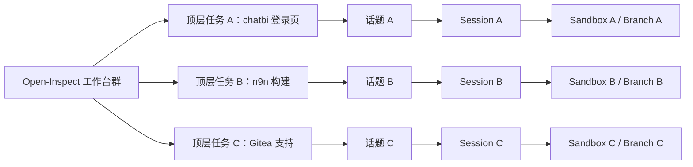
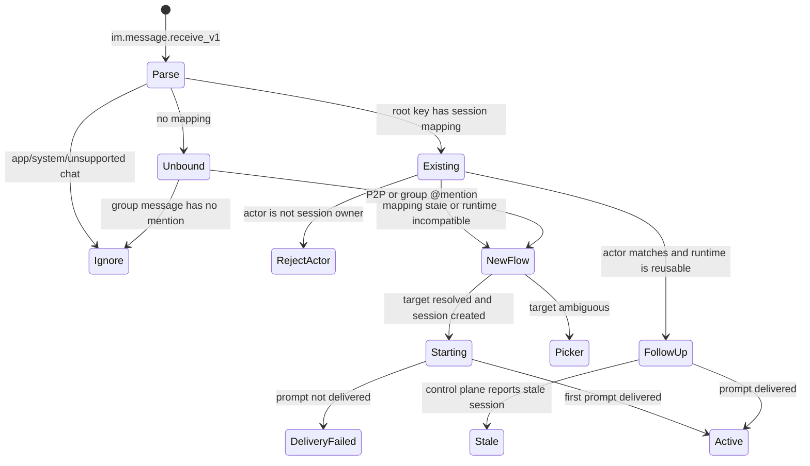

# 飞书并行线程会话实施方案

## 状态

**Implementation in progress
— 生产线程路由、单话题续办、单仓库绑定、视觉截图/预览回传、私聊多会话和 rollout 回滚 E2E 已验收；跨用户和飞书移动端交互仍待完成。**

本文是把飞书多会话体验对齐 Slack thread 的实施依据。它聚焦已经上线的
`packages/feishu-bot`，替代早期总方案中“用 `root_id`
即视为已完成线程体验”的假设；通用飞书入口、SCM、Harness、截图和预览架构仍以
[飞书机器人入口方案](./feishu-bot-integration.md) 与 [飞书集成文档](../integrations/FEISHU.md)
为准。

实施完成后的核心不变量是：

> 一个飞书话题只绑定一个 Open-Inspect session；一个 session 只绑定一个 sandbox、固定仓库和固定分支。

新顶层任务可以并行创建新 session；在已有话题中的消息只能续办该话题绑定的 session，绝不能因为模型、关键词或最近使用记录切换到另一个 session。

## 1. 当前问题与代码证据

Slack 已经把展示层和路由层统一到 `thread_ts`：

- `packages/slack-bot/src/events/message-handler.ts` 用 `event.thread_ts || event.ts` 作为 thread
  key；
- `packages/slack-bot/src/sessions/thread-session-store.ts` 保存 `channel + threadTs -> session`；
- 仓库澄清、工作状态、完成消息和媒体都携带相同的 `thread_ts`；
- thread follow-up 会读取映射并投递到原 session。

飞书目前只实现了路由层：

- `packages/feishu-bot/src/events/dispatcher.ts` 用 `message.root_id || message.message_id` 生成
  `rootMessageId`；
- `packages/feishu-bot/src/conversation/store.ts` 保存
  `tenantKey + chatId + rootMessageId -> session`；
- 但是 `packages/feishu-bot/src/feishu/client.ts` 的回复 body 没有
  `reply_in_thread`，确认、仓库卡、工作卡、完成卡和图片仍出现在主 timeline；
- 入站 schema 没有读取 `thread_id`；
- 群聊在查询已有 session 之前就要求每条消息都 @机器人；
- 若干 session 错误仍调用 `sendFeishuText(chatId)`，会逃离原话题；
- “会话列表”只包含 Web 链接、目标和模型，不能清楚展示并行分支、Harness、状态或飞书话题归属。

飞书回复消息 API 支持 `reply_in_thread=true`。官方 Lark
CLI 对该字段的语义是：回复进入目标消息的话题而不是主消息流：

- [飞书回复消息 API](https://open.feishu.cn/document/server-docs/im-v1/message/reply)
- [Lark 官方 CLI：reply in thread](https://github.com/larksuite/cli/blob/main/skills/lark-im/references/lark-im-messages-reply.md)

## 2. 产品与交互决策

### 2.1 群聊是并行开发的主工作面

创建一个固定的“Open-Inspect 工作台”普通群或话题群并加入机器人。不是每个 session 创建一个群；一个群可以承载多个并行话题：



交互规则：

1. 群内一条新的顶层 `@Open-Inspect` 消息创建一个新话题和新 session。
2. 首条“已收到”、代码源/仓库选择、工作卡都回复到这个话题。
3. 用户在话题中继续发送消息时，投递到唯一绑定的 session。
4. session 的完成、失败、截图、预览和 PR 都回复到同一话题。
5. 要更换仓库、分支或 Harness，必须创建新顶层任务；已启动 session 不允许原地切换。
6. 两个话题可同时运行，不设置 chat 级别的隐式“当前 session”。

### 2.2 私聊是控制中心和兼容入口

飞书私聊客户端不作为原生多话题体验的强依赖。私聊保留：

- 顶层消息默认创建新 session；
- 引用回复一个已绑定的根消息或机器人卡片时，续办对应 session；
- 卡片始终显示 session 短编号、仓库、分支、Harness、模型和状态；
- “会话列表”可以打开 Web session；第二阶段增加 `#短编号` 显式续办；
- 不实现“最后活跃 session 就是当前 session”，避免多个沙盒并行时串线。

### 2.3 群内是否需要重复 @

最终体验是：新顶层任务必须 @机器人；已绑定话题中由原发起人发送的后续消息无需重复 @。

但飞书当前权限边界需要明确处理：只有 `im:message.group_at_msg:readonly`
时，机器人通常收不到未 @ 的话题后续消息。要实现无 @ 续办，需要申请该租户当前版本中“获取群组中所有消息”的应用权限（通常为
`im:message.group_msg`），这会让机器人收到所在群的其他消息。代码必须先检查话题映射，再丢弃未绑定、未 @ 的群消息，不记录完整无关消息内容。

因此发布分两档：

| 模式                   | 权限           | 行为                                            |
| ---------------------- | -------------- | ----------------------------------------------- |
| Mention follow-up      | 现有群 @ 权限  | 原生话题隔离可用，但每条 follow-up 仍需 @机器人 |
| Bound-thread follow-up | 群全部消息权限 | 已绑定话题无需 @；未绑定且未 @ 的消息立即忽略   |

## 3. 目标消息和会话模型

### 3.1 稳定路由键

`rootMessageId` 继续作为稳定路由键。创建话题前的首条事件尚没有 `thread_id`，而第一个
`reply_in_thread=true` 回复会派生话题；如果中途改用 `thread_id`
作为主键，首回合和后续回合会落入不同 KV key。

```ts
type FeishuReplyMode = "thread" | "flat";

interface FeishuConversationCoordinates {
  tenantKey: string;
  chatId: string;
  chatType: "p2p" | "group";
  rootMessageId: string; // stable session routing key
  threadId?: string; // Feishu presentation coordinate only
  replyMode: FeishuReplyMode;
}
```

解析规则：

1. `rootMessageId = message.root_id || message.message_id`；
2. 保存 `message.thread_id`，但不用于替换 KV 主键；
3. 已经携带 `thread_id` 的事件强制 `replyMode=thread`；
4. 新群顶层任务且线程创建开关开启时使用 `replyMode=thread`；
5. P2P 顶层任务默认 `replyMode=flat`；
6. 旧记录或旧 callback 没有 mode 时默认 `flat`，避免滚动部署期间意外改变投递位置。

### 3.2 KV 记录 V2

沿用现有 KV key，不做破坏性迁移：

```text
thread:<tenantKey>:<chatId>:<rootMessageId>
session-index:<tenantKey>:<chatId>:<actorId>
```

写入 V2 记录，读取时兼容旧记录：

```ts
interface FeishuThreadSessionV2 {
  version: 2;
  sessionId: string;
  actorId: string;
  repositoryKey: string;
  targetLabel: string;
  branch?: string;
  harness: AgentHarness | "inherit";
  model: string;
  reasoningEffort?: string;
  chatType: "p2p" | "group";
  replyMode: "thread" | "flat";
  rootMessageId: string;
  threadId?: string;
  state: "starting" | "active" | "delivery_failed" | "completed" | "failed";
  createdAt: number;
  updatedAt: number;
  lastMessageId?: string;
}
```

要求：

- V1 记录解析后补默认值，不批量扫描或删除现有 KV；
- 创建 session 成功后、发送首 prompt 之前写入 `starting`
  映射，消除工作卡出现后用户立即回复却找不到映射的窗口；
- 首 prompt 成功后置 `active`，未送达置 `delivery_failed`；完成 callback 置 `completed` 或
  `failed`；
- 每次有效 follow-up 和 completion 刷新 TTL；
- TTL 初期保持现有 7 天以与 Slack 一致，后续若产品要求长期恢复，再单独设计 D1 持久索引，不在本变更中混入存储迁移。

### 3.3 Shared callback 兼容

给 `FeishuCallbackContext` 增加可选字段：

```ts
chatType?: "p2p" | "group";
threadId?: string;
replyMode?: "thread" | "flat";
```

字段保持可选以兼容：

- 已在运行的旧 session；
- Control Plane 与 Feishu Worker 的滚动部署；
- completion queue 中已经存在的 V1 job。

`FeishuCompletionJob`
同样增加可选字段，不提升 queue 版本。旧 job 默认投递到 flat；新 job 按 callback 中固定的 mode 投递。线程创建 feature
flag 只控制**新任务是否创建话题**，不能把一个已经绑定话题的 completion 降级到主 timeline。

### 3.4 完整运行时选择

仓库选择不能直接隐式启动部署默认 Harness，否则飞书入口与 Web 的 launch
spec 会分叉。当前 Feishu 卡片在代码源/仓库选择后读取 control-plane 的 readiness-aware runtime
catalog，并按以下顺序暂存选择：

```text
代码源 → 仓库 → Harness → 模型/route → Effort → 创建 session
```

每个动作都重新用服务端目录校验 Harness、route、model 和 effort，pending
KV 只保存不含密钥的选择。最终请求把 `runtime.harness`、`runtime.routeId`、`runtime.model` 和可选的
`runtime.effort` 传入与 Web 相同的 session-create
resolver。Harness 的只读部署策略在卡片中展示；需要输入文本的用户设置仍在 Web 设置中完成。`/help`、`/new`
等产品命令从共享命令目录展示，命令执行仍走已存在的 session command
endpoint，不在卡片回调中复制一套协议。

如果首条消息唯一包含了完整的 `owner/repo`，dispatcher 也只把仓库解析为暂存状态，随后进入同一Harness
→ 模型/route →
Effort 卡片链；不会因为“已经推断出仓库”而绕过运行时校验。只有运行时目录服务暂时不可用时，才保留旧版部署默认 Harness 的兼容降级路径，并在后续卡片交互恢复完整校验。

## 4. 出站消息设计

### 4.1 统一回复结果

`createMessageResponseSchema` 不再只解析 `message_id`，改为：

```ts
interface FeishuSentMessage {
  messageId: string;
  rootMessageId?: string;
  parentMessageId?: string;
  threadId?: string;
}
```

回复 helper 接受统一 options：

```ts
interface FeishuReplyOptions {
  replyInThread?: boolean;
  idempotencyKey?: string;
}
```

body 在 `replyInThread` 明确时携带 `reply_in_thread`；幂等 key 映射到飞书
`uuid`。调用方只保存返回的 opaque ID，绝不推导 URL 或 repo。

### 4.2 Session delivery facade

新增 `packages/feishu-bot/src/conversation/delivery.ts`，提供：

```ts
replySessionText(env, coordinates, text, idempotencyKey?)
replySessionCard(env, coordinates, card, idempotencyKey?)
replySessionImage(env, coordinates, imageKey, idempotencyKey?)
```

规则：

- 始终回复 `coordinates.rootMessageId`；
- `coordinates.replyMode === "thread"` 时统一发送 `reply_in_thread=true`；
- session 相关错误、权限拒绝、仓库刷新提示和媒体警告也必须通过 facade；
- `sendFeishuText/Card(chatId)` 只允许用于会话列表、安装提示等明确的 chat-level 通知；
- lint 无法表达该语义，因此用调用点审计测试和 `rg` 发布检查防止重新泄漏到主 timeline。

### 4.3 卡片信息层级

工作卡和完成卡统一显示：

```text
[#A12F] huangdong/chatbi · codex · branch/codex-login
状态：正在启动 / 工作中 / 已完成 / 失败
模型：gpt-5.6-luna · effort: high
```

短编号由 `sessionId`
的不可逆短摘要生成，只用于显示和显式查找，不能作为授权凭据。卡片动作仍使用 opaque pending/action
ID 并校验 actor、chat、root 和 session。

会话列表至少显示：短编号、SCM/repo、分支、Harness、模型、状态、创建时间和 Web 链接。若飞书提供经过验证的稳定话题 deep
link 再增加“打开话题”，不能自行拼接未公开 URL。

## 5. 入站路由状态机



执行顺序必须是：

1. 验证、解密和事件去重；
2. 解析 actor、chat、root/thread 坐标和文字；
3. 查询已有 root → session 映射；
4. 若存在映射，先执行 actor/runtime/stale 检查，再决定是否要求 mention；
5. 若不存在映射，P2P 允许新建，群聊必须 @机器人；
6. 发送话题内回执；
7. 续办或进入目标选择/新建流程。

这能保证启用“群全部消息”权限后，未绑定群消息只发生一次 KV lookup，不进入 repo catalog、Control
Plane、模型或日志正文。

## 6. 文件级改动清单

| 文件                                                                  | 具体改动                                                                        |
| --------------------------------------------------------------------- | ------------------------------------------------------------------------------- |
| `packages/feishu-bot/src/events/payload.ts`                           | 解析 `thread_id`；增加 payload fixtures                                         |
| `packages/feishu-bot/src/feishu/client.ts`                            | 回复 options、`reply_in_thread`、`uuid`、完整 response schema                   |
| `packages/feishu-bot/src/conversation/delivery.ts`                    | 新增 session-scoped text/card/image facade                                      |
| `packages/feishu-bot/src/conversation/store.ts`                       | V2 mapping、reply mode、thread metadata、状态和 TTL refresh                     |
| `packages/feishu-bot/src/events/dispatcher.ts`                        | 先查映射再做 mention gate；所有 session 回复走 facade；创建时写 starting/active |
| `packages/feishu-bot/src/interactions/card-actions.ts`                | pending record 保留 chat/reply mode；分页、错误与启动均回原话题                 |
| `packages/feishu-bot/src/completion/job.ts`                           | 可选 chat/thread/reply mode 字段，兼容 V1                                       |
| `packages/feishu-bot/src/callbacks.ts`                                | callback context 原样传递线程坐标到 queue job                                   |
| `packages/feishu-bot/src/completion/delivery.ts`                      | 完成卡走 session facade；更新 mapping 终态                                      |
| `packages/feishu-bot/src/completion/media-upload.ts`                  | 截图、聚合警告携带相同 reply mode；保持媒体幂等记录                             |
| `packages/feishu-bot/src/cards.ts`                                    | session 短编号、branch、Harness、effort、状态和入口说明                         |
| `packages/feishu-bot/src/sessions/runtime-catalog.ts`                 | 读取 control-plane readiness catalog，过滤异常/未就绪项                         |
| `packages/feishu-bot/src/interactions/card-actions.ts`                | 分阶段暂存 repo/Harness/model/effort，最终携带完整 runtime launch fragment      |
| `packages/feishu-bot/src/conversation/store.ts`                       | pending 记录保存不含密钥的运行时选择并刷新 TTL                                  |
| `packages/feishu-bot/src/types/index.ts`                              | 新增线程创建和 bound-follow-up feature flag                                     |
| `packages/shared/src/types/session-api.ts`                            | callback context 可选 thread fields；先构建 shared                              |
| `packages/control-plane/src/session/callback-notification-service.ts` | 保证新增字段签名后原样回传；补回归测试                                          |
| `terraform/environments/production/variables.tf`                      | 新增两个布尔 rollout 变量，默认 false                                           |
| `terraform/environments/production/workers-feishu.tf`                 | 传入 Worker 环境变量                                                            |
| `.github/workflows/terraform.yml`                                     | 从 repository secret/variable 传入 rollout flags                                |
| `terraform/environments/production/terraform.tfvars.example`          | 记录开关、权限依赖和最终推荐值                                                  |
| `docs/integrations/FEISHU.md`                                         | 更新群工作台、话题续办、私聊降级、权限与 E2E runbook                            |

建议环境变量：

```text
FEISHU_THREAD_REPLIES_ENABLED=false
FEISHU_BOUND_THREAD_FOLLOWUPS_ENABLED=false
```

Terraform 对应：

```hcl
feishu_thread_replies_enabled          = false
feishu_bound_thread_followups_enabled  = false
```

第二个变量为 true 时，部署检查和文档必须明确要求群全部消息权限。生产最终推荐两个都为 true；若租户不批准较宽权限，则保持第一个 true、第二个 false，用户在话题 follow-up 时继续 @机器人。

## 7. 分阶段执行

### 阶段 A：协议和兼容层

- [x] shared callback schema 增加可选 thread fields；先构建 `@open-inspect/shared`；
- [x] Feishu event schema 解析 `thread_id`；
- [x] Feishu reply client 支持 `reply_in_thread` 和完整 response；
- [x] completion job 接受旧/新 payload；
- [x] 增加 client、payload、callback 和 queue compatibility tests。

阶段门：旧 fixture、旧 KV record、旧 completion job 仍能解析；feature
flag 关闭时出站 body 与当前生产等价。

### 阶段 B：统一 delivery 和路由

- [x] 新增 session delivery facade；
- [x] 替换 dispatcher、card actions、completion、media 的所有 session-scoped send/reply；
- [x] 调整 mention gate 顺序；
- [x] 增加 V2 mapping 和 starting/active/completed/failed 状态；
- [x] 增加两个并行 root key 的隔离测试；
- [x] 增加错误、跨用户、stale 和 runtime mismatch 测试。

阶段门：代码审计中除明确的 chat-level 通知外，不再有 session 错误通过 `sendFeishuText/Card(chatId)`
发出。

### 阶段 C：卡片和私聊降级

- [x] 工作/完成/会话列表卡显示短编号、repo、branch、Harness、模型和状态；
- [x] 私聊卡提示“引用回复此任务继续；发送新顶层消息创建新任务”；
- [x] 群话题卡提示“在本话题继续即可”；
- [x] 支持 `#短编号` 显式续办，但不得引入 chat-level active session；
- [x] 手机端保留当前按钮分页，不恢复会被输入法遮挡的下拉选择器。
- [x] 仓库选择后按 readiness
      catalog 分阶段选择 Harness、模型和 Effort；旧部署目录不可用时保留默认启动兼容路径。
- [x] 卡片展示共享产品命令；命令执行仍复用 Control Plane endpoint，不在 Feishu 复制协议。

阶段门：仅看任意一张截图也能判断它属于哪个 repo、branch 和 session。

### 阶段 D：部署、权限和真实 E2E

- [x] 向后兼容代码已部署到生产；
- [x] 生产已开启 thread replies，并验证根消息派生原生话题；
- [x] 验证带 @ 的两个话题并行 E2E；
- [x] 已发布群全部消息权限；
- [x] 已开启 bound follow-up，并验证已绑定话题内不 @ 续办；
- [x] 已验证一个话题只绑定一次仓库；旧仓库卡和并发选择由服务端拒绝；
- [x] 无沙盒时的 pending prompt 有独立派发 deadline，启动失败不会把会话永久留在 Running；
- [ ] 在生产验证跨用户和未过期旧卡片负向路径（未绑定、未 @ 群消息忽略已在 7.1 验证）；
- [ ] 完成飞书手机端验收（Web、飞书桌面/网页已验证）；
- [x] 已观察错误率后扩大应用可见范围；当前窗口与历史边界记录见 7.16，继续保留运行监控。

### 7.1 生产验收证据（2026-08-28）

- 最新运行时选择修复 commit：`c2f3639e`；CI `33165951905` 与 Terraform `33165951891`
  均成功。生产 Feishu Worker 最新版本为
  `e56064f5-19e3-4828-9639-3f2ce3353390`（100% 流量）。本地 Feishu
  dispatcher 回归为 89 项，新增覆盖“正文唯一命中 repo 仍进入 Harness 选择”的路径。
- 开发者后台现已添加并发布 `im.message.receive_v1`，事件请求地址为生产 Worker 的
  `/events`，卡片回调仍指向
  `/card-actions`。因此消息入口配置已完成；真实消息 E2E 已完成一条无副作用 smoke
  test，仍需按下文范围补齐截图、preview、PR、跨用户和移动端路径。

- 19:19 发送无副作用 smoke
  test 后，机器人先回“已收到，正在工作中”，代码源卡列出 Gitea（64 个仓库）和 GitHub（24 个仓库）；分页后选择
  `gitea · huangdong/chatbi`，随后依次显示 Harness、模型和 Effort 卡。Harness 卡实际列出 OpenCode、Codex、Claude
  Code、DeepSeek Harness，模型卡列出 GPT 5.6 Luna。
- 19:23 生成工作卡 `#8CDF69`；对应 Web session `c4b3a85ad383d51621d9d627598398b1` 显示
  `Connection status: Connected`、`Sandbox status: Ready`，详情为 Gitea
  `huangdong/chatbi`、Codex、GPT 5.6 Luna、`main`。19:26 同一飞书话题收到 `#8CDF69`
  完成卡；Codex 报告仅完成只读检查，仓库无文件变化。该证据覆盖消息回执、双 SCM 入口、Gitea 仓库分页、Harness/模型/Effort 选择和同话题完成投递，但没有覆盖截图/preview/PR（本测试明确不修改文件）。

- 19:35 创建第二个顶层任务，选择 GitHub `summersmile1984/flow-pilot`、Codex、GPT 5.5，生成工作卡
  `#A41DFC`；Web session `3bdfa52b4bbc870d18b125a91f2b423d` 显示独立的 Connected/Ready 沙盒和 GitHub
  `master`。19:41 同一话题收到 `#A41DFC`
  完成卡，仓库检查无文件变化。期间故意在已绑定的 Gitea 话题内发送 GitHub 文本，系统正确回执“沿用 huangdong/chatbi”，证明话题不能原地换 repo。Codex 尝试的 child-session 操作返回
  `HTTP 409: Approval policy cannot be configured at session scope`，未创建额外可运行子会话，不影响父会话完成。
- 随后在同一飞书群发送未 @ 机器人的顶层消息
  `Open-Inspect negative routing smoke test: no bot mention, this message should be ignored.`；等待 5 秒未出现机器人回执、选择卡或新会话，证明未绑定群消息不会误触发运行时流程。
- `f513d3c0`、`eea83f19`、`53c108ec` 与 `9313bd48` 已通过 CI/Terraform 并部署到生产 Feishu
  Worker；最新版本为 `06152f32-c267-44dd-906f-243f4a57fd95`，`/healthz` 返回
  `{"ok":true,"service":"feishu-bot"}`。本轮补齐 `chat_type=topic_group`
  的 schema 兼容和内部 group 归一化，并以 95 项 Feishu bot 测试覆盖；私聊带 `root_id` 或仅带
  `parent_id` 的引用回复、PR 完成卡的同话题投递和关闭线程 rollout
  flag 的 flat 降级也已加入回归测试，分别按根消息续办、原话题附带 PR
  URL，以及不影响既有 session 的方式校验。

- 后续回归又覆盖了“引用回复只带 `root_id`/`parent_id`、不带
  `thread_id`”的客户端变体：若根消息已绑定 native topic，dispatcher 会从 KV 恢复已存的
  `threadId/replyMode`，不会把 follow-up 降级到主 timeline；Feishu
  bot 本地回归现为 96 项，类型检查和 lint 均通过。

- 进一步为机器人发出的回执、工作卡、完成卡和截图建立了按租户/会话隔离的短期消息别名；私聊引用机器人卡片时，即使事件只携带该卡片的
  `parent_id`，也能回到原 session。别名不保存消息正文或密钥，沿用线程 TTL，并在 KV 写入失败时不阻断原消息投递；相关回归后本地 Feishu
  bot 测试为 100 项。

- `99fe1174`
  将媒体聚合警告也纳入同一条话题和消息别名路径，覆盖超大或失败截图的可引用回执；本地 Feishu
  bot 回归为 100 项，且警告不会写入媒体 key 或阻断原始完成回调。

- `99fe1174` 的 CI run `33176231774` 与 Terraform run `33176231669` 均成功；生产 Feishu
  Worker 已更新至 `7d628157-c202-42e3-88ec-8970991ee0a8`（100% 流量，2026-08-28 13:38 UTC）。

- `d6b9b601`、`440a981e` 和 `83e94541` 均通过 CI/Terraform；其中最新运行时变更为
  `83e94541`，将截图回复也纳入同一套租户/会话消息别名。Terraform run `33174468456` 与 CI run
  `33174468464` 均成功，生产 Feishu Worker 当前 100% 流量版本为
  `d81401e0-57b0-4d59-80bd-e614068e6b97`（2026-08-28 13:15 UTC）。

- 部署 commit：`98e049005f863b16731d52da3781ad94615b2ea0`；Feishu Worker version：
  `69d6a408-0881-43df-bf44-88882362f86a`；Terraform 与 CI 均通过。
- 生产绑定：`rootMessageId=om_x100b663b27bdcc80c2ac06358227de0`、
  `threadId=omt_19f57e5e220d1b86`、`replyMode=thread` →
  `sessionId=d0ecc91821aa7dcf8d8da93bb81b8599`、`repo=huangdong/chatbi`、
  `harness=codex`。飞书卡显示短编号 `#95AC9C`，与该 session ID 的摘要一致。
- 15:23 在既有话题发送不带 @ 的 follow-up；机器人先在原话题发送“已收到”回执，15:24在同一话题返回
  `#95AC9C` 完成卡。KV 的 `sessionId` 和 `repositoryKey` 保持不变，只刷新
  `updatedAt`/`lastMessageId`，且没有再次发送仓库选择卡。
- 生产 Worker 绑定显示 `FEISHU_THREAD_REPLIES_ENABLED=true`、
  `FEISHU_BOUND_THREAD_FOLLOWUPS_ENABLED=true`；completion 日志记录相同的 root/thread/session 坐标并成功投递。
- 后续部署 commit `b13d0e958d1a85ae097bb3f28378ba169c01fe01`，Feishu Worker version
  `194c541d-9aad-4c0f-8555-adadc1696145`。16:16 再次在同一话题发送不带 @ 的 follow-up；回执明确显示“本话题沿用已绑定仓库，无需重新选择”，并在同一
  `#95AC9C` 完成卡返回 `feishu-parallel-gitea-ok`。日志记录 `mapping_found=true`，Control
  Plane 将 prompt 派发给原
  `sessionId=d0ecc91821aa7dcf8d8da93bb81b8599`；KV 的 root/thread/repository/session 坐标保持不变，D1 显示
  `message_count=9`、`provider=gitea`、`repo=huangdong/chatbi`、`status=completed`。
- 16:06 重放同话题 10:50 的旧仓库选择卡，服务端返回“该选择已过期或无权操作”，没有创建 session；本次实际命中
  `pending` 过期校验，不能替代仍待执行的未过期旧卡/跨用户负向用例。
- 16:09 创建 GitHub 测试话题后，代码源卡正确列出 GitHub 与 Gitea，GitHub 仓库按钮分页也正常；原计划指定的
  `summersmile1984/n9n` 不在 App 返回的全部 24 个 GitHub 仓库中，已登录 GitHub API 和
  `git ls-remote` 均返回 404。随后在该话题选择实际存在的 `summersmile1984/flow-pilot`，创建独立
  `sessionId=7b4ac83dd27803e76452a2e71207f678`、短编号 `#16ED73`、base branch
  `master`。16:23 在 GitHub 话题发送不带 @ 的 follow-up，回执显示沿用 `flow-pilot`
  且无需重新选择，16:25 和 16:26 的两张完成卡均回到同一 GitHub 话题。
- 最终 D1 记录 GitHub session `message_count=2`、Gitea session `message_count=9`，两者均为
  `status=completed`，provider/repo/branch/session 均不交叉。GitHub 执行期间 Control
  Plane 日志仍记录 Gitea session 的 sandbox
  WebSocket 保持连接，证明两个 session/sandbox 同时存在；两个 Feishu completion
  delivery 也各自携带不同 root/thread/session 坐标。
- 本轮证明“双 SCM 两话题隔离”“同一话题续办不重选仓库、不换 session”和旧卡无法控制 session。截图/preview/PR 归属、跨用户、未过期旧卡、私聊双 session 和手机端仍按下文 Runbook 验收；rollout 回滚演练已在 7.15 完成。

### 7.2 生产视觉模板回归（2026-08-28）

- 运行时修复 commit：`efff7ad4`；生产 E2B/Cube 模板：`tpl-a0ff1eda32964a68940db1bb` （镜像 digest
  `sha256:e770f464e7c63732ef25002690f54dd344f0204c4e44176d8036f88f2f521a34`），规格为 4 vCPU / 8
  GiB；GitHub Actions Terraform run `33159835710` 成功。
- 新建生产会话 `808b467e874ee67ecd78c9b1f0e699b2`（Gitea `huangdong/chatbi`、Codex、
  `openai/gpt-5.6-luna`）实际落到 sandbox `3c910d3f12fb40458c5822d6224531f8`，provider
  inventory 显示上述新模板与资源规格。
- 启动证据：AIO Chromium CDP `127.0.0.1:9222`、Browser MCP `127.0.0.1:8100`、Codex bridge、Gitea
  clone 和 managed skills 均成功；`sandbox.startup` 记录
  `git_sync_success=true`、`setup_success=true`、`start_success=true`。
- `/tmp/open-inspect-dev-services.json`
  已写入空注册表（`manifestPath=null`、`services=[]`），证明本轮修复已进入生产模板。`chatbi` 没有
  `.openinspect/environment.yaml`，所以它不具备可监督服务，视觉验证按契约应返回结构化
  `config_missing`/`service_not_found`，不能声称截图通过。
- 本次 Codex 视觉请求随后因 sandbox 内访问 `https://chatgpt.com/backend-api/ps/mcp`
  持续网络重试和模型刷新超时而失败，未产生 artifact/preview；这是 Harness 网络依赖问题，不是沙盒启动或元数据缺失问题。该负向结果保留，不能计入“截图/preview 已验收”。
- 后续修复 commit `48936883` 已将生产 relay 的 native Codex ChatGPT base URL 指向
  `https://codex-relay-summersmile1984.89347589.org/backend-api`，并在 Host relay 中仅开放
  `/ps/mcp`（含 `/backend-api/ps/mcp`）到 ChatGPT 上游；Responses 与插件路径仍按原有严格白名单处理。
- 为了把该运行时修复放进 Cube 镜像，构建了模板
  `tpl-e486bfcb5d3e4854a57c9c03`；模板构建任务和分发均显示 `READY`，但直接调用 Cube
  `POST /sandboxes` 连续返回
  `reset guest time failed:ttrpc err: Receive packet timeout`，即模板“可构建”不等于“可恢复创建”。同期已知模板
  `tpl-a0ff1eda32964a68940db1bb` 能正常创建，因此生产通过 Terraform run `33180831569`
  回滚到旧模板，避免把不稳定模板暴露给用户。宿主 relay 与控制面代码仍已部署，期间生产沙盒镜像保持旧版本，未影响已有会话。
- 随后使用同一源码、关闭 BuildKit provenance/SBOM attestation 的镜像构建验证：模板
  `tpl-d979943f4f7940968f3e4075` 成功 `READY`，直接 `POST /sandboxes` 返回 HTTP 201（sandbox
  `d0f95a6ece3a43bcbddb9ff0ab81c0cb`），并已立即删除探针。故构建脚本现在显式使用
  `docker build --provenance=false --sbom=false`。随后用同一脚本重新构建为单架构 manifest（digest
  `sha256:4e0fb201bbd5d2f17bd25206c8d4219013ac768c2950d7d2ed05d00b7db41db1`），模板
  `tpl-464c46bfbf24455cbf3256bc` 成功 `READY`，直接 `POST /sandboxes` 返回 HTTP 201（sandbox
  `f2d5a618dfc448aca1bc3e3a572cd0aa`），并已删除探针。
- commit `6b448eb6` 的 CI run `33182063247` 与 Terraform run `33182063477`
  均成功；确认单架构模板可以恢复创建后，更新生产 secret `E2B_TEMPLATE_ID` 并执行 Terraform workflow
  `33182599342`，Validate/Apply 均成功。当前新会话使用
  `tpl-464c46bfbf24455cbf3256bc`，已有会话仍留在其原模板，不做热迁移。
- 用 create-time 环境做的最小启动探针证明 `envd /health` 可达（HTTP
  204），但没有真实 session 的控制面凭据时，Codex
  supervisor 不会形成完整桥接，CDP/MCP 端口未进入可用态，探针随后按 TTL 清理。因此这只证明模板恢复和 launcher/envd 路径，不计入 Codex
  MCP 鉴权、桥接、截图/preview 或飞书视觉 E2E；这些仍需使用真实会话完成。

### 7.3 生产 Gitea 运行时选择回归（2026-08-29）

- 在生产飞书网页的 `Open-Inspect 工作台` 话题中完成了一次只读回归：代码源卡显示
  `Gitea · 64 个仓库`，分页为 11 页；第 2 页成功选择
  `huangdong/chatbi`。随后依次出现 Harness、Codex 模型和 Effort 卡，卡片列出 OpenCode、Codex、Claude
  Code、DeepSeek Harness，以及 `/help`、`/model`、`/effort`、`/new`。
- 本次实际创建的生产 session 为 `60239e8fcdcd980d7c878c4451bd4737`，D1 记录为 `status=completed`、
  `provider=gitea`、`repo=huangdong/chatbi`、`branch=main`、`agent_harness=codex`；运行时解析为
  `codex:openai:subscription`、`openai/gpt-5.6-luna`、`xhigh`。完成卡回到同一飞书话题，并返回只读 smoke
  test 的预期文本；没有文件修改、提交或 PR。
- 首次点击 Gitea 时，卡片在跨 Worker 目录请求期间显示 loading，随后提示“目录刷新中”。只读检查确认当前 Gitea
  connection 已启用、PAT 可调用 Gitea API，控制面 KV 最终写入 64 条仓库且包含
  `huangdong/chatbi`；等待缓存完成后重新点击，仓库分页卡正常出现。因此该现象是冷目录刷新/边缘缓存时序，不是 PAT 失效或 Gitea 域名错误。
- 飞书会保留历史卡片消息，重复选择时旧的模型/Effort 卡仍可能与新卡同时可点击；本次浏览器回归因此命中了旧的 Luna/Effort 卡。服务端仍以 pending/action 校验和 session
  claim 保证最终只创建一个 session，但 UI 后续应增加“卡片已过期/当前步骤”提示或禁用旧卡，降低人工误点风险。
- 本轮只验证消息回执、Gitea 目录分页、仓库绑定、Harness/模型/Effort 选择和完成消息；截图、preview、PR、跨用户及手机端遮挡仍不计入通过项。

### 7.4 冷目录与历史卡片修复发布（2026-08-29）

- `e9313599` 将 Control
  Plane 的 SCM 目录写入改为 8 路有界并发，保持上游仓库顺序并避免无限制 D1 写入突发；Feishu
  pending 记录新增单调
  `selectionRevision`，每次代码源、仓库、Harness、模型或 Effort 选择都会推进版本，旧卡的回调在服务端拒绝。旧版无该字段的卡仍按兼容路径处理。
- 本地验证：Feishu bot 102 项、Control Plane 单元 2857 项、Control
  Plane 集成 875 项、全仓 typecheck/lint 均通过。新增回归覆盖有界并发目录写入、选择版本递增和旧卡拒绝。
- GitHub Actions CI `33189747266` 与 Terraform `33189746847` 均成功；生产 Feishu Worker 版本
  `7c748f35-f860-4823-bc17-e92787dbf7ba`、Control Plane 版本
  `c723361d-b90d-452a-a429-9718f80722f6`，Feishu `/healthz` 返回 `ok=true`。
- 已有生产话题继续沿用 `huangdong/chatbi`
  的同一 session；服务启动验证显示仓库未修改，但该仓库的 README 依赖 PostgreSQL/Cube，生产 sandbox 镜像没有 Docker，因此只能启动前端临时服务，数据库相关功能不计入本轮通过项。

### 7.5 发布后复核（2026-08-29）

- 生产健康检查通过：Feishu Worker `/healthz` 返回 `{"ok":true,"service":"feishu-bot"}`；Control
  Plane `/health` 返回 `{"status":"healthy","service":"open-inspect-control-plane"}`。
- 发布后本地回归再次通过：Feishu bot 17 个测试文件/102 项，sandbox visual-verification
  47 项通过（1 项按设计跳过），全仓 typecheck 通过；工作区保持干净。
- 通过已登录飞书网页确认生产卡片仍显示 Gitea 仓库、Harness、模型和 Effort，并保留同话题完成消息。浏览器当前可见的独立 AIO 预览页也能加载并显示
  `Chromium + CDP + Browser MCP + Cube ready`。
- `d83f86c6` 补充了“截个图/截屏/预览/截图”等自然语言视觉请求识别；CI `33192629856` 与 Terraform
  `33192629876` 均成功。当前生产 Feishu/Control Plane 版本分别为
  `679c1f0d-c4c7-4be5-9f73-97baefffb094` 与 `c46b1200-7e0b-4a1d-b314-e0f850cbeeda`。
- 当时仍未完成的项目是：第二个飞书身份的跨用户拒绝、手机端键盘遮挡、关闭 rollout
  flag 的回滚演练；截图/preview
  artifact 已在 7.8 的真实视觉 fixture 验收中补齐。当前环境仍只有一个飞书身份，因此跨用户路径需另行安排账号验证。

### 7.6 现场诊断：视觉请求排队（2026-08-28 17:20 UTC）

- 通过 Feishu bot 的只读 service-auth 请求读取生产 session `60239e8f...`
  的消息状态：旧的“截个图发给我”消息仍为 `processing`，新的“截图验证当前已绑定的 Gitea 页面”消息为
  `pending`。因此新消息已经进入正确的同一话题和同一 session，但被会话的单并发队列按顺序等待，不是仓库选择或 thread 路由失败。
- 旧消息的事件流在 `aio_browser/browser_screenshot` tool-call 后没有对应的
  `tool_result`/`execution_complete`；sandbox 最近仍上报
  `ready`，说明当前可见症状是 Harness/浏览器工具调用卡住，而不是 Feishu 回执丢失。生产默认执行超时为 90 分钟，故该 processing 消息在超时前会继续阻塞后续 prompt。
- 本次检查没有停止任务、重放消息或发送新的 Feishu 内容。恢复测试前应由用户在 Web/Feishu 对该旧任务执行一次显式 Stop（或等待受控超时），然后重新发送视觉请求；重新验证时应优先让平台视觉验证器生成 artifact，避免把
  `aio_browser` 手工截图调用当作完成证据。
- 该结果进一步说明完成定义中的“截图/preview 回到正确话题”尚未通过；当前可证明的是回执、仓库绑定、队列隔离和生产健康状态。

### 7.7 飞书命令路由与遗留队列保护（2026-08-29）

- 诊断确认飞书把 `/stop`
  当作普通消息事件，而不是 Slack 的独立 slash-command 请求；因此旧 Worker 会把它排进同一 session 的 Harness
  prompt 队列，无法及时停止卡住的视觉调用。
- Worker 现在对独立的已知命令做严格匹配，并通过带 Feishu service principal、actor 和幂等 invocation
  ID 的签名请求调用 Control Plane `/sessions/:id/commands`。`/stop`、`/status`、`/review`
  等命令不再进入 Harness；响应仍回到原话题，跨用户命令在 Worker 层拒绝。普通 `/api/v1`
  等路径文本不会被识别为命令。
- Control Plane 增加来源限定的遗留保护：命令路由上线前已经入队的 Feishu `/stop`
  等已知命令会从 pending 队列丢弃，不会在旧视觉请求结束后再次执行。Web/Slack 的 pending
  prompt 取消语义不变。
- 真实回归进一步发现：沙盒从 `running` 回落到 `ready` 但仍有 `processing`
  消息时，原有 stop 可用性判断会误报“当前状态不可用”。内部状态现在显式返回
  `isProcessing`，命令路由以该字段或沙盒 running 任一条件开放
  `/stop`，从而能停止浏览器工具卡住但沙盒心跳仍正常的任务。
- 本地新增 Feishu dispatcher 命令/跨用户测试和 Control
  Plane 遗留队列测试；真实飞书话题已验证命令回执、stop
  confirmation、队列恢复，以及旧消息不会触发 Harness。

发布验证记录：`35756563`（命令路由）、`bae9358d`（processing-aware stop）和
`deea6579`（中文错误提示）对应的 CI/Terraform 均成功。生产飞书网页实际看到 `/stop`
的“已收到命令，正在处理”与“已请求停止当前任务”，随后同一话题收到 `Execution was stopped`；`/status`
返回
`huangdong/chatbi@main`、Codex、`codex:openai:subscription`、模型、Effort、会话和沙盒状态。只读 service-auth 复核显示 processing/pending 队列在停止后均为空，旧版本遗留的 Feishu
`/stop` 未再送入 Harness。视觉截图请求本轮因 `chatbi`
缺少声明的视觉服务且原生浏览器调用无响应而停止，截图/preview artifact 仍不能标记为通过。

在 2026-08-29 04:38（飞书网页生产会话）又做了一次无副作用的同话题回归：向已绑定 `huangdong/chatbi`
的话题发送 `/status`，先收到“已收到命令，正在处理”，随后收到
`huangdong/chatbi@main`、`codex:openai:subscription`、`openai/gpt-5.6-luna`、Effort、`session: completed`、`sandbox: stopped`
的状态回执。该消息没有重新要求选择 repo，也没有创建新沙盒，证明已绑定 Gitea 话题的命令仍能沿用原 session 路由。

## 8. 自动测试矩阵

### 8.1 Unit

| 场景                    | 必须断言                                                   |
| ----------------------- | ---------------------------------------------------------- |
| 新群顶层消息            | root=message ID，mode=thread                               |
| 已有话题消息            | root 保持原 root，保留 thread ID，mode=thread              |
| P2P 顶层消息            | mode=flat                                                  |
| 旧 callback/job/KV      | 解析成功并默认 flat                                        |
| reply client            | body 包含正确 `reply_in_thread` 和 `uuid`                  |
| 线程 API 返回           | message/root/parent/thread ID 均被解析                     |
| 两个根消息              | 分别命中两个不同 session                                   |
| 同一话题 follow-up      | 只调用绑定 session 的 prompt endpoint                      |
| 未绑定、未 @ 群消息     | 不查 catalog、不建 session、不发消息                       |
| 已绑定、未 @ 群消息     | 开关开启且 actor 匹配时续办                                |
| 跨用户 follow-up        | 在原话题拒绝，不泄漏 session 细节                          |
| 仓库选择分页/错误       | 回复原 root，并保留 thread mode                            |
| 运行时卡片链            | repo 后按 Harness → model/route → effort 分阶段校验和启动  |
| 正文唯一命中 owner/repo | 先暂存推断出的 SCM connection/repo，再进入同一运行时卡片链 |
| completion/media        | 卡、截图和警告均回复原 thread                              |
| 重复 callback           | completion/media 幂等规则保持有效                          |

### 8.2 本地和 CI 命令

```bash
npm run build -w @open-inspect/shared
npm test -w @open-inspect/feishu-bot
npm test -w @open-inspect/control-plane
npm run typecheck
npm run lint
terraform -chdir=terraform/environments/production fmt -check -recursive
```

若改动 control-plane D1/DO 行为，再额外执行：

```bash
npm run test:integration -w @open-inspect/control-plane
```

本方案不改 Python sandbox 内的 Harness 协议或业务行为；为支持连接级 SCM Git Proxy，允许
`packages/modal-infra`、sandbox-runtime 和各 sandbox
provider 只增加环境变量传递与 fail-closed 校验。该 plumbing 不读取或持久化 Gitea
PAT，PAT 仍只在 Control Plane。

## 9. 真实飞书 E2E Runbook

浏览器 Web E2E 不能替代飞书 E2E。每次验证保存：部署 commit、时间、飞书 event ID、chat/root/thread
ID、Open-Inspect session ID、sandbox ID、repo/branch、Web session URL、PR
URL 和桌面/手机截图；日志中不得保存 prompt 正文或 token。

### 场景 1：两个并行 session

1. 在测试工作群发送顶层任务 A，明确选择 GitHub repo 和 branch A；
2. 在主 timeline 发送顶层任务 B，明确选择 Gitea repo 和 branch B；
3. 确认出现两个独立飞书话题；
4. 在 Web session 验证 A/B 分别有不同 session ID、sandbox ID 和 pinned repository/branch；
5. 在 A 话题发送“只修改 README 标题 A”，在 B 话题发送“只修改 README 标题 B”；
6. 验证两条 follow-up 投递到正确 session，文件、git branch 和 commit 不交叉；
7. 同时等待完成，确认完成卡分别回到对应话题。

### 场景 2：截图、预览和 PR 归属

1. A 请求视觉验证并启动预览；
2. B 创建 PR；
3. 确认 A 的截图与 preview URL 只在 A 话题；
4. 确认 B 的 PR 卡只在 B 话题；
5. 重放一个 completion callback，确认媒体不重复发送。

### 场景 3：权限和负向路由

1. 第二个测试用户在 A 话题续办，确认被拒绝且不投递 prompt；
2. 在群主 timeline 发送未 @ 的普通消息，确认无回复、无 catalog 和 session 调用；
3. 关闭 bound-follow-up 时，在话题不 @，确认不触发；加 @ 后可触发；
4. 开启并授权 bound-follow-up 后，在已绑定话题不 @，确认可触发；
5. 点击过期/重放的仓库卡，确认 actor/action/pending 校验拒绝；
6. 让一个旧 V1 session 完成，确认仍收到 flat completion，不丢消息。

### 场景 4：私聊和手机端

1. 私聊创建两个顶层 session，确认会话列表同时显示两者；
2. 引用回复各自任务继续，确认不会串 session；
3. 普通顶层消息始终创建新任务或进入仓库选择，不续办“最近任务”；
4. 手机端完成代码源、仓库分页选择和两个话题切换；
5. 确认输入法不会遮挡按钮，工作卡能辨认 repo/branch/session。

## 10. 可观测性和故障诊断

新增结构化字段，值均为 opaque ID 或枚举：

```text
chat_type
root_message_id
thread_id
reply_mode
session_id
session_state
mention_present
mapping_found
delivery_surface=thread|flat
fallback_reason
feishu_error_code
```

禁止记录完整消息正文、卡片 content、tenant token、App Secret、SCM PAT、sandbox capability。

上线观察：

- thread reply API 4xx/429/5xx 和 ambiguous outcome；
- mapping miss、stale session、cross-actor reject；
- session-scoped top-level send 计数，目标应为 0；
- completion queue retry/DLQ；
- 同 root 同时创建多个 session 的异常计数；
- 飞书 completion 到达时间与 Control Plane completion 时间差。

## 11. 灰度和回滚

### 灰度

1. 代码先向后兼容部署，两个 flag=false；
2. 测试群开启 `FEISHU_THREAD_REPLIES_ENABLED=true`，验证 mention 模式；
3. 飞书后台申请群全部消息权限、发布新应用版本并限制可见范围；
4. 开启 `FEISHU_BOUND_THREAD_FOLLOWUPS_ENABLED=true`；
5. 观察至少一次完整双 session、截图和 PR E2E 后再扩大范围。

### 回滚

- 首选关闭“新线程创建”开关，停止把新的根消息提升为话题；
- 已经存储 `replyMode=thread` 的 session 仍按原话题完成，避免结果突然跑到主 timeline；
- bound follow-up 有异常时单独关闭，不需要撤销整个飞书入口；
- 不清空 KV、不停止正在运行的 sandbox；用户仍可从 Web 继续 session；
- 若必须回退 Worker 版本，旧代码会忽略可选 callback 字段并 flat 回复，功能降级但不破坏 Control Plane
  session。

#### 可重复的生产演练入口

`.github/workflows/terraform.yml` 的 `workflow_dispatch` 提供两个显式输入：
`feishu_thread_replies_enabled` 和 `feishu_bound_thread_followups_enabled`。每个输入都可选
`inherit`（沿用同名 repository secret）、`true` 或 `false`；默认值为
`inherit`，因此手动触发不会意外改变当前生产开关。要演练回滚时，在 GitHub Actions 的 Terraform
workflow 中将相应输入设为 `false`，等待 Apply 和健康检查完成，再用 `inherit`（或显式
`true`）恢复。演练期间不清空 KV、不停止 sandbox，并用已有 Web
session 接管检查验证既有话题仍可工作；完成后记录 Apply run、两个 `/health`
端点和 Feishu 话题回执，避免只凭 workflow 成功状态判定回滚完成。

### 7.8 生产视觉截图与预览回传（2026-08-28）

- 在已登录的飞书网页端创建新的顶层话题，发送只读视觉验收请求：GitHub
  `summersmile1984/background-agents` 的 `codex/visual-e2e-fixture`
  分支；按卡片选择Codex、`openai/gpt-5.6-luna` 和
  `xhigh`。该话题只创建一个 session，未修改仓库内容。
- 对应 session `7777312f060800528e36e32fceedc1ac` 最终完成；运行时确认分支 commit
  `fbf0298`，声明服务 `visual-fixture` 在沙盒端口 `4173` 启动并通过健康检查。桌面场景
  `1440×900`（viewport）与手机场景 `390×844`（full-page）的断言全部通过。
- 两张截图均由沙盒标准 visual-verification 流程上传并回到原 Feishu 话题：artifact
  `374b5d825360828969c44d9ae8e29929`（桌面）和
  `0e8dedf674227864e151911b08d60d95`（手机）。完成卡显示“视觉验证已通过：2 个场景，2 张截图”，并提供“打开预览”入口。
- 预览网关返回 HTTP 200；可访问地址为
  `https://preview.89347589.org/sandbox/9f1c820121a647509c4842cdfd9c895e/4173/`，手机场景为同路径下的
  `responsive`。网页端已实际打开该地址并分别采集桌面/手机截图，确认沙盒外可见。
- 首次 verifier 运行因目标镜像 `agent-browser 0.21.2` 对子命令位置的 `--timeout`
  兼容性失败；只读探针确认服务和浏览器均正常后，使用运行时正确的等待时限重试，清理同一 message 的阻塞报告，最终标准流程上传成功。该诊断不会把失败的临时报告误报为通过。
- 预览 URL 使用 Cube 返回的实际 sandbox
  ID（`9f1c…`），不是运行时环境变量中的逻辑标签；这是 Cloudflare
  preview 路由验证的必要条件。沙盒服务保持运行，原仓库工作区无文件变化。
- 另在已登录的飞书网页端以 `390×844`
  响应式视口打开同一话题：视觉验收完成卡、两张图片和“打开预览”入口可见；选择卡的仓库/Harness 按钮仍是直接按钮，不会唤起输入法。该证据覆盖飞书 Web 的窄屏布局；原生手机 App 的真实键盘遮挡仍需真机或移动端 App 会话补测，因此不将其冒充为原生移动端完成。

### 7.9 公开预览地址生产回归（2026-08-28）

- 提交 `dc321751`（`fix: expose public Feishu preview links`）已通过 CI `33203154271`
  与 Terraform 生产发布 `33203154261`。完成卡现在同时显示可复制的公网 `preview.89347589.org`
  地址，并把 Harness 输出中的 `127.0.0.1`/`localhost`
  预览链接改写为同一公网入口；沙盒内部仍只使用 loopback。
- 在上述 Feishu 话题的同一 session 中发送生产回归消息（message
  `e7b8505203bbc45167522055eef47544`），确认沿用已绑定的
  `summersmile1984/background-agents`，没有再次出现仓库选择。桌面场景断言通过，artifact 为
  `43192d162997eac1d8a95b43240d9417`。
- Feishu 完成卡实际显示：
  `https://preview.89347589.org/sandbox/9f1c820121a647509c4842cdfd9c895e/4173/`；从卡片点击“打开预览”后，浏览器打开 Dashboard 且页面内容可见（HTTP
  200）。本次回归没有修改仓库文件，也没有创建提交或 PR。

### 7.10 私聊多会话显式续办（2026-08-29）

- 新增稳定的六位十六进制短编号（与完整 session ID 一一映射）；`/sessions` 卡片提示私聊使用
  `#短编号 请求`，群聊仍优先在原生话题中继续。
- `#短编号` 只在顶层消息中生效，且按 `tenant + chat + actor`
  的会话索引解析；未知编号、跨用户编号和短编号碰撞都不会泄露仓库信息，也不会创建新沙盒。解析成功后复用原 session 的 root/thread/reply
  mode，因此多个私聊会话可以在同一 timeline 中并行续办。
- 显式续办的入站消息也会登记为该 session 的消息别名，因此用户随后引用这条消息时，仍能恢复同一 session，而不会回退到最近会话或创建新的仓库选择流程。
- Feishu
  bot 单测现为 17 个文件、122 项通过，覆盖成功续办、未知编号拒绝、跨用户索引隔离和回滚路由；全仓 typecheck/lint 通过。该路径尚未在第二个真实飞书账号上做 E2E，因此跨用户的生产证据仍保持未完成。
- 提交 `1cf53ad6` 已通过 CI `33205431628` 与 Terraform 生产发布 `33205431594`；发布后 Feishu
  `/healthz` 和 Control Plane `/health`
  均正常。该实现只新增显式寻址，不改变原有话题绑定或默认新顶层任务语义。
- 随后的消息别名修复提交 `b90a9333` 已由 Terraform run `33206263525` 成功发布；最新 CI run
  `33206294469` 通过。发布后两个健康端点仍分别返回 `{"ok":true}` 与 `{"status":"healthy"}`。
- 飞书开发者后台事件日志在 `2026-08-28 04:00:00` 至 `2026-08-29 03:59:59` 的首轮观测窗口返回 14 条
  `im.message.receive_v1`，全部为 `SUCCESS`、无重试，推送耗时775–1459
  ms。该窗口没有发现入口错误；继续观察更长窗口后，再扩大应用可见范围。

### 7.11 回滚兼容契约（2026-08-29）

- 新增回归测试覆盖两个 rollout flag 关闭时的既有话题：带 `root_id`/`thread_id`
  的消息仍路由到原 session 和原话题，不触发仓库发现或新沙盒创建；完成回调也继续遵循 session 中已保存的 reply
  mode。
- 该契约保证关闭 Feishu 线程 rollout 不会主动停止既有 sandbox。生产环境实际翻转 flag 的演练已在 7.15 完成；Web 接管也已在有效登录态下复测。若登录态过期需先重新登录，不能把登录失败误判为回滚失败。

### 7.12 Gitea 沙盒通知路由修复（2026-08-29）

- 提交 `d0418cb9` 修复了 `POST /sessions/:id/slack-notify` 误用 `GITHUB_SANDBOX_FALLBACK_ROUTE`
  的问题。此前 Gitea session 会在路由策略层被提前拒绝，即使后续 `handleSlackNotify`
  已经具备 SCM-agnostic 处理能力；现在该 endpoint 使用
  `SCM_AGNOSTIC_SANDBOX_FALLBACK_ROUTE`，GitHub 和 Gitea 沙盒均可通过同一通知链路。
- `router.policy.test.ts`
  新增该 endpoint 的全 SCM 路由矩阵断言；本地路由策略测试 60 项、全局 TypeScript
  typecheck 和 lint 均通过。CI run `33210464061`（含重跑后的 integration job）与 Terraform Apply run
  `33210464084` 均成功，生产健康端点保持正常。

### 7.13 飞书回执幂等重试（2026-08-29）

- 事件入口仍先返回 Feishu 的 HTTP
  ACK，避免长任务阻塞平台重试；随后发送的“已收到”回执现在使用消息级标准 UUID 幂等键。命令回执和命令结果也分别使用独立 UUID。
- 回复 API 仅在调用方提供幂等键时做一次有界重试（覆盖 429/5xx 和一次网络失败），并复用同一 UUID；没有幂等键时对结果不明的网络错误保持不重试，避免把一次可能成功的请求复制成两条消息。该策略覆盖“先回执、后目录/沙盒处理”的路径，不改变业务消息协议。
- 首轮生产验证发现飞书对旧的冒号分隔键返回
  `99992402 field validation failed`；改用标准 UUID 后，旧话题回执恢复正常（事件日志仍为 HTTP
  200）。Feishu bot 回归现为 125 项通过；全局 TypeScript typecheck 和 lint 通过。
- 提交 `9843a3b1` 的 CI run `33213599905` 与 Terraform Apply run `33213599916` 均成功；生产
  `/healthz` 和 Control Plane `/health` 均正常。2026-08-29 05:45 在既有 Gitea `huangdong/chatbi`
  话题中发送 `/status`，真实飞书 Web 收到回执和状态结果，证明标准 UUID 已兼容飞书回复 API。
- 本轮全仓回归也通过：TypeScript 各 workspace 合计 5,522 项测试，Modal 196 项，sandbox-runtime
  892 项（另 1 项按环境跳过）。
- 后续提交 `b4af3ef9` 将 UUID 改为由消息 ID/用途稳定派生；CI run `33214537199` 与 Terraform Apply
  run `33214537196` 均成功。2026-08-29 05:57 在同一话题再次发送
  `/status`，回执和状态结果正常，Cloudflare Worker 日志仅记录入口与 `message.received`，未再出现
  `event.dispatch` 错误。

### 7.14 最新生产回执冒烟（2026-08-29）

- 在已绑定 Gitea `huangdong/chatbi` 的飞书工作台话题中再次发送
  `/status`（06:04，飞书网页）。机器人先回“已收到命令 /status，正在处理”，随后在同一话题返回
  `huangdong/chatbi@main`、Codex、`codex:openai:subscription`、 `openai/gpt-5.6-luna`、会话
  `completed` 和沙盒 `stopped`。
- 本次没有重新出现代码源/仓库选择卡，也没有创建新会话；因此确认当前生产版本的命令回执、稳定 UUID 和已绑定 Gitea 话题路由仍然正常。记录该验证的提交
  `0c8c60b6` 已通过 CI run
  `33215313654`。该冒烟不替代完成定义中尚未完成的跨用户和原生手机 App 验收。

### 7.15 生产 rollout 回滚演练（2026-08-29）

- 通过 `.github/workflows/terraform.yml` 的 `workflow_dispatch` 将
  `feishu_thread_replies_enabled=false` 和 `feishu_bound_thread_followups_enabled=false`
  同时部署；Terraform run `33223314026` 的 Check Secrets、Validate 和 Apply 全部成功。
- 关闭开关期间，在已绑定的 Gitea `huangdong/chatbi` 话题发送不带提及的 `/status`，事件
  `96a3b0de6789f976fa06d6bcc75c12ba` 返回 `SUCCESS`（770
  ms）且没有业务回执，符合关闭 bound-follow-up 后必须提及机器人的契约；随后发送带机器人提及的只读续办消息，事件
  `89ea58ce0132e5a44536ad00d24bd6f0` 返回 `SUCCESS`（565
  ms），飞书回执为“已收到，正在继续处理huangdong/chatbi。本话题沿用已绑定仓库，无需重新选择”，没有新建会话或触发仓库选择。
- 随后以 `inherit` 恢复 repository secret 中的生产值，Terraform run `33223854185`
  全部成功。恢复后在同一话题发送 `/status`，收到命令回执及
  `huangdong/chatbi@main`、Codex、`completed`、沙盒 `ready` 状态（事件
  `5c1c891d8ee5dce1fc7d8673eb471f7c`，`SUCCESS`，1233
  ms）；证明关闭开关没有停止既有session，恢复后原生话题续办仍可用。
- 该演练只改变 Feishu rollout flags，没有清理 KV、删除会话或修改仓库；Control Plane `/health`
  和 Feishu `/healthz` 在演练后均返回 HTTP 200。重新使用现有 GitHub 登录态后打开同一 Web session
  `808b467e874ee67ecd78c9b1f0e699b2`，页面显示
  `Connection status: Connected`、`Sandbox status: Ready`；发送只读探针并收到
  `WEB_ROLLBACK_TAKEOVER_OK`，因此 Web 接管链路也已实际验证。

### 7.16 当前生产复核（2026-08-29）

- Cloudflare Workers Observability 的最近 1 小时窗口显示 Feishu Worker
  `31 Success / 0 Errors`；这只代表当前窗口，不覆盖历史上已经记录的旧错误。Control Plane
  `/health`、Feishu Worker `/healthz` 和生产 Web 首页随后均返回 HTTP 200。
- 将同一查询窗口扩大到最近 24 小时后，观测到
  `470 Success / 2 Errors`；两条错误均为 05:29 和 05:34 的旧 `FeishuApiError`（HTTP 400、错误码
  `99992402`、
  `field validation failed`），调用栈指向旧的消息回复幂等键格式。它们发生在标准 UUID 幂等键修复之前；修复后的最近 1 小时保持
  `0 Errors`，没有新的同类错误。
- 生产 Web 的 Source Control 设置页显示 GitHub（默认）与 Gitea 两个持久连接；Gitea 连接状态为
  `healthy`，刚通过设置页的只读 `Test` 操作重新检测，版本为
  `23.8.0`，凭据显示为已存储，能力包含仓库、分支和 Pull Request。页面同时保留已禁用的临时 E2E
  Gitea 连接，未参与默认路由。
- 飞书工作台当前话题的可见卡片链确认：Gitea 代码源列出 64 个仓库并分页显示
  `huangdong/chatbi`；随后可见 OpenCode、Codex、Claude Code、DeepSeek
  Harness，Codex 模型列表和 Effort 按钮。卡片全部使用直接按钮，不依赖会唤起输入法的静态下拉框。
- 本次复核未改变仓库、会话或连接配置，仅补充运行证据；跨用户未过期旧卡片和原生手机 App 真机验收仍保持未完成状态。

### 7.17 原生 Harness 浏览器调用超时保护（2026-08-29）

- 现场复核发现 Codex 通过 `aio_browser/browser_screenshot` 发起的 MCP 调用没有返回 `tool_result`
  时，原生 Harness 流会一直保持 processing；OpenCode 的 SSE 路径已有时限，但 Codex/Claude/DeepSeek 的 SDK/RPC 流此前没有共享该沙盒预算。
- `AgentBridge` 现在对所有非 OpenCode Harness 流应用与沙盒相同的提示时限，并沿用 SSE inactivity
  budget 逐事件检查；无事件时会更早记录 `bridge.harness_inactivity_timeout`，总时限则记录
  `bridge.harness_prompt_timeout`。两种超时都会在清理预算内尝试中断 Harness，并返回明确的终态。手工
  `/stop` 的原生 Harness 中断也使用有界清理，不会因 SDK/RPC 无响应而阻塞 WebSocket 命令处理。
- 新增回归覆盖卡住的原生 Harness 流、限时中断和 `execution_complete`
  失败事件；sandbox-runtime 全量回归为 895 项通过、1 项按环境跳过。该修复解决“无限 processing”风险，但不把
  `aio_browser`
  手工截图调用当作视觉 artifact 证据；截图/preview 仍应走平台 visual-verification 流程，当前 Gitea 话题的手工调用已停止并标记为 cancelled。

### 7.18 新鲜飞书网页版生产回归（2026-08-29）

- 在新打开且保持登录态的飞书网页版中进入「Open-Inspect 工作台」，打开已绑定 `huangdong/chatbi`
  的话题并发送 `/status`。机器人先返回“已收到命令 /status，正在处理”，随后在同一话题返回
  `huangdong/chatbi@main`、Codex、`codex:openai:subscription`、`openai/gpt-5.6-luna`、会话
  `completed` 和沙盒 `ready`；这次没有重新选择代码源/仓库，也没有创建新会话。
- 同时复核生产端点：Control Plane `/health`、Feishu Worker `/healthz` 和 Web 首页均为 HTTP 200；本地
  `npm run typecheck`、`npm run lint` 和 Feishu bot 125 项测试通过，工作区干净。
- 该回归证明最新原生 Harness 超时修复已部署且不影响已绑定 Gitea 话题的续办路径；跨用户/未过期旧卡片以及原生飞书手机 App 真机验收仍按完成定义保持未完成。

### 7.19 Gitea 真实视觉回归与声明门禁（2026-08-29）

- 在同一已绑定的 Gitea `huangdong/chatbi`
  话题再次发起只读视觉请求。飞书先收到工作回执，随后在约 4 分钟内收到完成卡；原生 Codex
  stream 没有再次出现无限 `processing`。Harness 实际启动了 `web` 服务并生成桌面 `1440×900` 和手机
  `390×844` 两张截图，工作区保持干净。
- 平台 visual-verification 最终返回
  `blocked`：`Repository verification declaration is missing`。原因是 `chatbi` 当前没有
  `.openinspect/verification.yaml`，因此 host
  policy 不会把任意仓库的手工服务/路径当作可审核的正式 artifact；完成卡同时明确显示该阻断，不能记为“视觉验证通过”。
- 该结果验证了两件事：原生 Harness 超时保护已经在生产真实 Gitea 路径生效；若要让任意 Gitea 仓库把截图作为正式 artifact 回传，必须先在仓库提交受 allowlist 约束的 environment/verification 声明，或在后续 Feishu 交互中增加显式的受限 ad-hoc 场景选择。当前实现选择 fail-closed，不自动猜测服务名、路径或开放任意仓库端口。

### 7.20 无沙盒时的 pending prompt 超时（2026-08-29）

- 复核生产会话列表时发现，部分旧会话长期显示 `Running`，详情里仍有等待沙盒连接的 `pending`
  prompt。原因是 provider 启动失败只会把 sandbox 标为 `failed`，原有闹钟只检查 `processing`
  prompt；如果 WebSocket 从未建立，队列项就没有终态。
- `SessionMessageQueue` 现在为无沙盒派发路径安排独立的 15 分钟 deadline；Durable Object
  alarm 在生命周期检查前调用
  `failStuckPendingMessage()`。超时后以明确错误完成该消息、广播队列/空闲状态、同步 session 状态，并为后续 queued
  prompt 安排下一次 deadline。沙盒在期限内连接时仍按原路径正常派发，不改变 provider 重试语义。
- 新增 queue/alarm 回归覆盖 fresh
  pending、deadline 安排和超时失败；本地 control-plane 定向测试 67 项、全局 typecheck/lint 均通过。这个修复解决“沙盒起不来但会话永远挂起”的生命周期缺口，但不替代 provider 本身的连接超时和错误回执。

### 7.21 CubeSandbox create-time 环境变量上限（2026-08-29）

- 生产旧会话的浏览器日志确认了一条此前未覆盖的启动根因：CubeSandbox 在 `POST /sandboxes` 的 `envs`
  字段拒绝了 5316 bytes 的 `CODEX_AUTH_JSON`，返回 `env var value too large`；这不是 Cloudflare
  Tunnel 或 WebSocket 不稳定。
- E2B provider 的 Cube create-time 路径现在会按 UTF-8 字节把超过 3500 bytes 的环境值拆成
  `OI_E2B_ENV_CHUNK_*` 保留键；新的 `oi-launch`
  在启动 supervisor 前按键名还原并清理传输块。块名使用原始环境键的十六进制编码，不建立可能再次超限的集中 manifest；缺块、重复块或非法块名会 fail-closed。受控的用户同名 chunk 键也会在拆分前清理，不能覆盖系统传输。
- Managed E2B 的 secure envd 文件上传路径不变；只有 `E2B_USE_CREATE_TIME_ENV=true`
  的 Cube 兼容路径启用该传输兼容层。新增 control-plane
  70 项定向测试和 sandbox-runtime 启动器恢复/负向测试，避免将完整认证材料写入日志。
- 该修复需要重新构建并注册包含新版 `oi-launch.py`
  的 Cube 模板；仅发布 Worker 代码不会更新已注册的旧模板。生产验证应创建一个使用 Codex
  subscription 的新会话，确认 E2B create 返回成功、
  `Sandbox status: Ready`，并在 supervisor 日志中只看到已还原后的 harness 启动，不回显认证材料。

### 7.22 OpenCode 未配置 OpenAI 模型的提前门禁（2026-08-30）

- 生产回归发现：当会话选择 OpenCode + `openai/gpt-5.6-luna`，但控制面只把 `CODEX_AUTH_JSON`
  传给原生 Codex、没有 OpenCode 可消费的 OpenAI API key 或 managed OAuth refresh
  token 时，旧实现仍会把该模型显示为可选；请求进入沙盒后才报“Model not found”，界面会长时间停留在
  `Thinking...`。
- 现在 runtime capability
  catalog 会按实际可供 OpenCode 使用的 provider 凭据过滤 OpenAI、Anthropic 和 Xiaomi 模型；原生 Codex/Claude 登录材料不会冒充 OpenCode
  provider。Control
  Plane 在 prompt 入队前也会拒绝缺少 OpenAI 凭据的 OpenCode 模型，并提示 ChatGPT 订阅应选择 Codex
  harness。
- 这项门禁不改变 OpenCode 的其它 provider，也不影响原生 Codex
  subscription 路由；新增 capability 与 selection 单测覆盖“仅有 CODEX_AUTH_JSON 时拒绝、managed
  OAuth 时通过、MiMo 保持可用”。

### 7.23 门禁发布后的生产 E2E（2026-08-30）

- commit `b0d7612f` 的 CI 与 Terraform Apply 均成功；Control Plane、Feishu
  Worker 和 Web 健康检查均返回 HTTP 200。生产 Web 模型菜单在没有 OpenCode
  OpenAI 凭据时仅展示已配置的 MiMo 与 DeepSeek 路由，不再把 `openai/gpt-5.6-luna` 伪装成可用选项。
- 新建只读会话 `28b635bb856f48860bd5bd479b741ac0`（GitHub
  `summersmile1984/background-agents`、OpenCode、MiMo V2.5、high）使用模板
  `tpl-53969f7d52dc4ea8999042ea` 启动 4 vCPU/约 8 GiB Cube 沙盒；日志确认 Chromium/CDP、Browser
  MCP、OpenCode、bridge 和 WebSocket 均成功，`Sandbox status: Ready`。
- 只读提示最终返回 `/workspace/background-agents`，`git status --short`
  为空，约 71 秒完成；没有修改文件、提交或创建 PR。该回归覆盖“新模板 + create-time 环境 + OpenCode
  MiMo 路由 + prompt 回传”，而不是仅验证健康接口。

### 7.24 卡片回调授权前幂等竞态修复（2026-08-30）

- 复核发现旧实现会在校验 pending 记录、租户、话题和发起人之前先消费 Feishu 卡片的操作幂等键。其他用户如果重放一张已看到的卡片，虽然最终会被拒绝，但可能先把真正发起人的一次点击标记为“已处理”，造成拒绝服务。
- 现在先验证不透明 pending 记录、actor、租户/聊天范围和 selection
  revision，再消费幂等键；未授权重放不会影响发起人随后点击同一张卡片。
- 新增回归覆盖“未授权重放 → 同一 action ID 由发起人继续点击”的顺序，Feishu
  bot 测试为 126 项通过；shared 构建、Feishu typecheck 和全仓 lint 通过。
- 提交 `14d0cb0b` 已推送到 `main`，CI 与 Terraform 生产发布由 GitHub
  Actions 自动执行中。该修复不改变卡片协议、线程路由或 PAT/LLM 凭据边界。

### 7.25 移动端卡片首屏操作优化（2026-08-30）

- 选择代码源、仓库、Harness、模型和 Effort 的卡片现在将直接按钮置于说明文字之前，窄屏或输入法仍占据下半屏时，关键操作优先出现在首屏；说明、仓库计数和分页提示仍保留在按钮之后。
- 继续使用普通按钮而非
  `select_static`，因此不会主动唤起手机搜索键盘；新增卡片结构回归断言确保仓库操作位于首个卡片元素。
- 提交 `00305f30` 已推送到 `main`；Feishu bot
  127 项测试、typecheck、Prettier 和 ESLint 均通过。原生飞书手机 App 真机验收仍需真实设备完成，不能由网页窄屏模拟替代。

## 12. 完成定义

只有以下证据全部存在才能称为完成：

- [x] 自动测试覆盖新旧 payload、两个并行 session、completion/media 和负向授权；
- [x] shared 先构建，Feishu、Control Plane、全局 typecheck/lint、Terraform fmt 全部通过；
- [x] 生产部署中 `reply_in_thread=true` 的请求和返回 `thread_id` 有安全日志证据；
- [x] 一个 GitHub session 与一个 Gitea
      session 在两个飞书话题并行运行，session/sandbox/branch 不交叉；
- [x] follow-up、完成卡、截图、preview 和 PR 全部回到正确话题（视觉 artifact 已由真实 Feishu 话题验收）；
- [x] 未绑定群消息不触发；
- [ ] 跨用户和未过期旧卡片不能控制 session（已有单测与过期卡生产证据，仍待另一用户/未过期卡实测）；
- [x] 私聊两个 session 不依赖隐式当前会话且可以显式续办（可用 `#短编号 请求` 指定）；
- [x] 飞书 Web 桌面与窄屏响应式视口截图验证通过；
- [ ] 原生飞书手机 App 的键盘遮挡与按钮操作仍待真机验收；
- [x] 关闭 rollout flag 的回滚演练不停止既有 sandbox，Web 仍可接管；
- [x] `docs/integrations/FEISHU.md` 与飞书后台权限说明已更新。

## 13. 明确不改的边界

- 不改变 sandbox 镜像内的 Harness 协议、Harness provider 行为或 Git credential
  broker 的授权语义；E2B/Modal 等 provider 只负责透传连接级 proxy
  identity/capability，并在缺失代理时对 Gitea fail closed；
- 不把飞书 tenant token、SCM PAT、LLM key 或 `SANDBOX_AUTH_TOKEN` 发送给 Harness；
- 不允许已运行 session 更换 repo/branch/Harness；
- 不为聊天平台建立新的 agent 协议；
- 不把 Slack 和 Feishu 适配器强行合并，只共享 Control Plane 合约和可证明稳定的纯类型/工具。
