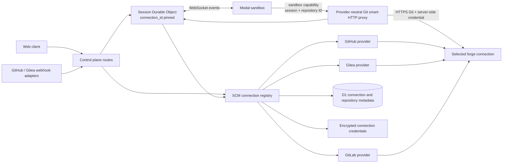

# Gitea and Multi-Connection Source Control

## Status

Implemented on `main` through the expand/dual-read phase; production rollout is operator-controlled.
ADR 0004 replaces ADR 0001 for connection-aware code, and a second connection is enabled only after
the online backfill preflight is clean. Gitea version discovery is diagnostic and is not a
compatibility gate; security advisories remain an operator risk decision with compensating controls
documented below.

Implemented scope includes the connection registry and encrypted PAT storage, Gitea REST adapter,
stable repository catalog and UI selection, session/environment/automation pinning, server-side Git
proxy capabilities, clone/push/pull-request flow, stable secrets/metadata/images/skills/MCP/settings
stores, aggregate database guards, and the leased/checkpointed migration UI. Gitea webhooks,
user-delegated Gitea OAuth, and final removal of legacy keys remain later contract/parity phases.

The sandbox lifecycle now also resolves a repository prebuilt image by its stable
`repo:<repositoryKey>` scope whenever a connection-aware repository is present, while retaining the
legacy `owner/name` lookup for pre-migration sessions. This keeps Gitea and GitHub repositories with
identical paths from sharing an image and allows the per-repository development environment to be
reused after a session restart (`12bf0478`).

The sandbox launch/build paths also enforce proxy-credential precedence: when a server-side Git
proxy base URL is present, legacy snapshot or provider clone tokens are omitted from the sandbox
environment even if an older caller supplies both values (`44967329`). The sandbox receives only the
short-lived repository capability through `SCM_GIT_CAPABILITY` (never the legacy `VCS_CLONE_TOKEN`),
keeping Gitea PATs in the control plane during fresh, restore, and image-build flows (`ce15c38b`).

Default-connection promotion is also transactional: when an operator marks a newly created Gitea
connection as default, the route inserts it as non-default and then calls the store's atomic
`setDefault` operation. This avoids colliding with the partial unique index that permits only one
default connection, while ensuring the previous default is cleared (`c705794b`).

Legacy restore code also fails closed for `SCM_PROVIDER=gitea`: it will not fall back to a
deployment GitHub App token when a proxy capability is absent. A Gitea restore must therefore be
launched with the server-side proxy contract, rather than relying on a direct-clone token.

## Executive Summary

Open-Inspect should support GitHub and Gitea in the same installation by introducing an explicit
**source-control connection**. A connection identifies one forge instance, its provider adapter,
authentication method, API and clone endpoints, and encrypted credential. Repositories, sessions,
environments, automations, secrets, images, and pull requests must refer to that connection.

This is not safely implementable by adding only a `GiteaSourceControlProvider`. The current provider
factory is selected once per deployment, most routes remain GitHub-only, and repository identity is
usually only `owner/name`. Two forges can therefore collide in caches and D1, and the sandbox
credential broker cannot distinguish credentials for multiple forge origins.

The first production slice should use these invariants:

| Area             | Decision                                                                                                             |
| ---------------- | -------------------------------------------------------------------------------------------------------------------- |
| Installation     | One Open-Inspect installation may have multiple enabled SCM connections.                                             |
| Session          | A repository-backed session is pinned to exactly one SCM connection; repo-less sessions may use none.                |
| Multi-repo       | Every repository in one session, environment, or automation must use that same connection.                           |
| Identity         | Canonical identity is opaque `scm_repositories.id`, uniquely resolved by `(connection_id, external_repository_id)`.  |
| Location         | `owner` and `name` are mutable display and clone-path attributes, not the primary key.                               |
| Gitea MVP auth   | A dedicated Gitea service account and scoped PAT. No password storage.                                               |
| User attribution | Git author comes from the Open-Inspect user; Gitea PR API author is the service account in V1.                       |
| OAuth            | Add linked user OAuth as a later slice, independent of browser sign-in.                                              |
| Git credentials  | Generalize the Git smart-HTTP proxy; a long-lived Gitea PAT must not enter a sandbox.                                |
| Protocol         | Keep the current web/control-plane/session protocol; add connection/repository identity and proxy routing behind it. |
| CLI              | Use HTTPS Git and Gitea REST. Do not make `tea` a V1 dependency.                                                     |
| Bots             | Gitea webhooks are a later parity phase; core repo/session/push/PR is first.                                         |

The configured target instance reports Gitea Enterprise `23.8.0` and exposes Swagger 2.0 at
`/swagger.v1.json`. Gitea's official Enterprise versioning rule maps this to Community `1.23.8` plus
Enterprise patch level `0`. The required repository, branch, pull-request, webhook, and
repository-by-ID operations exist. The adapter is contract-tested against that instance, while the
reported version remains diagnostic rather than a runtime compatibility gate. The version is
affected by later Gitea security advisories; operators should apply the documented controls and
decide whether their deployment risk policy permits enabling the connection.

## Goals

- Connect both GitHub and one or more self-hosted Gitea instances to one Open-Inspect installation.
- Preserve current GitHub behavior and existing sessions during migration.
- List, select, clone, edit, push, and open a pull request for Gitea repositories.
- Support self-hosted origins with ports and optional path prefixes.
- Keep SCM credentials out of browser responses, repository URLs, logs, Queue payloads, and durable
  sandbox environment variables.
- Prevent repository, credential, cache, image, secret, automation, and PR collisions across forges.
- Make provider capability and connection health visible in Settings.
- Provide a compatibility probe and contract-test suite for the target Gitea Enterprise version.

## Non-Goals

- Mixing GitHub and Gitea repositories inside one session in the first release.
- Making Gitea the primary browser sign-in provider in the first release.
- User-delegated Gitea PR authorship in the PAT MVP.
- Full GitHub App semantics on Gitea. A PAT cannot provide installation selection or short-lived
  installation tokens.
- Gitea Issues, Projects, Actions, Packages, Releases, commit signing, review submission, labels, or
  reviewer assignment unless added as an explicitly tested capability.
- A generic ACP or agent-harness protocol change. SCM and agent harness selection are separate axes.
- GitLab self-hosting work beyond the common connection seams required by this design.
- Automatic migration of an environment that intentionally mixes forge connections. Such a state is
  not representable in the current system and will be rejected explicitly.

## Terminology

### Provider

An implementation of forge behavior, for example `github`, `gitea`, or `gitlab`. A provider knows
API shapes, authentication headers, pagination, clone credentials, pull-request creation, and web
URLs.

### Connection

One configured forge instance and credential authority, for example `github-production` or
`gitea-aotsea`. Multiple connections may use the same provider.

### Repository key

An opaque, stable Open-Inspect ID stored in `scm_repositories.id`. The public API should return it
rather than ask clients to concatenate connection/provider fields.

### Repository location

The current `owner`, `name`, default branch, clone URL, and web URL. These may change after a rename
or transfer while the repository key remains stable.

## Current-State Findings

### The existing abstraction is deployment-scoped

ADR 0001 intentionally chooses one `SCM_PROVIDER` per deployment and does not persist provider state
on a session. `source-control/provider-from-env.ts` builds one provider from Worker environment
bindings, while `source-control/providers/index.ts` currently creates GitHub or GitLab and rejects
Bitbucket. `SourceControlProvider` already contains most primitive operations needed by Gitea, but
its methods receive only owner/name or an external ID and have no connection context.

The route policy is stricter than the abstraction: repository listing and session creation are
declared with GitHub-only policies. Many session, environment, secret, image-build, automation, and
runtime-proxy routes are similarly blocked before a non-GitHub provider can run. The GitLab adapter
is therefore a useful template, not evidence that non-GitHub production flow is complete.

### Repository identity is not forge-safe

The following surfaces key repositories by owner/name, numeric ID without issuer, or a global cache
key:

- shared `InstallationRepository` and `RepositoryRef` types;
- the `repos:list:v2` repository-list cache;
- `repo_metadata`, `repo_secrets`, `repo_images`, and image-build scope IDs;
- `session_repositories`, `environment_repositories`, and automation repositories/runs;
- managed-skill repository assignments;
- session index columns and the Durable Object session schema;
- `session_pull_requests` external repository and pull-request identities.

This is unsafe because `acme/api` and repository ID `42` can exist independently on GitHub and every
Gitea instance.

### Browser identity and SCM authority are coupled to GitHub

Browser sign-in currently supports GitHub and Google. GitHub account linking and refresh logic is
also used as SCM credential authority. Gitea is self-hosted, so `provider_user_id` is not globally
unique; the issuer/connection must participate in identity. The historical `user_scm_tokens` key is
unsuitable for new Gitea credentials.

Browser authentication and SCM authorization must become separate concepts:

- **Sign in to Open-Inspect** identifies a person.
- **Connect source control** authorizes that person or the installation to a forge connection.

### The sandbox already has useful security seams

The runtime clones with HTTPS and obtains credentials on demand from
`POST /sessions/:id/scm-credentials`. It validates the requested credential protocol and exact host
against `VCS_CLONE_BASE_URL`/`VCS_HOST`. `repository_sync.py` already preserves an HTTPS port and
path prefix when building `<base>/<owner>/<repo>.git`.

However, one sandbox currently has one clone origin and one cached SCM credential set. That is the
reason for the V1 single-connection-per-session invariant. Supporting mixed-forge sessions later
would require per-origin broker requests and per-origin cache entries, not just a UI change.

### Production configuration is still GitHub-first

Worker, web-build, and Modal Terraform currently wire GitHub application/login settings. Declared
`SCM_PROVIDER` and GitLab fields are not a complete production connection mechanism. Dynamic Gitea
connections therefore need durable metadata plus encrypted secrets, with an operator bootstrap path;
one static environment variable per provider will not scale to multiple self-hosted instances.

## Target Architecture



### Resolution rules

1. The browser selects an opaque `repositoryKey` or an environment.
2. The control plane resolves every selected repository to one connection.
3. Creation fails with `SCM_CONNECTION_MISMATCH` if more than one connection is present.
4. The session index and Durable Object persist `scm_connection_id` before sandbox creation.
5. Sandbox repository remotes target the control-plane Git proxy and contain only a session-scoped
   sandbox capability, never a forge PAT.
6. The proxy loads the pinned connection and repository, validates session membership, and adds the
   upstream credential server-side.
7. Pull-request API and Git push operations reuse the pinned connection even if the installation
   default later changes.

A repo-less session has no connection and the SCM credential/proxy routes always reject it. A child
with inherited repositories inherits the parent connection. A repo-less child that later selects its
first repository binds that repository's connection explicitly; it never gains the installation
default implicitly.

## Connection and Repository Model

### Shared types

The public/shared model should become structurally provider-neutral:

```ts
export type SourceControlProviderName = "github" | "gitea" | "gitlab" | "bitbucket";

export interface SourceControlConnectionSummary {
  id: string;
  provider: SourceControlProviderName;
  displayName: string;
  baseUrl: string;
  authMode: "github_app" | "pat" | "oauth";
  enabled: boolean;
  isDefault: boolean;
  health: "unknown" | "healthy" | "degraded" | "disabled";
  capabilities: SourceControlCapabilities;
}

export interface RepositoryIdentity {
  repositoryKey: string;
  connectionId: string;
  externalId?: string;
  owner: string;
  name: string;
  resolutionStatus: "resolved" | "unresolved" | "removed";
}

export interface RepositoryCatalogItem extends RepositoryIdentity {
  externalId: string;
  resolutionStatus: "resolved";
  fullName: string;
  webUrl: string;
  cloneUrl: string;
  defaultBranch: string;
  private: boolean;
  connection: Pick<SourceControlConnectionSummary, "id" | "provider" | "displayName" | "baseUrl">;
}
```

`externalId` is a string at the Open-Inspect boundary even if one provider returns a number. This
prevents JavaScript precision assumptions and accommodates future providers. `repositoryKey` is
opaque; clients must not parse it.

### Connection storage

Add a D1 table similar to the following:

```sql
CREATE TABLE scm_connections (
  id TEXT PRIMARY KEY,
  provider TEXT NOT NULL,
  display_name TEXT NOT NULL,
  base_url TEXT NOT NULL,
  api_base_url TEXT NOT NULL,
  clone_base_url TEXT NOT NULL,
  auth_mode TEXT NOT NULL,
  credential_source TEXT NOT NULL,
  credential_ref TEXT,
  username TEXT,
  capabilities_json TEXT NOT NULL DEFAULT '{}',
  version TEXT,
  revision INTEGER NOT NULL DEFAULT 1,
  enabled INTEGER NOT NULL DEFAULT 1,
  is_default INTEGER NOT NULL DEFAULT 0,
  last_checked_at INTEGER,
  last_error_code TEXT,
  created_at INTEGER NOT NULL,
  updated_at INTEGER NOT NULL,
  CHECK (provider IN ('github', 'gitea', 'gitlab', 'bitbucket')),
  CHECK (auth_mode IN ('github_app', 'pat', 'oauth')),
  CHECK (credential_source IN ('worker_binding', 'encrypted_d1'))
);

CREATE TABLE scm_connection_credentials (
  connection_id TEXT NOT NULL,
  purpose TEXT NOT NULL,
  ciphertext TEXT NOT NULL,
  encryption_format_version INTEGER NOT NULL,
  expires_at INTEGER,
  created_at INTEGER NOT NULL,
  updated_at INTEGER NOT NULL,
  PRIMARY KEY (connection_id, purpose),
  FOREIGN KEY (connection_id) REFERENCES scm_connections(id)
);
```

Implementation notes:

- Keep credentials out of connection metadata. Encrypt `scm_connection_credentials.ciphertext` with
  `TOKEN_ENCRYPTION_KEY` using the existing authenticated token-encryption primitive, and record an
  encryption format version for future rotation. Never return ciphertext or plaintext after
  creation.
- Initial credential purposes are `service_token`, `github_app_private_key`, `oauth_client_secret`,
  and `webhook_secret`. The provider registry receives a narrow secret reader, not raw database
  rows.
- `credential_source = worker_binding` preserves the existing GitHub App secret during bootstrap;
  `credential_ref` is an allow-listed logical binding name, not a secret value. Gitea PAT
  connections use `encrypted_d1` and a credential row. The registry has explicit readers for both
  sources and fails closed when the referenced secret is absent.
- Normalize `base_url` to an origin plus optional path prefix without a trailing slash.
- Derive Gitea `api_base_url` as `<base>/api/v1`, but allow an explicit value for reverse-proxy
  deployments and validate that it is same-origin unless an operator-only override is introduced.
- Add a partial/default uniqueness mechanism in application transactions: exactly zero or one
  enabled default connection. SQLite/D1 migration code should not rely on unsupported partial-index
  behavior without an integration test.
- `capabilities_json` is the last successful probe result, not a user-controlled feature bypass.
- Increment `revision` whenever endpoints, credential authority, or security-relevant configuration
  changes. Use it to invalidate provider and repository-catalog caches.

### Canonical repository storage

Add a stable internal repository entity. This is preferable to exposing a concatenated
`connectionId:externalId` key everywhere because unresolved legacy rows, provider migration, and
future connection consolidation remain possible.

```sql
CREATE TABLE scm_repositories (
  id TEXT PRIMARY KEY,
  connection_id TEXT NOT NULL,
  external_id TEXT,
  owner TEXT NOT NULL,
  name TEXT NOT NULL,
  path_key TEXT NOT NULL,
  default_branch TEXT,
  web_url TEXT,
  clone_url TEXT,
  is_private INTEGER,
  archived INTEGER NOT NULL DEFAULT 0,
  resolution_status TEXT NOT NULL DEFAULT 'resolved',
  last_seen_at INTEGER,
  removed_at INTEGER,
  created_at INTEGER NOT NULL,
  updated_at INTEGER NOT NULL,
  FOREIGN KEY (connection_id) REFERENCES scm_connections(id),
  UNIQUE (id, connection_id),
  CHECK (resolution_status IN ('resolved', 'unresolved', 'removed')),
  CHECK (
    resolution_status != 'resolved'
    OR (external_id IS NOT NULL AND web_url IS NOT NULL AND clone_url IS NOT NULL)
  )
);

CREATE UNIQUE INDEX scm_repositories_external
  ON scm_repositories(connection_id, external_id)
  WHERE external_id IS NOT NULL;

CREATE UNIQUE INDEX scm_repositories_active_path
  ON scm_repositories(connection_id, path_key)
  WHERE removed_at IS NULL;
```

`repositoryKey` in external contracts is this opaque `id`. Owner/name and provider-returned URLs are
mutable catalog data. A repository missing from one refresh is marked removed only after a
deliberate reconciliation policy; it is not immediately deleted because historical sessions and
references must remain renderable.

An unresolved tombstone exists only to preserve a legacy historical binding. It is excluded from the
selectable catalog and cannot start a new sandbox, build an image, issue a proxy capability, or
create a PR. A later successful resolution updates the same internal repository ID in place.

### Provider registry

Replace deployment-singleton construction in runtime paths with a registry:

```ts
interface SourceControlProviderRegistry {
  getConnection(connectionId: string): Promise<ResolvedSourceControlConnection>;
  getDefaultConnection(): Promise<ResolvedSourceControlConnection>;
}

interface ResolvedSourceControlConnection {
  config: SourceControlConnectionConfig;
  provider: SourceControlProvider;
}
```

Provider instances may be cached by `(connection_id, updated_at)` inside one Worker isolate, but no
credential or configuration cache may outlive a connection update without versioning. Routes that
operate on a repository or session must resolve that object's connection, not the current default.

The next provider interface should accept a normalized repository locator rather than loose
owner/name arguments, and it should distinguish REST authority from server-only Git-proxy authority:

```ts
interface RepositoryLocator {
  repositoryId: string;
  connectionId: string;
  externalId?: string;
  owner: string;
  name: string;
  cloneUrl: string;
}

interface SourceControlProviderV2 {
  readonly name: SourceControlProviderName;
  readonly capabilities: SourceControlCapabilities;

  listRepositories(cursor?: string): Promise<RepositoryPage>;
  getRepository(target: RepositoryLocator): Promise<ProviderRepository>;
  getRepositoryByExternalId(externalId: string): Promise<ProviderRepository | null>;
  listBranches(target: RepositoryLocator, cursor?: string): Promise<BranchPage>;
  getBranchHead(target: RepositoryLocator, branch: string): Promise<string | null>;
  getPullRequest(target: RepositoryLocator, number: number): Promise<PullRequestState>;
  createPullRequest(
    target: RepositoryLocator,
    input: CreatePullRequestInput,
    authority: ScmAuthority
  ): Promise<PullRequestState>;
  getGitUpstreamAuth(
    target: RepositoryLocator,
    operation: "read" | "write"
  ): Promise<ServerOnlyGitAuth>;
  buildManualPullRequestUrl(target: RepositoryLocator, input: ManualPullRequestInput): string;
}
```

`ServerOnlyGitAuth` must never cross into the session DO event log, Queue, Modal API, or sandbox.
The provider factory receives sanitized connection config plus a narrow secret reader, not the full
Worker environment.

### Provider capabilities

Add explicit capabilities so the UI and services do not infer behavior from provider names:

```ts
interface SourceControlCapabilities {
  listRepositories: boolean;
  listBranches: boolean;
  createPullRequest: boolean;
  draftPullRequest: boolean;
  userOAuth: boolean;
  webhooks: boolean;
  commitSigning: boolean;
  repositoryById: boolean;
}
```

The provider name remains useful for adapter selection, but service behavior should gate on a
capability and return a typed `SCM_CAPABILITY_UNAVAILABLE` response.

## Gitea Provider Contract

### Target-instance probe

Connection creation/test performs bounded, read-only calls:

1. `GET /api/v1/version` — record product version.
2. `GET /api/v1/user` — authenticate and record the service user ID/login.
3. One paginated repository-catalog request — verify repository scope.
4. Optionally fetch one selected repository and its branches when validating a user choice.

The test response exposes status and safe metadata only. It must not echo token fragments, raw
upstream bodies, or authorization headers.

### Authentication

| Operation | PAT MVP                                                                 | User OAuth phase                                                           |
| --------- | ----------------------------------------------------------------------- | -------------------------------------------------------------------------- |
| REST      | `Authorization: token <PAT>`                                            | `Authorization: Bearer <access token>`                                     |
| Git HTTPS | sandbox capability to proxy; proxy uses service username + PAT upstream | proxy may select user login/token only after separate authorization design |
| Browser   | no token                                                                | authorization-code flow with state and PKCE                                |

Never send a PAT as an OAuth Bearer token or as URL query data. Do not use Gitea tokens with HTTP
Basic for REST; published advisories include Basic-auth paths that bypassed OAuth/PAT scope checks.

The MVP PAT needs `write:repository`, `read:user`, and `read:organization` for the planned catalog,
repository, branch, push, and PR functions. Restrict its effective access using a dedicated service
account with membership only in allowed repositories; Gitea PAT scope is not a substitute for
repository selection.

The target 23.8.0 token schema exposes no reliable PAT expiry. Treat the service PAT as valid until
revoked; do not invent a short expiry or mistake a local cache TTL for credential rotation.

### Repository catalog

Do not assume `/user/repos` has GitHub semantics. On the target Enterprise 23.8.0 Swagger it is
described as repositories the authenticated user **owns**. Use:

1. `GET /user` to obtain the authenticated user ID.
2. `GET /repos/search?uid=<id>&private=true&exclusive=false&page=<n>&limit=<n>` to include owned and
   contributed repositories.
3. Follow pagination until the configured maximum, using response pagination metadata when present.

The Community 1.23 API documents repository search as an object containing `ok` and `data`, while
some provider methods elsewhere return arrays. Decode the target version's wrapper explicitly; do
not cast the body to a GitHub-shaped array.

Turn this version-specific behavior into a contract test. A later Gitea version may permit a better
endpoint; the provider may select it based on a probe but must return the same normalized catalog.

### Required API mapping

| Open-Inspect operation | Gitea Enterprise 23.8.0 route                 | Notes                             |
| ---------------------- | --------------------------------------------- | --------------------------------- |
| Version                | `GET /version`                                | Relative to `/api/v1`.            |
| Current user           | `GET /user`                                   | PAT validation and catalog UID.   |
| Catalog                | `GET /repos/search`                           | Paginated; use authenticated UID. |
| Repository             | `GET /repos/{owner}/{repo}`                   | Parse with a runtime schema.      |
| Stable lookup          | `GET /repositories/{id}`                      | Retry rename/transfer resolution. |
| Branches               | `GET /repos/{owner}/{repo}/branches`          | Paginated.                        |
| Branch head            | `GET /repos/{owner}/{repo}/branches/{branch}` | Encode path segment correctly.    |
| Pull requests          | `GET /repos/{owner}/{repo}/pulls`             | Normalize state/draft/merged.     |
| Pull request           | `GET /repos/{owner}/{repo}/pulls/{index}`     | Use repository-local index.       |
| Create PR              | `POST /repos/{owner}/{repo}/pulls`            | Handle 403/404/409/422/423.       |
| Webhooks               | `/repos/{owner}/{repo}/hooks`                 | Later phase.                      |

Every response is untrusted input. Parse it with Zod (or an equivalent explicit decoder), bound
response size and pagination, set timeouts, and map upstream statuses to stable internal error
codes.

### Clone and push

- Preserve API-returned, credential-free `clone_url` as catalog data. Validate it against the
  connection origin/base path instead of reconstructing it from a hostname.
- Build the sandbox remote as a control-plane proxy URL containing opaque session/repository
  identity, not the upstream owner/name or PAT.
- Preserve upstream reverse-proxy path prefixes and explicit ports inside the server-side proxy
  mapping.
- `buildGitPushSpec` should use the authorized proxy remote and a branch refspec, not assume
  `github.com`, `gitlab.com`, or direct forge credentials.
- Manual PR fallback URL is provider-generated. For Gitea, verify the target version's compare URL
  in an end-to-end test instead of treating it as an API contract.
- Branch names may contain `/`; encode them as the operation's single logical branch parameter and
  verify that reverse proxies preserve encoded paths.

## Database Migration

### Migration principles

1. Additive schema first; no destructive migration in the deploy that introduces connections.
2. Create a default GitHub connection from existing installation configuration.
3. Backfill all legacy repository-bearing rows with that connection.
4. Dual-read old rows only during a bounded compatibility window; all new writes include connection
   and external repository identity.
5. Rebuild legacy primary/unique keys that omit the connection.
6. Switch API contracts and Durable Object schema before allowing a second connection.
7. Only then enable Gitea connection creation.

### D1 table-by-table plan

| Surface                                          | Change                                                                                                            |
| ------------------------------------------------ | ----------------------------------------------------------------------------------------------------------------- |
| `scm_connections` / `scm_connection_credentials` | New connection metadata and separately encrypted credentials.                                                     |
| `scm_repositories`                               | New canonical internal repository table; unique on connection/external ID and active connection/path.             |
| `repo_metadata`                                  | Reference `repository_id`; retain owner/name only as a location snapshot during migration.                        |
| `repo_secrets`                                   | Change identity to `(repository_id, key)` so equal numeric IDs from different forges cannot collide.              |
| `repo_images` and image-build scope              | Reference `repository_id`; include it in scope IDs, cache keys, fingerprints, and lock/dedupe keys.               |
| `sessions`                                       | Add nullable `scm_connection_id`; require it only when repositories exist, and retain owner/name/id snapshots.    |
| `session_repositories`                           | Add `connection_id`,`repository_id`; new PK `(session_id, repository_id)` and unique position.                    |
| `environment_repositories`                       | Add `connection_id`,`repository_id`; persist nullable connection on the environment.                              |
| `automation_repositories`                        | Add `connection_id`,`repository_id`; persist nullable connection on the automation.                               |
| `automation_runs`                                | Snapshot connection and repository ID so reruns do not follow a changed default.                                  |
| `session_pull_requests`                          | Add `connection_id` and `repository_id`; unique identity becomes `(repository_id, pr_number)`.                    |
| managed skill repository assignments             | Use `repository_id` so assignment applies to exactly one forge repository.                                        |
| `integration_repo_settings`                      | Replace owner/name string identity with `repository_id`.                                                          |
| `mcp_servers.repo_scope`                         | Normalize repository scopes into a join table keyed by `repository_id`; retain JSON only for compatibility reads. |
| Git proxy capabilities                           | Store only token hash, audience, subject ID, allowed repository/operation, expiry, and revocation.                |
| SCM webhook deliveries/triggers                  | Dedupe by connection/delivery and add connection/repository-aware `scm_event` matching.                           |

Repository location columns remain because they are useful for display, auditing, and historical
session reconstruction. They must not be used alone for authorization.

Use database constraints in addition to application validation. `scm_repositories` exposes
`UNIQUE(id, connection_id)`; aggregate child tables store both values and use a composite foreign
key. Parents store the same nullable connection ID, child position is unique within the parent, and
a transaction/trigger (covered by D1 integration tests) rejects a child whose connection differs
from its parent. Repo-less sessions, environments, and automations keep the parent connection `NULL`
and have no repository children.

### Durable Object migration

The session DO previously added and then removed `scm_provider` because ADR 0001 made it
deployment-level. Add a new monotonic schema migration that persists:

- `scm_connection_id` on session metadata;
- `connection_id` and `repository_id` on session repositories;
- a startup assertion that all repository rows match the session connection.

Never rewrite old DO migrations or make a schema migration fetch D1. Legacy session identity is
resolved only after local schema migration, during normal asynchronous initialization. If no default
connection exists, the session remains readable but cannot start a new sandbox until an operator
repairs the connection.

The DO SQLite schema migration itself must remain synchronous and local: it only adds nullable
columns/tables. After schema migration, `ensureInitialized` asynchronously reads the D1 session
index or trusted initialization payload, resolves the default connection/repository IDs, and writes
them in one DO SQLite transaction. An unresolved legacy DO remains read-only and its
credential/proxy routes fail closed. A repo-less DO keeps `scm_connection_id = NULL` and never
receives SCM authority.

### Backfill algorithm

SQL migrations cannot call a forge API, so expansion, online backfill, key cutover, and final
contract are separate deploys:

1. **Expand SQL migration:** create the connection/repository tables and add nullable new columns.
   Insert a stable `github-default` metadata row; do not derive its ID from a URL or secret.
2. **Dual-read/write deploy:** new writes include repository IDs and legacy location snapshots;
   reads prefer IDs and fall back to legacy owner/name while emitting a metric.
3. **Online backfill job:** a Worker/CLI job with a lease, checkpoint cursor, bounded batches, and
   idempotent upserts queries the GitHub catalog and legacy rows. It maps external IDs first, then
   owner/name, and creates unresolved tombstones rather than dropping history.
4. **Audit/preflight:** report per-table totals, unresolved rows, collisions, orphan IDs, mixed
   aggregates, and active DOs needing hydration. Repeat the job until completion is 100% for active
   records; do not enable a second connection yet.
5. **Key-cutover SQL migration:** rebuild only tables whose old primary/unique keys prevent a second
   forge, preserving legacy snapshot columns and dual writes. Copy transactionally and install
   repository/connection-aware constraints.
6. **DO hydration:** schema migrations add nullable columns; normal request/startup code hydrates
   old DOs asynchronously as described above.
7. **Image cutover:** mark legacy repository images superseded and rebuild them; do not reinterpret
   old fingerprints as connection-safe.
8. **Enablement:** switch connection-aware stores to authoritative, keep legacy reads/writes for a
   minimum of two releases, and only then expose Gitea connection creation.
9. **Final contract migration:** after legacy-fallback metrics remain zero, remove obsolete unique
   keys, JSON repository scopes, and deprecated global-provider writes in a separate release.

### Rollback

Before key cutover, additive phases can roll back application code while retaining unused columns
and tables. Take a D1 Time Travel bookmark immediately before key cutover. Key cutover is an
explicit rollback fence: block old binaries that ignore repository IDs even if no Gitea connection
exists. After the fence, rollback means disable multi-connection/Gitea and forward-fix; after a
second connection contains data, database downgrade is never safe.

## Control-Plane API

### Connection management

Proposed routes:

| Method   | Route                               | Purpose                                                |
| -------- | ----------------------------------- | ------------------------------------------------------ |
| `GET`    | `/scm/connections`                  | Safe summaries and capabilities.                       |
| `POST`   | `/scm/connections`                  | Create; accepts secret write-only.                     |
| `GET`    | `/scm/connections/:id`              | Safe details and last probe.                           |
| `PATCH`  | `/scm/connections/:id`              | Rename, endpoints, secret replacement, enable/default. |
| `POST`   | `/scm/connections/:id/test`         | Read-only live compatibility probe.                    |
| `POST`   | `/scm/connections/:id/disable`      | Disable without deleting history.                      |
| `POST`   | `/scm/connections/:id/oauth/start`  | Later user-account link flow.                          |
| `DELETE` | `/scm/connections/:id/account-link` | Later revoke one user's link.                          |

Connection creation is an installation-admin operation. The current single-tenant product lacks a
complete role model, so until one exists the route must use the same trusted installation-management
policy as other global settings and be documented as such.

Do not hard-delete a connection referenced by any session, repository, environment, automation,
image, or PR. Disabling it preserves historical rendering and rejects new sessions with a typed
error.

### Repository catalog

Recommended shape:

```text
GET /repos?connectionId=<optional>&cursor=<opaque>
```

- Omitted `connectionId` aggregates enabled connections and returns each item's connection summary.
- Cache keys include connection ID, connection revision, authenticated principal/authority, and
  page.
- The provider owns upstream pagination; the API returns an opaque cursor.
- `GET /repos/:repositoryKey/branches` avoids encoding nested owners in a public route.
- During compatibility, old owner/name routes may resolve only against the default connection and
  return a deprecation header.

### Session creation

New clients send `repositoryKeys` or an environment ID. The server resolves and snapshots full
repository identity. Old clients may send owner/name only during migration; the server resolves it
on the default connection and returns the normalized identity in the response.

Typed errors should include:

- `SCM_CONNECTION_NOT_FOUND`
- `SCM_CONNECTION_DISABLED`
- `SCM_CONNECTION_UNHEALTHY`
- `SCM_CONNECTION_MISMATCH`
- `SCM_REPOSITORY_NOT_FOUND`
- `SCM_REPOSITORY_ACCESS_DENIED`
- `SCM_CAPABILITY_UNAVAILABLE`
- `SCM_UPSTREAM_RATE_LIMITED`
- `SCM_UPSTREAM_CONTRACT_MISMATCH`

No error includes upstream authorization headers or raw response bodies.

## Authentication and Secrets

### PAT MVP

- Store the supplied PAT only through the connection-management secret endpoint.
- Encrypt before D1 persistence with the existing token encryption primitive.
- Return `configured: true`, created/updated timestamps, and last test state—not the value or
  suffix.
- Redact `Authorization`, Git credential protocol output, clone URLs with userinfo, and upstream
  error bodies from structured logs.
- Use a dedicated Gitea account. Repository membership is the main repository-selection boundary.
- Reject passwords in the connection API; a login password must never become an automation secret.

The already-created target PAT is sufficient to start implementation testing. Its value must stay
out of this document, source control, shell history, test fixtures, snapshots, and telemetry.

### User OAuth phase

Gitea supports authorization code, OIDC discovery, PKCE, refresh tokens, and granular scopes. Add it
as an account-link flow after the PAT path is stable:

1. Keep GitHub/Google browser login unchanged.
2. Register one OAuth application per Gitea connection.
3. Use the connection base URL as issuer and always use `state` plus S256 PKCE.
4. Request only documented granular scopes. Do not add unknown scopes because Gitea documentation
   warns that unknown/nonstandard scope combinations can fall back to broad access on older
   versions.
5. Store encrypted access/refresh credentials in a dedicated `user_scm_connections` table keyed by
   `(user_id, connection_id)` with a second issuer-safe uniqueness constraint on
   `(connection_id, provider_subject)`.
6. Update uniqueness constraints that currently omit issuer before enabling two Gitea instances.
7. Prefer user OAuth for PR attribution; fall back to the connection PAT only when product policy
   explicitly permits it.

Do not extend the legacy `user_scm_tokens` table for self-hosted providers. Use canonical
`user_identities`/Better Auth account linkage or a new connection-account table with issuer-safe
keys. Do not copy user refresh credentials into Session DO participant records; persist only the
canonical user/connection link and resolve/decrypt at the point of an authorized API operation.

A representative table is:

```sql
CREATE TABLE user_scm_connections (
  id TEXT PRIMARY KEY,
  user_id TEXT NOT NULL,
  connection_id TEXT NOT NULL,
  provider_subject TEXT NOT NULL,
  provider_login TEXT,
  provider_email TEXT,
  access_token_ciphertext TEXT,
  refresh_token_ciphertext TEXT,
  access_token_expires_at INTEGER,
  refresh_token_expires_at INTEGER,
  granted_scope TEXT NOT NULL,
  status TEXT NOT NULL,
  created_at INTEGER NOT NULL,
  updated_at INTEGER NOT NULL,
  UNIQUE (user_id, connection_id),
  UNIQUE (connection_id, provider_subject)
);
```

For a self-hosted issuer, do not perform implicit cross-provider email account linking unless an
operator explicitly marks that issuer trusted.

## Sandbox and Credential Broker

### Sandbox configuration

Add a secret-free structure to session/sandbox configuration:

```ts
interface SandboxSourceControlConfig {
  connectionId: string;
  provider: SourceControlProviderName;
  gitProxyBaseUrl: string;
  repositories: Array<{
    repositoryId: string;
    remoteUrl: string;
  }>;
}
```

The control plane validates and produces this structure. The Modal layer transports it. Every
`remoteUrl` targets the control plane and contains no forge credential. The runtime configures
`credential.useHttpPath=true` and releases only a session-scoped sandbox capability to the proxy.
PATs and OAuth tokens are never included.

### Provider-neutral Git smart-HTTP proxy

Generalize the existing GitHub-specific smart-HTTP proxy into a provider-neutral route such as:

```text
/git/:sessionId/:repositoryId.git/{info/refs|git-upload-pack|git-receive-pack}
```

The proxy:

1. the sandbox token belongs to the session;
2. `repositoryId` is in that session's immutable repository set;
3. the repository belongs to the session's pinned, enabled connection;
4. the smart-HTTP suffix and method are allow-listed;
5. the upstream URL comes only from the validated catalog/connection, never request input;
6. the provider supplies the upstream `Authorization` server-side;
7. redirects are manual and never carry credentials to another origin;
8. request/response streams, sizes, timeouts, and safe headers are bounded.

The sandbox-facing credential helper returns only its sandbox capability for the control-plane
proxy. The long-lived Gitea PAT remains inside the control plane. Clone, fetch, push, submodule
policy, and image builds must all use this path before production Gitea enablement.

Proxy capabilities are random, short-lived bearer values stored only as hashes. Each capability is
bound to its audience (`session_git` or `image_build_git`), session/build ID, allowed repository
IDs, allowed operation (`read`/`write`), expiry, and revocation state. The capability travels only
in the Git HTTP Basic header—not the remote URL, query, logs, or Git config—and rotates on resume.
Disabling the connection or session revokes effective access immediately even before token expiry.

The proxy must not become an arbitrary URL fetcher. Its only upstream lookup key is an authorized
internal repository ID. It must reject repository IDs from another session even when both use the
same connection.

### Direct upstream credential helper

The runtime's existing exact-netloc helper behavior remains useful for short-lived provider
credentials and local development, but it is not the production Gitea PAT path. If retained:

- requests must include `protocol`, `host`, and `path`;
- the control plane authorizes a decoded repository path against the session repository set;
- cache entries are keyed by connection/origin/path;
- `/gitea` does not prefix-match `/gitea-evil`;
- sibling repositories require an explicit allow-list rather than installation-wide access.

Token release is never based on a browser-supplied host or the installation default.
`GiteaSourceControlProvider` must never return a forge PAT through the legacy
`generateCredentialHelperAuth()` path. For production Gitea, `/sessions/:id/scm-credentials` returns
only the proxy capability; direct-upstream Gitea PAT mode is prohibited.

### URL and SSRF rules

- Production connections require HTTPS. Allow HTTP only for an explicit development flag and
  loopback/private test setup.
- Reject URL userinfo, query strings, fragments, control characters, and ambiguous encoded hosts.
- Normalize IDN/hostname, lower-case scheme/host, preserve explicit ports, and remove trailing
  slash.
- Resolve and validate redirect targets before forwarding credentials. Never follow a cross-origin
  redirect with authorization intact.
- Apply DNS/IP egress policy appropriate to intentionally self-hosted private forges. Configuration
  and test routes are admin-only SSRF surfaces and need audit logs and bounded timeouts.
- The production proxy scopes access to exact internal repository IDs. Private submodules or setup
  hook dependencies must be declared and added to the immutable session/build authorization set;
  same-connection sibling access is not implicit.

### Image builds

The existing image-build path can place clone credentials in environment variables. A long-lived
Gitea PAT must never use that fallback because repository setup code could read it and snapshots
could retain it. Image-build clones must use a short-lived proxy capability bound to build ID and
repository ID. Existing repository images should be superseded when identity/fingerprint semantics
change.

Phase 4 includes a data-plane feasibility gate: exercise representative large clone/fetch/push
packfiles, streaming backpressure, cancellation, body-size limits, and maximum request duration on
Cloudflare Workers. If the Worker path cannot safely carry expected Git traffic, deploy a dedicated
data-plane relay (for example in Modal) that implements the same hashed-capability and
session/repository authorization contract. Do not fall back to placing the PAT in the sandbox.

### Mixed-connection future work

To lift the V1 invariant, the runtime and proxy must route every remote by repository ID, model
multiple connection lifecycles, and update environment/automation UX and authorization. This must be
a separate threat-model review.

## Web UI and UX

### Settings: Source control

Add a new `Source control` settings section rather than mixing SCM credentials with agent harness
keys. It shows connection cards with:

- display name, provider, sanitized base URL, auth mode;
- enabled/default badges;
- version and last successful probe time;
- capabilities and accessible repository count;
- last safe error code/message;
- Test, Edit, Replace credential, Make default, Disable actions.

The create/edit Gitea form contains display name, base URL, service username, and a write-only PAT.
After save, the PAT field is blank and says “configured”; it is never rehydrated into the browser.
Test is read-only and presents separate checks for reachability, authentication, repository scope,
branch read, and PR capability.

### Repository picker

- Group repositories by connection display name and forge icon.
- Search across full name and connection name.
- Show forge hostname for self-hosted instances.
- Store `repositoryKey` as the option value.
- Link using the server-returned `webUrl`; remove build-time hardcoded GitHub/GitLab URL helpers.
- Prevent selecting a second connection once a first repository is chosen, with an explanatory
  message rather than a late server error.

### Sessions and pull requests

- Session header shows provider/connection and links with returned URLs.
- Replace “View in GitHub” with capability-neutral “View repository” or “View pull request”.
- Gitea PR statuses use normalized internal states; unsupported draft/reviewer features are hidden
  by capability.
- Historical sessions still render even when their connection is disabled.

### Environments and automations

When editing an environment or automation, enforce the same-connection invariant and show which
connection is pinned. A later default-connection change must not silently retarget existing objects.

## Webhooks and Bots

Core Gitea session support does not require webhooks. Add them after repository/PR flow is stable.

Create a Gitea ingress adapter rather than sending Gitea payloads directly through GitHub handlers.
Normalize provider events into a forge-neutral internal envelope:

```ts
interface ForgeEventEnvelope {
  connectionId: string;
  provider: SourceControlProviderName;
  deliveryId: string;
  event: string;
  eventType?: string;
  repository: RepositoryIdentity;
  actor?: ExternalActor;
  payload: NormalizedForgePayload;
}
```

For Gitea:

- verify HMAC-SHA256 over the exact raw body before JSON parsing;
- compare against lowercase-hex `X-Gitea-Signature` in constant time;
- use `X-Gitea-Delivery` as the dedupe key, scoped by connection;
- use `X-Gitea-Event-Type` when the more specific trigger matters;
- do not assume GitHub-compatible header names imply GitHub-compatible payload semantics;
- store webhook secrets encrypted and support connection disable/revocation;
- periodically reconcile hooks because upstream advisories include webhooks that continued after a
  collaborator lost repository access.

Persist delivery dedupe as `(connection_id, delivery_id)` with received/processed timestamps and a
bounded retention policy. Automation adds a provider-neutral `scm_event` trigger whose match key
includes `connection_id + repository_id + event/action`. Keep `github_event` as a compatibility
reader and dual-normalize it until the final contract phase. Session/message provenance also gains
provider-neutral source values (for example `scm-webhook`/`gitea-bot`) rather than overloading
`github-bot`; service-auth namespaces must be connection/provider-specific.

Bot parity should be staged: PR event ingestion, `@mention` session creation, comment/status
updates, then richer review features.

## Deployment and Operations

### Terraform/bootstrap

1. Keep existing GitHub environment bindings during migration.
2. Add a bootstrap task that creates/updates the stable `github-default` connection metadata while
   its `credential_source=worker_binding` GitHub App credentials continue to come from allow-listed
   Worker secrets. A GitHub secret change bumps the connection revision during bootstrap/deploy.
3. Add connection-management routes and D1 storage for Gitea PATs.
4. Do not put the Gitea PAT in `NEXT_PUBLIC_*`, Terraform output, Modal secret payloads, or plan
   files.
5. Remove the deployment-wide `SCM_PROVIDER` switch only after all runtime paths resolve a
   connection.
6. Keep an operator kill switch that disables all non-GitHub connection creation during rollout.

Moving the legacy GitHub App secret into encrypted D1 is optional future work, not part of the Gitea
MVP. Connection disable and health checks must behave consistently for both credential sources; a
missing binding or credential row is a failed-closed unhealthy connection.

### Observability

Emit structured metrics/logs with connection ID and provider, never secrets:

- connection probe latency/result/version;
- catalog pages/items and truncation;
- upstream status class and stable error code;
- credential-broker requests, denials, mint/decrypt latency, and cache TTL;
- clone, push, and PR creation success/failure;
- repository-by-ID rename/transfer recovery;
- mixed-connection validation failures;
- legacy default-resolution count;
- rows missing connection ID after migration;
- webhook signature/dedupe/reconciliation results.

Use a hashed or opaque connection ID in shared telemetry if forge hostnames are considered
sensitive. Set alerts for authentication failure spikes, contract mismatches, and repeated broker
host denials.

### Security advisory and operator controls (not a compatibility gate)

The target currently reports Enterprise 23.8.0, which corresponds to Community 1.23.8 plus an
Enterprise patch level. Compatibility and security support are distinct. Open-Inspect records the
version and exposes connection health, but deliberately does not reject a connection solely based on
its version:

- The adapter must contract-test the target version so development can proceed.
- Operators should obtain vendor security support or apply compensating controls before exposing
  production repositories; this is an operational recommendation, not an application-level version
  gate.
- The security review should specifically cover:
  - OAuth scope enforcement bypass through HTTP Basic (`GHSA-9r5x-wg6m-x2rc`, fixed 1.26.2);
  - restricted-token creation of higher-scope tokens (`GHSA-683j-3ff6-hh2x`, fixed 1.27.0);
  - webhooks continuing after collaborator revocation (`GHSA-66m4-5jjr-2rg5`, fixed 1.27.0);
  - diffpatch Git hook installation RCE (`GHSA-rcr6-4jqh-j84m`, fixed 1.27.1).
- If the operator accepts the risk, use a narrowly permissioned service account, limit repository
  membership, and audit the connection. Open-Inspect still refuses token creation, keeps PATs in the
  control plane, and blocks unsafe proxy origins regardless of the reported version.

If an upgrade cannot happen immediately, compensating controls include closed public registration,
blocking the diffpatch API at the reverse proxy, refusing all token-creation calls through
Open-Inspect, a dedicated minimal-membership service account, and regular webhook reconciliation.
These controls do not replace a vendor-supported fix.

## Implementation Phases

Each phase should be a reviewable PR series. Do not combine schema migration, provider behavior, and
UI rollout in one change.

### Phase 0: ADR and live contract fixtures

1. Add an ADR superseding ADR 0001 with the connection model and V1 invariant.
2. Capture a sanitized, minimal contract fixture derived from target Swagger for only used schemas;
   do not vendor the whole instance document without review.
3. Add URL normalization, provider error, capability, and repository identity shared types.
4. Document that the reported Gitea version is diagnostic metadata and is not a compatibility gate.

Exit: architecture accepted; no production behavior change.

### Phase 1: Additive connection schema and GitHub backfill

1. Add `scm_connections`, `scm_repositories`, credentials, and nullable reference columns in an
   expand-only SQL migration.
2. Bootstrap `github-default` from current configuration.
3. Deploy dual-read/dual-write code and the checkpointed online backfill job.
4. Add the monotonic, nullable-only session DO migration and asynchronous hydration.
5. Run collision/unresolved/aggregate consistency preflight and instrument every legacy resolution.

Exit: all current GitHub tests pass, active repository-backed records are 100% resolved, repo-less
records remain intentionally null, and unresolved historical rows are reported/read-only.

### Phase 2: Registry and route de-coupling

1. Implement the connection repository/store and registry.
2. Refactor repository/session/environment/automation/image/secret routes from GitHub-only to
   provider-capability policies.
3. Preserve truly GitHub-only commit signing and GitHub webhook routes behind explicit gates.
4. Scope caches, locks, image keys, and PR identities by connection.
5. Thread connection identity through session create, DO initialization, runtime proxy, and PR
   service.
6. Run the key-cutover migration only after preflight, retain legacy snapshot columns/dual writes,
   and set the deployment rollback fence.

Exit: GitHub works entirely through `github-default`; disabling global provider fallback in tests
reveals no hidden dependency.

### Phase 3: Gitea PAT provider

1. Implement base URL validation and the `GiteaSourceControlProvider` REST client.
2. Add bounded pagination and runtime response schemas.
3. Implement catalog, repo access, branches/head, stable-ID lookup, server-only upstream Git auth,
   PR lookup, PR creation, and provider web URLs.
4. Add connection create/update/test APIs with write-only encrypted PAT storage.
5. Add fake-server contract tests plus an opt-in live target smoke test.

Exit: provider/route tests can list repositories and branches, resolve rename by ID, and create/read
a PR through the REST adapter in an isolated Gitea test repository. Git transport remains disabled
for production until Phase 4.

### Phase 4: Sandbox end-to-end flow

1. Thread `SandboxSourceControlConfig` through control plane, Modal adapter, and runtime.
2. Generalize the GitHub smart-HTTP proxy to session/repository-authorized provider routing.
3. Remove hardcoded clone-host maps from generic paths and keep upstream PATs server-side.
4. Bind proxy authorization to the session connection and immutable repository set.
5. Validate resume/snapshot/image-build flows and proxy capability expiry/cache behavior.
6. Pass the Worker Git-stream feasibility gate for representative packfiles or select the dedicated
   data-plane relay before production.
7. Verify a complete task creates a branch and PR without exposing the PAT.

Exit: new and resumed Gitea sessions pass clone/fetch/push/PR tests; GitHub regression suite remains
green.

### Phase 5: Web UX and controlled rollout

1. Add Source control Settings and connection health UI.
2. Upgrade catalog/picker/session links to repository keys and returned URLs.
3. Enforce one connection per selection/environment/automation in browser and server.
4. Enable Gitea behind an operator feature flag for one test account/repository.
5. Observe, then expand repository membership deliberately.

Exit: an admitted user can configure/test a Gitea connection and complete the full workflow without
manual database or shell changes.

### Phase 6: OAuth and webhook parity

1. Add issuer-safe Gitea user account linking with PKCE and refresh.
2. Prefer user credentials for attribution according to policy.
3. Add signed/deduplicated Gitea webhook ingress and normalized events.
4. Add GitHub-bot-equivalent features incrementally by capability.

Exit: user attribution and selected bot flows meet separately defined acceptance tests.

### Phase 7: Final contract cleanup

1. Require zero legacy fallback reads and zero unresolved active rows for at least two releases.
2. Take a D1 Time Travel bookmark and export the per-table reconciliation report.
3. Remove deprecated global-provider writes, old owner/name uniqueness, legacy JSON repository
   scopes, and compatibility event writers.
4. Keep owner/name/URL snapshots that still serve historical display/audit purposes.

Exit: repository IDs and connection resolution are the only authorization identity; no supported
binary depends on ADR 0001's deployment singleton.

## File-Level Implementation Map

| Area                            | Primary files/directories                                                                                                                                             |
| ------------------------------- | --------------------------------------------------------------------------------------------------------------------------------------------------------------------- |
| Shared SCM/repository contracts | `packages/shared/src/types/repository-catalog.ts`, `packages/shared/src/types/repositories.ts`, new connection/capability types                                       |
| Provider contract/factory       | `packages/control-plane/src/source-control/types.ts`, `config.ts`, `provider-from-env.ts`, `providers/index.ts`, `providers/types.ts`                                 |
| Gitea adapter                   | new `packages/control-plane/src/source-control/providers/gitea-provider.ts` and tests                                                                                 |
| Registry/store                  | new control-plane connection registry plus `packages/control-plane/src/db/` store                                                                                     |
| Route policies                  | `packages/control-plane/src/router.ts`, `routes/shared.ts`, `routes/repos.ts`, session/environment/automation/image/secret routes                                     |
| Repository resolution           | `packages/control-plane/src/repos/resolve.ts`, repository cache and metadata stores                                                                                   |
| Session persistence             | `packages/control-plane/src/session/schema.ts`, session create/initialize/DO services                                                                                 |
| Credential broker/PR            | `packages/control-plane/src/session/scm-credentials-service.ts`, pull-request service/handlers, runtime proxy                                                         |
| Sandbox transport               | `packages/control-plane/src/sandbox/sandbox-env.ts`, image-build planner/scope/adapters, `packages/modal-infra/src/`, `packages/sandbox-runtime/src/sandbox_runtime/` |
| Browser auth/account linking    | `packages/shared/src/sign-in-provider.ts`, `packages/control-plane/src/auth/user/`, Better Auth configuration and identity migrations                                 |
| Web UX                          | `packages/web/src/lib/scm.ts`, repository picker/session UI/settings routes/components                                                                                |
| D1                              | new migrations under `terraform/d1/migrations/` covering every repository-bearing table                                                                               |
| Terraform                       | Worker/web/Modal bindings and bootstrap/feature flags under `terraform/`                                                                                              |
| Webhooks                        | new Gitea route/adapter; later normalization shared with `packages/github-bot`                                                                                        |

## Test Strategy

### Unit tests

- URL normalization: HTTPS, port, path prefix, Unicode/encoded hosts, userinfo/query/fragment
  rejects.
- Gitea auth header selection; secret redaction; no credential in clone URL.
- Runtime decoders for every consumed Gitea response and error body.
- Catalog pagination, truncation, empty/owned/contributed/private repositories.
- Nested owner namespaces and encoding; split owner/name only on the last slash where unavoidable.
- Repository rename/transfer recovery by stable ID.
- Connection-aware cache/scope/key generation and cross-forge collision cases.
- Capability gates and provider-neutral error strings.
- Git proxy session/repository membership, method/suffix allow-list, redirect, and disabled
  connection behavior.
- PR status mapping, duplicate PR conflicts, protected branch errors, and manual URL fallback.

### Control-plane integration tests

- Apply all D1 migrations to a legacy fixture and verify backfill/rebuilt constraints.
- Two connections each contain `acme/api` and external ID `42`; all metadata, secrets, images, PRs,
  skills, environments, and automations remain isolated.
- Legacy client resolves only the default connection; new client selects a repository key.
- One session/environment rejects repositories from two connections.
- Changing the default does not retarget an existing session/environment/automation.
- Disabled connection renders history but blocks new session/credential issuance.
- Repository catalog cache cannot cross user authority or connection revision.
- Session DO upgrade and restore from every supported schema version.
- Repo-less session/automation has a null connection and cannot obtain a Git proxy capability.
- Composite aggregate constraints reject a mixed connection even under concurrent/direct store
  writes.

### Provider contract tests

Run against a disposable Gitea container for the supported upstream version and a fake server for
precise fault cases:

- version/user/catalog with multiple pages;
- private owned and organization/contributor repository;
- list branches and branch head;
- clone, fetch, create branch, commit, and push over HTTPS;
- create/get/list PR and duplicate/protected branch cases;
- repository rename and lookup by ID;
- 401, 403, 404, 409, 422, 423, 429, 5xx, timeout, malformed JSON, oversized response;
- reverse proxy with base path and non-default port;
- same-origin and cross-origin redirects.
- representative large Git pack streaming, backpressure, timeout, cancellation, and platform limits.

Add an opt-in live smoke suite for `gitea.aotsea.com` that reads credentials from a local secret
store, uses an isolated repository, and never runs on forks or prints response headers. It should
first assert the reported version/capability contract and fail closed on drift.

### End-to-end tests

- Configure a connection from Settings and verify the token never returns to the browser.
- Pick Gitea repo, start sandbox, stream task, push branch, create PR, follow returned link.
- Resume/snapshot a session and repeat fetch/push after credential cache expiry.
- Run same workflow on GitHub in the same deployment.
- Trigger simultaneous GitHub and Gitea sessions and verify event/credential isolation.
- Delete or revoke the Gitea PAT and confirm safe, actionable UI state.

### Security tests

- Constant-time webhook signature verification over raw body and delivery dedupe.
- SSRF cases: localhost, metadata IPs, DNS rebinding model, redirects, userinfo, alternate IP
  formats.
- Log/snapshot/error scanning for PATs, OAuth tokens, and authorization headers.
- API authorization for connection management and secret replacement.
- Proxy capabilities are hashed at rest, expire/rotate/revoke, stay out of remote URLs, and enforce
  audience/repository/operation.
- Proxy refuses any repository outside the session set and any upstream origin outside the pinned
  normalized connection.
- Disabled/revoked connection refuses proxy requests immediately, even in a running sandbox.

## Acceptance Criteria

The core Gitea feature is complete only when all of the following are true:

- GitHub and Gitea connections operate concurrently in one installation.
- Every active repository-backed record has a resolved non-null repository/connection identity;
  repo-less records remain intentionally null and have no SCM authority.
- Existing GitHub sessions, environments, automations, images, secrets, and PR history survive
  migration.
- Gitea repository catalog includes private repositories the service account owns or contributes to,
  with correct pagination.
- A Gitea session can clone, fetch, modify, push, create a PR, and retrieve PR state.
- New and resumed sandboxes use the pinned connection and repository-authorized Git proxy; the Gitea
  PAT never enters either sandbox.
- No PAT/OAuth token appears in UI responses, logs, source, environment dumps, Queue messages, clone
  URLs, or persisted plaintext.
- Cross-forge same-name and same-numeric-ID collision tests pass.
- Mixed-connection session/environment/automation inputs fail with a typed actionable error.
- Gitea base-path/port tests pass.
- Settings show safe connection health and allow token replacement/disable.
- GitHub regression tests and CI remain green.
- The detected Gitea version is recorded for diagnostics without blocking compatible deployments.

## Risks and Mitigations

| Risk                                           | Impact                                       | Mitigation                                                                                  |
| ---------------------------------------------- | -------------------------------------------- | ------------------------------------------------------------------------------------------- |
| Treating provider as connection                | Cross-instance credentials/data collide      | Stable connection entity in every identity and authorization path.                          |
| Incomplete schema backfill                     | Old records become inaccessible or misrouted | Additive migration, consistency queries, compatibility reads, rollout gate.                 |
| PAT has broad repo membership                  | Compromise exposes many repos                | Dedicated service account, minimal membership/scopes, encrypted storage, audit.             |
| Old Gitea scope vulnerabilities                | Token exceeds intended scope                 | Operator-managed upgrades; never use Basic for REST; use a least-privilege service account. |
| Route remains GitHub-only                      | Feature fails late/inconsistently            | Route-policy inventory and provider-capability tests.                                       |
| Self-hosted URL becomes SSRF channel           | Internal network access/credential leak      | Admin-only config, strict URL/redirect/netloc policy, egress controls, audit.               |
| API drift in Enterprise fork                   | Runtime parser failures or wrong semantics   | Version/capability probe, live Swagger fixture, runtime schemas, fail closed.               |
| Catalog endpoint omits contributed repos       | Users cannot select valid repos              | Target-specific `/repos/search?uid=...` contract test and pagination.                       |
| Rename/transfer breaks owner/name              | Session/secret history detaches              | Stable external repo ID + connection; repository-by-ID recovery.                            |
| Mixed forge sandbox leaks token                | Credential sent to wrong host/repo           | V1 single-connection invariant and session/repository-authorized server-side Git proxy.     |
| OAuth identity collides across Gitea instances | Wrong account/credential selected            | Include issuer/connection in uniqueness; do not reuse legacy token table.                   |
| Default connection changes behavior            | Existing objects silently retarget           | Pin connection on sessions, environments, automations, and run snapshots.                   |
| Webhook payload assumed GitHub-compatible      | Incorrect actions or signature bugs          | Separate adapter, raw-body Gitea signature verification, normalized envelope.               |

## Open Product Decisions

These decisions do not block the PAT core if defaults below are accepted:

1. **Who may manage connections?** Default: all admitted users under the current trusted
   single-tenant model, with audit fields; tighten when roles exist.
2. **PR authorship in V1?** Default: Gitea service account authors the API PR; commit author remains
   the Open-Inspect user.
3. **Catalog scope?** Default: every repository accessible to the service account. Restrict through
   service-account membership rather than a UI allow-list in the first slice.
4. **Multiple Gitea instances?** Data model supports them immediately; rollout can begin with one.
5. **Mixed-connection environments?** Default: prohibited together with mixed sessions.
6. **When to enable webhooks?** Default: after clone/push/PR and settings UX reach production
   quality.

## Documentation and Source References

Primary external references:

- Gitea Enterprise version correspondence: <https://docs.gitea.com/enterprise/23/>
- Gitea 1.23 API reference (the target compatibility baseline): <https://docs.gitea.com/api/1.23/>
- Gitea 1.23 repository search operation: <https://docs.gitea.com/api/1.23/operations/repo-search/>
- Gitea 1.23 current-user repositories operation:
  <https://docs.gitea.com/api/1.23/operations/user-current-list-repos/>
- Gitea 1.23 reverse-proxy and sub-path guidance:
  <https://docs.gitea.com/1.23/administration/reverse-proxies/>
- Gitea API usage, authentication, pagination, and instance Swagger location:
  <https://docs.gitea.com/1.23/development/api-usage/>
- Gitea generated API reference: <https://docs.gitea.com/api/>
- Gitea OAuth2/OIDC endpoints, PKCE, and granular scopes:
  <https://docs.gitea.com/1.23/development/oauth2-provider/>
- Gitea webhook delivery headers and signature verification:
  <https://docs.gitea.com/usage/repository/webhooks/>
- Gitea permission model: <https://docs.gitea.com/1.22/usage/permissions/>
- Target instance Swagger contract: <https://gitea.aotsea.com/swagger.v1.json>
- Better Auth generic OAuth account linking: <https://better-auth.com/docs/plugins/generic-oauth>
- Upstream OAuth scope-bypass advisory and fixed versions:
  <https://github.com/go-gitea/gitea/security/advisories/GHSA-9r5x-wg6m-x2rc>
- Upstream token privilege-escalation advisory and fixed versions:
  <https://github.com/go-gitea/gitea/security/advisories/GHSA-683j-3ff6-hh2x>
- Upstream webhook revocation advisory and fixed versions:
  <https://github.com/go-gitea/gitea/security/advisories/GHSA-66m4-5jjr-2rg5>
- Upstream diffpatch RCE advisory and fixed versions:
  <https://github.com/go-gitea/gitea/security/advisories/GHSA-rcr6-4jqh-j84m>
- Current upstream patch release used as the preferred upgrade reference:
  <https://github.com/go-gitea/gitea/releases/tag/v1.27.2>
- Gitea security advisory index: <https://github.com/go-gitea/gitea/security/advisories>

Relevant internal references:

- `docs/adr/0001-single-provider-scm-boundaries.md`
- `docs/provider-contribution-checklist.md`
- `packages/control-plane/src/source-control/types.ts`
- `packages/control-plane/src/routes/shared.ts`
- `packages/control-plane/src/routes/repos.ts`
- `packages/control-plane/src/session/schema.ts`
- `packages/control-plane/src/sandbox/sandbox-env.ts`
- `packages/sandbox-runtime/src/sandbox_runtime/repository_sync.py`
- `packages/sandbox-runtime/src/sandbox_runtime/credentials/git_credential_helper.py`
- `terraform/d1/migrations/`
