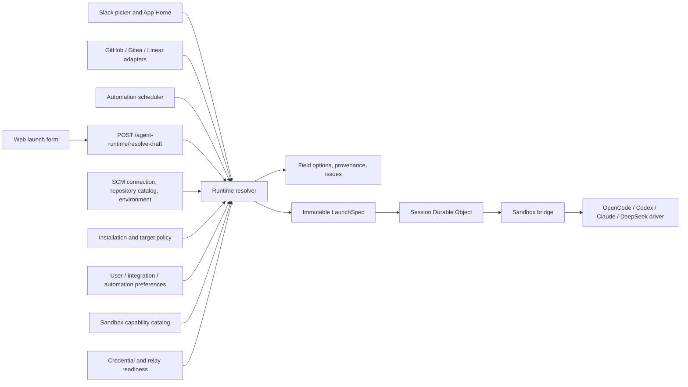
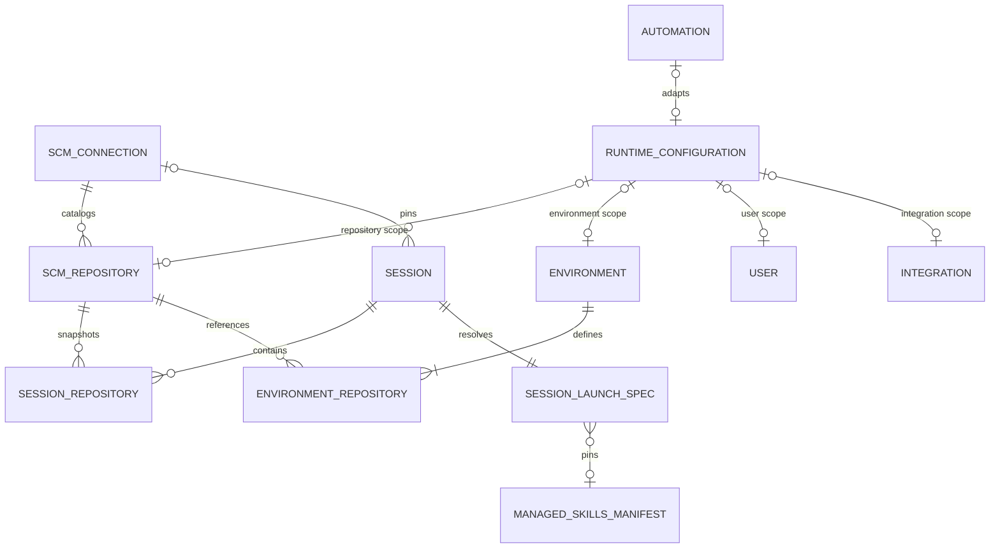

# Runtime Launch Configuration Alignment

## Status

Proposed design based on a code-path audit and a read-only production UI walkthrough. The current
implementation has working source-control connection selection and four sandbox harness drivers, but
the complete launch configuration is not governed by one capability model. This document defines the
target product flow, logical data model, control-plane contracts, channel behavior, migration
sequence, and acceptance gates.

This design builds on `gitea-multi-provider.md`. Source-control connections and agent harnesses are
orthogonal axes: selecting Gitea must not imply a particular harness, and selecting Codex must not
imply GitHub. The selected repository does, however, determine the connection, scoped secrets,
network route, environment defaults, and therefore which runtime routes are actually ready.

---

# Part I — Overall Design

## Executive Summary

Open-Inspect should expose session launch as one progressively resolved configuration:

```text
Source-control connection
  -> repository or environment
  -> effective target policy and secret scope
  -> harness
  -> ready model route
  -> model
  -> reasoning effort
  -> harness settings
  -> skills or command
  -> immutable session LaunchSpec
```

Today these inputs are implemented by separate components and validators:

- the web page selects the model and effort before the harness;
- the harness selector is enabled when any one provider route is ready;
- the model selector filters by provider family, not by the exact ready route;
- effort support comes from the global model catalog, not the selected harness driver;
- harness-specific settings are hard-coded in Python drivers;
- `/xxx` is a managed-skill completion alias and is not a structured command;
- Slack infers a harness from the model, while GitHub and Linear omit the harness;
- automations validate individual fields when saved and the full combination only when fired;
- web, Slack, integrations, environments, and automations store preferences in different places.

The result is a configuration that can look valid in the UI but fail during session creation, or
silently lose a setting after the sandbox starts. The fix is not another collection of client-side
conditionals. The control plane must own a single target-aware runtime resolver and return the exact
valid choices to every client.

The central product concepts are:

1. **LaunchRequest** — a caller's explicit choices and inherited preferences.
2. **RuntimeCapabilityCatalog** — what the deployed sandbox version and configured credentials can
   run for a particular target.
3. **RuntimeResolver** — applies policy, defaults, readiness, compatibility, and validation once.
4. **LaunchSpec** — the immutable, fully resolved snapshot used to create and resume the session.
5. **CommandRegistry** — structured product and harness commands, separate from managed skills.

## Verified Current-State Problem

A read-only production walkthrough reproduced a concrete invalid state:

1. Select the Gitea connection and repository `huangdong/n9n`.
2. Select the Claude Code harness.
3. The UI automatically selects `anthropic/claude-haiku-4-5` with effort `max`.
4. The Harnesses settings page reports that the Claude runtime is available, but the Anthropic
   credential is missing; only the Claude-to-DeepSeek relay route is ready.
5. The selector still permits the Anthropic model because Claude is considered available when any
   one of its routes is ready.
6. Session creation then rejects the combination with `CREDENTIAL_MISSING` and HTTP 409.

A second issue is silent rather than fatal. The shared model catalog allows `max` for
`openai/gpt-5.6-luna`, while the Codex driver accepts only `none`, `minimal`, `low`, `medium`,
`high`, and `xhigh`. The web and control plane accept `max`; the driver omits it from `turn/start`
instead of rejecting it.

These are contract defects. A browser-only fix would leave Slack, bots, automations, child sessions,
and direct API callers inconsistent.

## Goals

- Make every displayed launch combination executable at the time it is displayed, subject only to an
  explicitly surfaced readiness change after display.
- Preserve GitHub and Gitea as independent source-control connections and use stable repository
  identities everywhere.
- Resolve harness, provider route, model, effort, settings, skills, and commands through one server
  contract.
- Give each selector a clear dependency and explain why an option is inherited, disabled, or
  unavailable.
- Support installation, repository, environment, user, integration, automation, and session-level
  defaults without ambiguous precedence.
- Keep security policy distinct from user preference: a lower scope may choose within policy but may
  not weaken it.
- Persist an immutable launch snapshot so a running session does not change when defaults,
  credentials, catalogs, or environment settings change.
- Make Web, Slack, GitHub, Gitea, Linear, automations, and child sessions produce the same
  LaunchSpec for the same inputs.
- Define a structured `/xxx` command surface with capability-aware availability.
- Keep credentials and secret values out of browser payloads, LaunchSpec JSON, logs, and events.

## Non-Goals

- Making SCM provider behavior part of a harness protocol.
- Allowing repositories from different SCM connections in one session.
- Dynamically changing the harness or its provider transport inside an existing session.
- Exposing every native harness option merely because an SDK happens to support it.
- Treating UI validation as authoritative; the server always resolves and validates again.
- Sending SCM or model-provider credentials to the browser.
- Replacing the existing control-plane-to-sandbox WebSocket protocol with ACP.
- Guaranteeing one identical implementation for every native command. Product commands may have
  harness-specific adapters or be unavailable where semantics cannot be preserved.

## Design Principles

### One source of truth

The control plane owns compatibility and readiness. Clients render returned capabilities and do not
maintain private maps such as “Codex supports OpenAI and DeepSeek.”

### Invalid states are unrepresentable

Once a harness is selected, the model selector contains only models on ready routes for that harness
and target. Once a model is selected, effort contains only values that the selected driver can
faithfully transmit.

### Defaults and policy are different operations

Defaults merge by specificity. Policies intersect. A repository default may select Claude, but an
installation policy can disable Claude. A session override may select a different enabled harness,
but it cannot enable a disabled runtime or request a forbidden permission mode.

### Resolve late, snapshot once

The web may resolve drafts repeatedly to support a responsive UI. The authoritative resolution
happens transactionally at session creation, immediately before the session and sandbox are
initialized. The result is stored as a versioned LaunchSpec.

### Stable identities, mutable presentation

All repository-backed inputs use `repositoryKey` and `connectionId`. `owner/name`, provider labels,
URLs, and branch names are presentation or snapshot data, never cross-provider keys.

### Explicit degradation

Unsupported effort values, settings, and commands are rejected or shown as unavailable. They are
never silently dropped.

## Product Mental Model

Users should understand the launch form as answering five questions:

1. **Where will the agent work?** Source, repository set, environment, and branch.
2. **Which agent runtime will do the work?** Harness and transport route.
3. **Which model behavior should it use?** Model and effort.
4. **How may it operate?** Harness settings, skills, tools, and operator-enforced policy.
5. **What should it do first?** A normal prompt or a structured command.

The UI should show a compact summary before launch:

```text
Gitea · Aotsea / huangdong/n9n / main
Codex · OpenAI subscription / GPT 5.6 Luna / high
Autonomous policy · All applicable skills · 3 MCP servers
```

Inherited values display their origin, for example `Environment default`, `My default`, or
`Installation policy`. A value must not be labeled merely `default` when the user cannot tell which
scope supplied it.

## Target Architecture



## High-Level Decisions

| Area              | Decision                                                                                    |
| ----------------- | ------------------------------------------------------------------------------------------- |
| SCM identity      | Use opaque `repositoryKey` and `connectionId`; never route by `owner/name` alone.           |
| Session SCM scope | Zero or one connection per session; all selected repositories share it.                     |
| Harness lifecycle | Harness and provider transport route are fixed at session creation.                         |
| Model changes     | Allowed only when the active driver advertises live model switching for the route.          |
| Effort            | Defined by harness route plus model; unsupported values fail closed.                        |
| Settings          | Typed schema with scope, mutability, visibility, and security bounds.                       |
| Credentials       | Referenced by readiness route and secret scope; never copied into LaunchSpec.               |
| Commands          | Structured registry; `/` opens commands, `$` opens managed skills.                          |
| Resolution        | One control-plane resolver used by every launch entry point.                                |
| Persistence       | Store indexed core fields and a versioned immutable LaunchSpec JSON snapshot.               |
| Warm sessions     | Bound to a launch-draft digest; any identity-affecting change invalidates the warm session. |
| Existing sessions | Continue using their stored legacy fields; synthesize a legacy LaunchSpec on read.          |

---

# Part II — Detailed Design by Stage

## 1. Terminology and Boundaries

### Source-control connection

A configured forge instance and credential authority. Examples are the GitHub App connection and the
Gitea connection at `gitea.aotsea.com`. Provider type alone is not an identity because multiple
Gitea instances can exist.

### Target

The work location selected by the caller: no repository, one repository, an ordered repository set,
or an environment. Resolving a target snapshots repositories, branches, and one connection.

### Harness

The coding-agent runtime adapter: `opencode`, `codex`, `claude`, or `deepseek`. It owns lifecycle
and native protocol translation, not SCM authentication.

### Route

One concrete way a harness reaches a model provider. Examples:

- `codex:openai:subscription`
- `codex:deepseek:host-relay`
- `claude:anthropic:setup-token`
- `claude:deepseek:host-relay`
- `opencode:any:configured-provider`

Readiness belongs to a route, not merely a harness.

### Capability

A versioned statement of what the deployed runtime can do: supported routes, models, efforts,
settings, live mutations, commands, attachments, and tool event support.

### LaunchRequest

The unresolved request from a web form, integration, automation, or child-session operation. Fields
may be explicit or inherit defaults.

### LaunchSpec

The resolved and immutable session snapshot. It records effective choices and provenance but does
not contain secret values.

## 2. Unified Logical Data Model

### 2.1 Target input and snapshot

Clients submit opaque target identifiers:

```ts
export type SessionTargetInput =
  | { kind: "none" }
  | { kind: "repository"; repositoryKey: string; branch?: string }
  | { kind: "repository-set"; repositoryKeys: string[] }
  | { kind: "environment"; environmentId: string };
```

The server resolves them into:

```ts
export interface ResolvedTargetSnapshot {
  kind: "none" | "repository" | "repository-set" | "environment";
  connectionId: string | null;
  provider: SourceControlProviderName | null;
  environmentId: string | null;
  repositories: Array<{
    repositoryKey: string;
    connectionId: string;
    externalRepositoryId: string;
    owner: string;
    name: string;
    branch: string;
    position: number;
    webUrl: string;
    cloneUrl: string;
  }>;
}
```

`owner`, `name`, and URLs are snapshot presentation values. Subsequent operations use
`repositoryKey` and the session-pinned connection.

### 2.2 Runtime capability catalog

The deployed sandbox runtime publishes a versioned static manifest. The control plane combines it
with dynamic policy and readiness:

```ts
export interface RuntimeCapabilityCatalog {
  catalogVersion: string;
  runtimeImageVersion: string;
  checkedAt: number;
  harnesses: HarnessCapability[];
}

export interface HarnessCapability {
  harness: AgentHarness;
  displayName: string;
  enabled: boolean;
  runtimeAvailable: boolean;
  routes: HarnessRouteCapability[];
  settingsSchemaVersion: string;
  settings: HarnessSettingDefinition[];
  commands: CommandDefinition[];
  liveMutation: {
    model: boolean;
    effort: boolean;
    settings: string[];
  };
}

export interface HarnessRouteCapability {
  routeId: string;
  modelProvider: string;
  transport: "native" | "host-relay" | "opencode-provider";
  credentialKind: string | null;
  readiness: RuntimeReadiness;
  models: RouteModelCapability[];
}

export interface RouteModelCapability {
  model: string;
  displayName: string;
  enabled: boolean;
  efforts: string[];
  defaultEffort: string | null;
  nativeEffortMap: Record<string, string>;
  supportsAttachments: boolean;
  supportsToolEvents: boolean;
  supportsLiveModelSwitch: boolean;
}
```

The shared model catalog remains useful for names, descriptions, and operator enablement. It is not
the launch compatibility authority. A model is selectable only when it appears in a ready route.

### 2.3 Readiness

Readiness is target-aware because repository and environment secrets can override installation
secrets:

```ts
export interface RuntimeReadiness {
  ready: boolean;
  code:
    | "READY"
    | "HARNESS_DISABLED"
    | "RUNTIME_UNAVAILABLE"
    | "ROUTE_DISABLED"
    | "MODEL_DISABLED"
    | "CREDENTIAL_MISSING"
    | "CREDENTIAL_EXPIRED"
    | "RELAY_UNAVAILABLE"
    | "NETWORK_UNREACHABLE"
    | "POLICY_DENIED";
  message: string;
  remediation?: {
    kind: "open-settings" | "contact-operator" | "choose-another-route";
    href?: string;
  };
  checkedAt: number;
}
```

The response may expose whether a credential exists and its fingerprint/expiry metadata, but never
the credential value.

### 2.4 Harness settings

Harness settings require a typed product schema rather than arbitrary JSON:

```ts
export interface HarnessSettingDefinition {
  key: string;
  label: string;
  description: string;
  type: "boolean" | "string" | "integer" | "enum" | "string-list";
  defaultValue: unknown;
  enumOptions?: Array<{ value: string; label: string }>;
  allowedScopes: RuntimeConfigurationScope[];
  mutability: "session-start" | "per-turn";
  visibility: "user" | "operator" | "read-only";
  sensitive: false;
  constraints?: Record<string, unknown>;
}
```

Secret inputs are not harness settings. Credentials remain in the encrypted secret stores and are
referenced indirectly through route readiness.

Initial product settings should be deliberately small:

| Harness  | User-visible settings                                                        | Operator/read-only policy                             |
| -------- | ---------------------------------------------------------------------------- | ----------------------------------------------------- |
| OpenCode | provider-specific optional behavior exposed only when stable                 | server command, filesystem and outer sandbox policy   |
| Codex    | optional system instructions, MCP selection, eligible collaboration features | approval policy, sandbox mode, network policy         |
| Claude   | optional system prompt append, effort, eligible tool groups                  | permission mode ceiling and tool allowlist ceiling    |
| DeepSeek | eligible MCP/tool groups                                                     | approval, shell, telemetry, update and sandbox policy |

The existing autonomous values can remain defaults, but they must be represented in the capability
response. A read-only value such as `danger-full-access` should be visible as enforced platform
policy rather than hidden in Python.

### 2.5 Configuration fragments and provenance

Every scope supplies the same logical fragment:

```ts
export interface RuntimeConfigFragment {
  harness?: AgentHarness | null;
  routeId?: string | null;
  model?: string | null;
  effort?: string | null;
  settings?: Record<string, unknown>;
  skillSelection?: SessionSkillSelection;
}

export type RuntimeConfigurationScope =
  | "installation"
  | "user"
  | "integration"
  | "repository"
  | "environment"
  | "automation"
  | "session";

export interface ResolvedValue<T> {
  value: T;
  source: { scope: RuntimeConfigurationScope; id: string | null };
  inherited: boolean;
}
```

Default precedence, from least to most specific, is:

```text
installation
  -> user or integration caller defaults
  -> repository defaults
  -> environment defaults
  -> automation template or explicit session request
```

An environment is a deliberate workspace definition and therefore overrides implicit repository and
caller defaults. An explicit value in the launch form may override a default if policy permits.

Policy does not use this precedence. Effective policy is the intersection of installation,
connection, repository, and environment restrictions. No user or integration preference can expand
it.

### 2.6 LaunchRequest

The new API request is grouped by meaning:

```ts
export interface LaunchRequest {
  target: SessionTargetInput;
  runtime?: {
    harness?: AgentHarness | "inherit";
    routeId?: string | "auto";
    model?: string | "inherit";
    effort?: string | "inherit";
    settings?: Record<string, unknown>;
  };
  skills?: SessionSkillSelection;
  initialAction?:
    | { type: "prompt"; content: string; attachments?: SessionAttachmentInput[] }
    | { type: "command"; commandId: string; arguments: Record<string, unknown> };
  caller: {
    channel: "web" | "slack" | "github" | "gitea" | "linear" | "automation" | "child";
    preferenceOwnerId?: string;
  };
}
```

The verified principal and caller channel are derived server-side for public APIs. Clients may not
assert another user's identity or secret scope.

### 2.7 Immutable LaunchSpec

```ts
export interface SessionLaunchSpecV1 {
  version: 1;
  resolverVersion: string;
  capabilityCatalogVersion: string;
  resolvedAt: number;
  target: ResolvedTargetSnapshot;
  runtime: {
    harness: ResolvedValue<AgentHarness>;
    routeId: ResolvedValue<string>;
    model: ResolvedValue<string>;
    effort: ResolvedValue<string | null>;
    nativeEffort: string | null;
    settings: Record<string, ResolvedValue<unknown>>;
  };
  skillsManifestId: string | null;
  commandCapabilities: string[];
  caller: {
    channel: LaunchRequest["caller"]["channel"];
    canonicalUserId: string | null;
    integrationId: string | null;
  };
  draftDigest: string;
}
```

The LaunchSpec stores no token, API key, refresh token, setup token, auth.json, or PAT. `routeId`
allows the runtime to request the appropriate credential path without learning unrelated secrets.

### 2.8 Physical persistence

Keep frequently queried fields indexed and retain the full snapshot separately:

```sql
CREATE TABLE session_launch_specs (
  session_id TEXT PRIMARY KEY,
  version INTEGER NOT NULL,
  resolver_version TEXT NOT NULL,
  catalog_version TEXT NOT NULL,
  draft_digest TEXT NOT NULL,
  harness TEXT NOT NULL,
  route_id TEXT NOT NULL,
  model TEXT NOT NULL,
  reasoning_effort TEXT,
  spec_json TEXT NOT NULL,
  created_at INTEGER NOT NULL
);
```

Existing indexed session columns remain during migration. New code verifies that the indexed fields
match the snapshot before sandbox creation.

Reusable preferences can use a normalized scope table:

```sql
CREATE TABLE runtime_configurations (
  id TEXT PRIMARY KEY,
  scope_type TEXT NOT NULL,
  scope_id TEXT NOT NULL,
  config_json TEXT NOT NULL,
  schema_version INTEGER NOT NULL,
  created_by TEXT,
  created_at INTEGER NOT NULL,
  updated_at INTEGER NOT NULL,
  UNIQUE(scope_type, scope_id)
);
```

The store must validate allowed scope types and verify referenced repository, environment, user, or
integration records before writing because a polymorphic `scope_id` cannot have one database foreign
key. Automations may retain indexed model/harness columns while also producing a
`RuntimeConfigFragment` through an adapter.

The logical relationships are:



The SCM side answers where the session works. Runtime configurations contribute defaults and policy.
The resolver is the only component allowed to combine them into `SESSION_LAUNCH_SPEC`.

## 3. Source-Control Source Selection

### Current behavior

- The web loads source-control connections and repository records.
- The source selector is shown only when multiple connections exist.
- Changing the source clears repository and branch state.
- Repository launch requests prefer `repositoryKey`.
- Slack interactive targets prefer `repositoryKey`, but routing rules still persist lowercase
  `owner/name` and resolve the first catalog match.

### Target behavior

1. Always retain `selectedConnectionId` in the launch draft, even if the source selector is hidden.
2. Filter repository and environment options before rendering, not after an item is selected.
3. Persist source selection by connection ID, never provider type or hostname.
4. Display connection label, provider, and hostname whenever duplicate repository names could be
   ambiguous.
5. When a cached catalog is stale, show its age and revalidate access during server resolution.
6. If a connection becomes unavailable, keep the last selection visible but disabled with a
   remediation action.

### Gitea and GitHub invariants

- `github/acme/api`, `gitea-a/acme/api`, and `gitea-b/acme/api` are three distinct targets.
- A webhook adapter resolves its installed connection first, then resolves the external repository
  ID within that connection.
- Slack routing rules store `repositoryKey`, with a dual-read migration for historical `owner/name`
  rules.
- Gitea service-account PAT authorship and GitHub App authorship are SCM details and do not alter
  harness selection.

### User interaction

The first control is labeled **Source**. If one connection exists it is rendered as a compact
read-only chip. If multiple exist it is a searchable selector with health state:

```text
GitHub · summersmile1984                 Ready
Gitea · Aotsea · gitea.aotsea.com       Ready
Gitea · Lab · git.internal.example       Connection unavailable
```

Changing Source resets target-dependent fields and sends a new draft-resolution request.

## 4. Repository, Repository Set, Environment, and Branch

### Current behavior

Single-repository selection is stable. Multi-repository UI receives the full repository list and
then disables a different connection after the first selection. Legacy environments without a
connection can appear under every selected source. The server correctly rejects multiple connections
when stable repository keys are resolved.

### Target behavior

- The target selector receives only records matching the selected connection.
- Multi-repository mode shows only one connection from the beginning.
- Repository names that would collide at `/workspace/{repoName}` are disabled with an explanation.
- Environments are shown only under their pinned connection. Legacy connectionless environments are
  shown in a separate **Migration required** section and are not launchable until resolved.
- Branch options are fetched by `repositoryKey`; branch values are snapshotted into LaunchSpec.
- Environment launches display member repositories and branches before launch.
- A repo-less session explicitly uses `{ kind: "none" }`; absence of a field is not overloaded to
  mean both “not chosen yet” and “no repository.”

### Interaction states

The target control has four states:

1. **Loading** — catalog skeleton, send disabled.
2. **Ready** — searchable targets grouped as Environments and Repositories.
3. **Stale** — selection remains visible, catalog age shown, server revalidation required.
4. **Unavailable** — reason and refresh/settings action shown, send disabled.

Selecting or changing the target clears incompatible explicit runtime choices only when they are no
longer valid. Valid choices remain and their provenance is recalculated.

## 5. Harness Selection

### Current behavior

Harness precedence is explicit request, environment default, installation runtime preference,
deployment environment value, then OpenCode. A session locks the harness after creation. The
selector treats a harness as available when at least one route is ready.

### Target behavior

The harness selector consumes target-aware `HarnessCapability` records. Each item reports:

- runtime installation state;
- enabled/disabled policy;
- number of ready routes;
- inherited source;
- concise disabled reason;
- settings availability.

A harness is selectable only if at least one route has at least one enabled model. Selecting it
causes the route and model selectors to be recomputed together. If exactly one route is ready, route
selection remains implicit. If multiple routes are ready, the model grouping communicates the route,
and an advanced route selector may be exposed when two routes contain the same model name.

Example:

```text
OpenCode                  Ready · installation default
Codex                     Ready · OpenAI subscription, DeepSeek relay
Claude Code               Partial · DeepSeek relay only
DeepSeek Harness          Ready · Host relay
```

Choosing `Claude Code` in this example must show only DeepSeek models. Anthropic models remain
visible only in an explanatory disabled section if that helps remediation; they cannot become the
selected value.

## 6. Model Selection

### Current behavior

The web and control plane duplicate a provider-family compatibility map. Enabled model preference is
separate from credential and relay readiness. Existing native sessions limit follow-up changes to
the initial model provider, but this is also a client-side rule.

### Target behavior

- Models come only from ready routes of the selected harness.
- The control plane returns display metadata plus route ID; the client does not infer route from a
  string prefix.
- Disabled models may be displayed with reasons but cannot be submitted.
- Existing sessions use the LaunchSpec route and its `supportsLiveModelSwitch` capability.
- Cross-route changes always require a new session.
- A model removed from the operator catalog remains visible on historical sessions but is not
  offered for new sessions.
- A change in model resets effort to the resolved default only when the prior effort is invalid.

Model options are grouped by executable route, not just marketing provider:

```text
OpenAI subscription
  GPT 5.6 Luna
  GPT 5.4 Codex

DeepSeek through Host relay
  DeepSeek V4 Flash
```

## 7. Reasoning Effort

### Current behavior

Effort is defined by model only. Codex supports a different set from the shared catalog, Claude
forwards another set, and DeepSeek does not expose reasoning effort through the current driver.
Unknown or unsupported values may be dropped by a driver.

### Target behavior

Effort is a `RouteModelCapability`, not a global `MODEL_REASONING_CONFIG` lookup. The resolver:

1. finds the selected route and model;
2. obtains allowed product effort values;
3. maps the product value to a native value;
4. rejects any missing mapping;
5. writes both product and native values into LaunchSpec;
6. the driver asserts the native value again before sending it.

No-effort models render no effort control. The UI uses the label **Effort** and displays provenance:

```text
Effort: high · model default
Effort: xhigh · my override
No configurable effort · DeepSeek V4 Flash
```

The immediate Codex fix is either to add a tested native `max` mapping or remove `max` from Codex
routes. Silent omission is forbidden.

## 8. Harness Settings

### Current behavior

The Harnesses settings page controls the installation default, enablement, native credentials, and
relay health. Driver behavior such as approval policy, sandbox mode, Claude tool allowlist, system
prompt, shell access, update checks, and telemetry is hard-coded.

### Target settings experience

Settings → Harnesses has four sub-sections:

1. **Availability** — installed runtime version, enabled state, routes, models, and last readiness
   check.
2. **Defaults** — installation-level default harness, model, effort, and supported user-visible
   settings.
3. **Security policy** — operator-only bounds, with read-only display for ordinary users.
4. **Credentials and relays** — secret replacement/removal and readiness tests, never secret reads.

Repository and Environment settings reuse the same schema and show only scopes allowed by each
setting. A new-session **Runtime settings** popover shows effective values, provenance, and the
small set of session-overridable fields.

### Mutability

- `session-start` settings are locked once the session is created.
- `per-turn` settings may be changed only when the driver advertises support.
- Changing a locked value offers **Start a new session with these settings**.
- Security policy values are never per-turn mutable.

### Driver contract

The Python driver factory receives a validated runtime object:

```py
@dataclass(frozen=True)
class ResolvedHarnessRuntime:
    harness: AgentHarness
    route_id: str
    model: str
    native_effort: str | None
    settings_schema_version: str
    settings: Mapping[str, object]
```

Every driver must reject unknown keys and unsupported values. It must not silently ignore settings
that were accepted into LaunchSpec.

## 9. Skills and `/xxx` Commands

### Current behavior

Both `/` and `$` trigger managed-skill completion. The prompt payload contains raw text only.
Harness drivers expose start, stream, stop, and close but no command capability. Consequently,
`/compact`, `/review`, `/model`, or a native harness command has undefined cross-harness behavior.

### Syntax decision

- `/` opens the structured command palette.
- `$` opens managed-skill completion.
- Existing `/skill-name` remains a temporary compatibility alias and displays a migration hint; it
  is removed after stored documentation and usage telemetry show safe adoption.
- Harness-native commands that do not have product semantics use a namespaced ID and are labeled by
  origin. The raw prompt is never used as the command protocol.

### Command model

```ts
export interface CommandDefinition {
  id: string;
  slashName: string;
  title: string;
  description: string;
  owner: "product" | "harness";
  harnesses: AgentHarness[] | "all";
  contexts: Array<"draft" | "idle-session" | "running-session">;
  execution: "control-plane" | "driver" | "prompt-transform";
  arguments: CommandArgumentDefinition[];
  mutates: Array<"session" | "model" | "effort" | "context">;
}

export interface CommandInvocation {
  commandId: string;
  arguments: Record<string, unknown>;
  clientInvocationId: string;
}
```

### Initial command set

| Command    | Owner                    | Behavior                                                               |
| ---------- | ------------------------ | ---------------------------------------------------------------------- |
| `/help`    | product                  | Show commands available for the current draft or session.              |
| `/stop`    | product                  | Interrupt the active turn through the existing stop command.           |
| `/status`  | product                  | Show session, sandbox, SCM, harness, model, and readiness state.       |
| `/model`   | product                  | Open model selection; execute only if live switching is supported.     |
| `/effort`  | product                  | Open allowed efforts for the active route and model.                   |
| `/new`     | product                  | Start a new draft inheriting the target and eligible runtime settings. |
| `/compact` | product adapter          | Invoke a tested context-compaction adapter or show unavailable.        |
| `/review`  | product prompt-transform | Resolve to a managed review workflow with explicit provenance.         |

Native commands may be exposed as `/native:<name>` in advanced mode. A native command must declare
its arguments and result events; merely forwarding a raw string is not sufficient.

### Interaction

Typing `/` opens a palette grouped into **Session**, **Runtime**, and **Harness**. Items that cannot
run are disabled with a reason. Selecting a command may open argument controls instead of inserting
text. The message timeline records a structured command event and its outcome.

Slack reserves platform slash commands, so Slack should register one app command such as `/inspect`,
with subcommands or buttons backed by the same CommandRegistry. It should not promise that arbitrary
web `/xxx` text has Slack platform semantics.

## 10. Draft Resolution and Warm Sandbox Interaction

### Draft API

The web calls:

```http
POST /agent-runtime/resolve-draft
Content-Type: application/json

{
  "target": { "kind": "repository", "repositoryKey": "repo_...", "branch": "main" },
  "runtime": { "harness": "claude", "model": "inherit", "effort": "inherit" }
}
```

The response contains:

```ts
export interface ResolveLaunchDraftResponse {
  draftDigest: string;
  effective: {
    target: ResolvedTargetSummary;
    harness: ResolvedValue<AgentHarness> | null;
    routeId: ResolvedValue<string> | null;
    model: ResolvedValue<string> | null;
    effort: ResolvedValue<string | null> | null;
    settings: Record<string, ResolvedValue<unknown>>;
  };
  options: {
    harnesses: HarnessOption[];
    models: ModelOption[];
    efforts: EffortOption[];
    settings: HarnessSettingOption[];
    commands: CommandOption[];
  };
  issues: RuntimeSelectionIssue[];
  launchable: boolean;
}
```

### Issue contract

```ts
export interface RuntimeSelectionIssue {
  code:
    | "TARGET_REQUIRED"
    | "SCM_CONNECTION_MISMATCH"
    | "TARGET_UNAVAILABLE"
    | "HARNESS_UNAVAILABLE"
    | "ROUTE_NOT_READY"
    | "MODEL_INCOMPATIBLE"
    | "EFFORT_UNSUPPORTED"
    | "SETTING_INVALID"
    | "COMMAND_UNAVAILABLE"
    | "CAPABILITY_CHANGED";
  field: "target" | "harness" | "route" | "model" | "effort" | "settings" | "command";
  severity: "error" | "warning";
  message: string;
  remediation?: RuntimeReadiness["remediation"];
}
```

### Warm-session safety

The existing UI may begin warming while the user types. The warm session must be bound to
`draftDigest`, which covers target, resolved runtime, settings, and skills. Any identity-affecting
change cancels the old warm operation. The final create/prompt request includes the digest, and the
server rejects it with `CAPABILITY_CHANGED` if authoritative re-resolution produces another digest.

The UI then displays what changed and asks the user to retry; it never sends a prompt to a sandbox
prepared for another harness or target.

## 11. Session Creation and Existing Session Controls

### Creation transaction

1. Authenticate caller and derive canonical user/integration identity.
2. Resolve target and check repository access.
3. Load scoped defaults, policy, secrets metadata, and runtime catalog.
4. Resolve and validate LaunchRequest.
5. Pin managed-skill revisions.
6. Persist session core fields and LaunchSpec.
7. Initialize the Durable Object from the persisted LaunchSpec.
8. Start the sandbox with the pinned target and runtime route.
9. Accept the initial prompt or command only after runtime readiness is confirmed.

Session creation is rejected before sandbox allocation when the spec is not launchable.

### Existing session

The session composer displays:

- source connection and repository snapshot;
- locked harness and route;
- active model and effort;
- runtime-settings summary;
- available command palette.

Harness and route are locked. Model, effort, and per-turn settings are interactive only when the
LaunchSpec capability permits them. A live mutation is validated by the same resolver against the
session's pinned route and current target secret scope.

If credentials expire after the session is created, the session remains inspectable. The next turn
is blocked with a precise remediation message rather than starting a different route automatically.

## 12. Web New-Session UX

The footer should be reordered into dependent controls:

```text
[Source] [Target] [Branch] | [Harness] [Model] [Effort] [Runtime settings] | [Skills]
```

On narrow screens these become three rows or one **Configure session** sheet. The prompt remains the
primary element.

Interaction rules:

1. Source change clears Target and all target-invalid options.
2. Target change resolves scoped defaults and capability readiness.
3. Harness change recomputes route, model, effort, settings, and commands.
4. Model change preserves effort only if still valid.
5. Effort is never shown as generic `default`; its source is visible.
6. Runtime settings show a badge when values differ from inherited defaults.
7. Send is enabled only when `launchable=true` and the prompt or command is valid.
8. Disabled values have explanatory tooltips and settings links.
9. A compact summary is announced for accessibility after resolution.
10. The final server response, not optimistic client state, determines the session snapshot.

## 13. Settings UX

### Installation Harness settings

Operators configure runtime availability, enabled routes, default runtime fragment, policy bounds,
and credentials. Readiness tests are route-specific. “Runtime installed” and “credential ready” are
not collapsed into one status.

### Repository settings

A repository may define default harness/model/effort/settings within installation policy. The page
is reached through the stable repository key and shows its SCM connection.

### Environment settings

An environment may override repository defaults for its full workspace. The preview shows the
effective runtime fragment and any member-repository conflicts.

### Personal settings

Users can save a default or named runtime profiles. Personal defaults never store credentials and
cannot weaken policy. Browser localStorage may cache the last draft for convenience, but it is not
the authoritative preference store.

### Integration settings

Slack, GitHub, Gitea, and Linear integration settings use the same RuntimeConfigFragment editor.
Repository selectors store stable repository keys. The UI validates templates against current
capabilities and shows when a later credential or policy change makes them unhealthy.

## 14. Slack Interaction

Slack has less horizontal space but must preserve the same semantics:

- App Home stores personal model, effort, and optional harness preference in the control plane,
  replacing channel-specific compatibility logic.
- Target selection values use repository keys and include source labels.
- Routing rules migrate from `owner/name` to repository keys.
- When the target and runtime resolve unambiguously, a mention launches immediately.
- When ambiguous or invalid, Slack opens a modal with Source, Target, Harness, Model, and Effort.
- The completion message includes the effective harness/model and a **View Session** link.
- `/inspect status`, `/inspect stop`, and other Slack commands invoke the shared CommandRegistry.

Slack must not infer `OpenAI -> Codex` independently. It may submit an `auto` preference, but the
control plane chooses the valid route and returns provenance.

## 15. GitHub and Gitea Bot Interaction

GitHub and Gitea webhook adapters are provider-specific at ingestion and provider-neutral after
repository resolution:

1. Resolve webhook installation/connection.
2. Resolve the external repository ID to `repositoryKey` within that connection.
3. Load integration runtime defaults.
4. Submit a LaunchRequest with caller channel `github` or `gitea`.
5. Use the common RuntimeResolver.

Integration configuration includes harness/model/effort/settings as one fragment. Neither adapter
may omit the harness while assuming the model determines it. A provider-native review action is an
SCM capability; the coding harness remains independent.

Comment commands such as `/inspect review` may be parsed into structured commands. They must not be
forwarded as raw prompt text. GitHub-only reviewer and App behavior remains behind SCM capabilities;
Gitea receives equivalent behavior only when its adapter advertises it.

## 16. Linear Interaction

Linear keeps its issue/project mapping and user identity behavior but delegates runtime selection:

- integration defaults are stored as a RuntimeConfigFragment;
- mapped repository targets use stable repository keys;
- the activity message displays resolved harness/model rather than only model;
- invalid configuration is reported before announcing that a coding session is being created;
- retry after remediation resolves a new LaunchSpec instead of reusing stale inferred fields.

## 17. Automations

### Current behavior

The form independently selects enabled models and an optional harness. Save-time validation checks
field syntax but not the executable combination. The scheduler calls the runtime selection check
only when a run launches.

### Target behavior

- The automation form uses the same dependent selectors as a session draft.
- Saving requires a currently launchable resolved template unless the operator explicitly saves it
  disabled.
- The stored automation retains its unresolved RuntimeConfigFragment plus the last validation
  summary and catalog version.
- Every firing re-resolves because credentials, policies, and runtime versions may change.
- An invalid run is marked `configuration_error` without allocating a sandbox.
- The automation page shows remediation and supports **Validate now**.
- Multi-target automations resolve one LaunchSpec per target because scoped secrets and repository
  defaults can differ.

## 18. Child Sessions and Session Resume

A child session inherits the parent's target and runtime fragment by default. The server resolves a
new LaunchSpec, preserving the parent route when still ready. Explicit child overrides pass through
the same policy and capability checks.

Resume uses the stored LaunchSpec, not current defaults. If the stored runtime image is unavailable,
resume fails with `RUNTIME_UNAVAILABLE` and offers **Start replacement session**; it does not
silently switch harnesses.

## 19. Sandbox and Driver Protocol

The bridge remains the stable product protocol. Add two control-plane-to-bridge messages:

```ts
type StartRuntimeCommand = {
  type: "start_runtime";
  runtime: SanitizedRuntimeLaunchSpec;
};

type InvokeRuntimeCommand = {
  type: "invoke_command";
  invocationId: string;
  commandId: string;
  arguments: Record<string, unknown>;
};
```

`prompt` retains content, model, effort, attachments, and author during transition, but the bridge
validates them against the started runtime. Later it can reference the active runtime spec instead
of repeating locked fields.

At startup the bridge compares `settingsSchemaVersion` and supported route IDs with its packaged
manifest. A mismatch fails fast with `CAPABILITY_CHANGED`. This prevents a newly deployed control
plane from sending settings an older Modal image cannot understand.

## 20. API Surface

Recommended endpoints:

| Method and path                     | Purpose                                                                    |
| ----------------------------------- | -------------------------------------------------------------------------- |
| `POST /agent-runtime/resolve-draft` | Resolve target-aware options and issues without creating a session.        |
| `GET /agent-runtime/catalog`        | Operator/debug view of the deployed static and dynamic capability catalog. |
| `GET /agent-runtime/preferences`    | Read canonical user runtime preferences.                                   |
| `PUT /agent-runtime/preferences`    | Save canonical user runtime preferences.                                   |
| `POST /sessions`                    | Accept LaunchRequest; persist authoritative LaunchSpec.                    |
| `GET /sessions/:id/runtime`         | Return sanitized LaunchSpec and allowed live mutations.                    |
| `PATCH /sessions/:id/runtime`       | Apply supported per-turn model, effort, or settings changes.               |
| `POST /sessions/:id/commands`       | Execute a structured command.                                              |

Existing flat session-create fields remain accepted during migration and are translated into a
LaunchRequest. New responses include deprecation metadata in development and logs, not noisy
end-user warnings.

## 21. Error and Remediation UX

Every rejected selection identifies one field and one action. Examples:

| Code                      | User message                                                  | Action                                           |
| ------------------------- | ------------------------------------------------------------- | ------------------------------------------------ |
| `CREDENTIAL_MISSING`      | Claude Code cannot use Anthropic for this target.             | Configure Claude token or choose DeepSeek route. |
| `EFFORT_UNSUPPORTED`      | Codex cannot transmit `max` for GPT 5.6 Luna.                 | Choose `xhigh` or another harness.               |
| `SCM_CONNECTION_MISMATCH` | One session cannot mix repositories from two connections.     | Remove mismatched repositories.                  |
| `CAPABILITY_CHANGED`      | Runtime availability changed while the session was preparing. | Review updated choices and retry.                |
| `COMMAND_UNAVAILABLE`     | Compact is not supported by this harness version.             | Start a new session or use another harness.      |

Errors from external APIs are mapped to stable product codes. Raw SDK, provider, or secret-store
errors remain in redacted operator logs.

---

# Part III — Delivery, Verification, and Final State

## 22. Migration Plan

### Phase 0 — Stop known invalid and silent behavior

- Make model choices route-readiness-aware in the current form.
- Fix Codex effort support by adding a tested mapping or removing unsupported values.
- Filter multi-repository choices by the selected connection before rendering.
- Store new Slack routing rules by repository key and dual-read old rules.
- Make GitHub and Linear session launches use the same temporary harness inference as Slack, then
  remove all three inference implementations in Phase 1.
- Add integration tests for the reproduced Claude credential-missing state.

### Phase 1 — Capability catalog and shared resolver

- Add shared capability, LaunchRequest, issue, and draft-response types.
- Move provider-family compatibility out of web and Slack into the control plane.
- Implement target-aware readiness and `resolve-draft`.
- Convert the web launch form to dependent selectors.
- Convert automations to the shared draft resolver.

### Phase 2 — Immutable LaunchSpec

- Add `session_launch_specs` migration and stores.
- Persist LaunchSpec transactionally with the session.
- Initialize Durable Objects and sandboxes from LaunchSpec.
- Bind warm sessions to `draftDigest`.
- Synthesize `version: 0` legacy specs for existing sessions.

### Phase 3 — Unified entry points

- Move Slack preferences from independent inference/KV behavior to control-plane preferences.
- Convert GitHub, Gitea, and Linear adapters to LaunchRequest.
- Convert child session creation and automation firing.
- Add source-labeled target pickers everywhere.

### Phase 4 — Typed settings and driver manifest

- Define the first stable harness setting schemas.
- Package a runtime capability manifest in the sandbox image.
- Pass validated settings to drivers and reject unsupported keys.
- Add settings/provenance UI at installation, repository, environment, and session scopes.

### Phase 5 — Structured commands

- Add CommandRegistry, command palette, events, and bridge invocation.
- Migrate managed skills to `$` completion.
- Implement product commands and capability-gated adapters.
- Register the Slack `/inspect` command and parse GitHub/Gitea comment commands.

### Phase 6 — Remove compatibility paths

- Stop accepting flat create-session runtime fields after every first-party caller migrates.
- Remove duplicate web/control-plane/Slack harness-provider maps.
- Remove legacy Slack `owner/name` routing after backfill and audit.
- Remove `/skill-name` compatibility after usage reaches the agreed threshold.

## 23. Testing Strategy

### Resolver unit tests

Use table-driven cross-products:

- every harness × route × model × effort;
- enabled/disabled harness and model states;
- missing, expired, repository, environment, and global credentials;
- relay online/offline;
- policy intersection and default provenance;
- explicit override, automation, integration, and child-session inputs;
- stable repository identity collisions across GitHub and two Gitea connections.

The test asserts both the resolved value and why every rejected option is rejected.

### Driver contract tests

For each advertised capability:

- start the driver with a generated resolved runtime;
- assert exact native model and effort parameters;
- assert every accepted setting reaches the native SDK/RPC request;
- assert unknown or unsupported values fail;
- assert commands produce normalized events;
- assert capability manifest matches the implementation.

No driver test may treat “parameter was omitted” as success for an explicitly requested value.

### Control-plane integration tests

- D1 preference layers and provenance;
- session LaunchSpec transaction and indexed-field consistency;
- target secret scoping;
- automation save and fire revalidation;
- child inheritance and explicit override;
- warm-session digest mismatch;
- existing-session legacy synthesis;
- sanitized runtime response contains no credentials.

### Browser E2E matrix

At minimum:

| Scenario                                               | Expected result                                                              |
| ------------------------------------------------------ | ---------------------------------------------------------------------------- |
| GitHub repo + Codex + ready OpenAI                     | Launch succeeds and session shows pinned GitHub target/Codex route.          |
| Gitea repo + Codex + ready OpenAI                      | Same runtime behavior; clone/push remains pinned to Gitea.                   |
| Gitea repo + Claude, Anthropic missing, DeepSeek ready | Only DeepSeek models selectable.                                             |
| Codex + GPT 5.6 Luna                                   | Only driver-supported efforts selectable and exact value reaches app-server. |
| Duplicate `owner/name` on GitHub and Gitea             | Source and repository remain distinct in Web and Slack.                      |
| Multi-repo across two connections                      | Second connection never appears in picker; API also rejects crafted request. |
| Change Harness after warm starts                       | Old warm session is cancelled; new digest and runtime are used.              |
| Existing session                                       | Harness/route locked; only advertised live mutations enabled.                |
| `/` in composer                                        | Command palette opens; `$` opens skills; command is sent structurally.       |
| Automation capability becomes invalid                  | Save/run status shows configuration error and no sandbox is allocated.       |

The production smoke suite performs read-only option checks first, then launches dedicated E2E
repositories for clone, prompt, commit, push, and pull-request verification on both GitHub and
Gitea.

### Cross-channel contract tests

Given the same target and preference fixture, Web, Slack, GitHub, Gitea, Linear, automation, and
child callers must produce equal runtime fields in LaunchSpec. Channel identity and initial prompt
may differ; harness, route, model, effort, settings, and target snapshot may not.

## 24. Observability

Emit structured, credential-free events:

- `runtime.draft_resolved`
- `runtime.selection_rejected`
- `runtime.launch_spec_created`
- `runtime.capability_changed`
- `runtime.driver_started`
- `runtime.command_invoked`
- `runtime.live_mutation_applied`

Useful dimensions include caller channel, harness, route ID, model, effort, issue code, connection
provider, resolver version, catalog version, and latency. Do not log repository credentials, model
keys, prompt bodies, auth.json, setup tokens, PATs, or raw settings that could later become
sensitive.

Metrics should distinguish:

- UI-visible invalid combinations, which should reach zero;
- server rejections caused by readiness races;
- sandbox startup failures after a valid LaunchSpec;
- driver capability mismatches;
- channel-specific resolution differences;
- frequency of inherited versus explicit selections;
- command availability and failure by harness.

## 25. Security and Reliability Risks

| Risk                                               | Mitigation                                                                              |
| -------------------------------------------------- | --------------------------------------------------------------------------------------- |
| Capability drift between Worker and Modal image    | Versioned manifest handshake and fail-fast mismatch.                                    |
| Stale readiness enables an expired credential      | Short TTL, creation-time revalidation, precise retry state.                             |
| Secret metadata leaks too much                     | Return only configured/expiry/fingerprint metadata allowed by role.                     |
| Warm sandbox uses stale target/runtime             | Bind it to draft digest and cancel on identity changes.                                 |
| Arbitrary settings weaken isolation                | Typed allowlist plus intersected operator policy.                                       |
| Driver silently ignores a field                    | Contract tests and runtime rejection of unknown/unsupported values.                     |
| GitHub/Gitea repository collision                  | Stable repository key and connection ID at every boundary.                              |
| Command name collision with skills/native commands | `/` command registry, `$` skills, namespaced native IDs.                                |
| Polymorphic configuration scope loses integrity    | Store-level reference validation and periodic consistency audit.                        |
| Draft resolution becomes slow                      | Cache static catalog, batch target metadata, cache readiness by target-secret revision. |
| Integration behavior regresses during migration    | Dual-read adapters and cross-channel LaunchSpec equality tests.                         |

## 26. Acceptance Criteria

The design is implemented only when all of the following are proven:

1. The production new-session page cannot select a harness/model/effort combination the current
   target-aware resolver says is invalid.
2. The exact selected effort and every accepted per-session setting are present in the native
   harness request or the launch is rejected before sandbox work begins.
3. GitHub and Gitea repositories with the same owner/name remain distinct in Web, Slack,
   automations, sessions, secrets, and pull-request operations.
4. Every new session has a versioned immutable LaunchSpec with no secret values.
5. Web, Slack, GitHub, Gitea, Linear, automations, and child sessions use one RuntimeResolver.
6. Existing sessions remain inspectable and resumable through the documented legacy path.
7. Harness settings have typed definitions, provenance, policy bounds, and driver contract tests.
8. `/xxx` invokes a structured command, `$xxx` selects a skill, and unsupported commands are shown
   as unavailable instead of sent as ambiguous raw text.
9. Warm-session digest tests prove that changing source, target, harness, route, model, settings, or
   skills cannot reuse an incompatible sandbox.
10. Browser E2E covers both GitHub and Gitea for selection, clone, prompt, commit, push, and
    pull-request flows with at least Codex and one relay route.
11. Automation save and run states surface configuration invalidity before sandbox allocation.
12. Redaction tests prove that credentials do not appear in capability responses, LaunchSpec, logs,
    events, or browser state.

## 27. Final Product State

After this plan is complete, a user experiences one coherent launch flow rather than a collection of
independent selectors. Choosing a source determines the available targets. Choosing a target
determines scoped policy and readiness. Choosing a harness determines executable routes and models.
Choosing a model determines exact effort and setting capabilities. The resulting summary is the same
whether the session starts in Web, Slack, GitHub, Gitea, Linear, an automation, or a child session.

The sandbox receives a versioned, validated runtime snapshot and remains unaware of UI-specific
defaults. Harness drivers translate only values they explicitly advertise. Source control remains
provider-neutral and securely pinned to the selected connection. Commands become intentional,
discoverable product actions, while managed skills keep their own syntax and immutable manifest.

This is the alignment boundary: no layer is allowed to independently guess the harness, route,
model, effort, repository identity, or command semantics.
