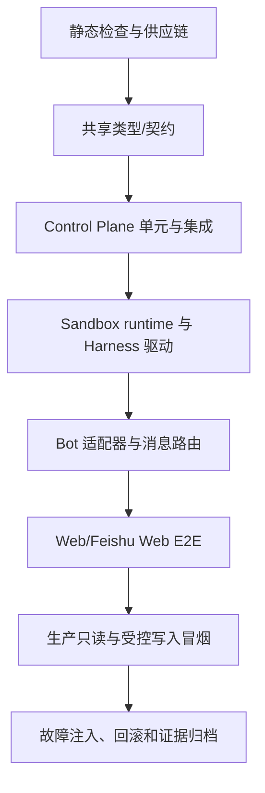

# Open-Inspect 验证方案与边界矩阵

## 1. 目的与当前范围

本方案用于验证当前 fork 的完整链路：SCM 连接（GitHub/Gitea）→ Web 会话→ Control Plane → 沙盒→
Harness（OpenCode、Codex、Claude Code、DeepSeek
Harness）→ 结果、截图、预览和 PR。验证目标不是“接口返回 200”，而是证明每个请求只作用于它绑定的连接、仓库、分支、Harness、沙盒和聊天话题，并且失败时可观测、可恢复、不会泄露凭据。

当前发布范围：

- 飞书 Web（桌面浏览器和窄屏响应式视口）；Slack Web 行为保持回归覆盖；
- GitHub 与自托管 Gitea；Gitea 连接使用 Control Plane 代理能力，不把 PAT 注入沙盒；
- OpenCode、Codex、Claude Code、DeepSeek
  Harness；每个 session 创建后锁定 Harness、route、模型和 effort；
- E2B/Cube/Modal 中已配置的沙盒 provider，以及沙盒内的 Chromium/CDP、Browser MCP 和受管开发服务。

明确不作为本次发布阻塞项：

- 原生飞书手机 App 的键盘遮挡和按钮操作；窄屏 Web 仍必须验证；
- 第二个飞书身份的生产负向 E2E。服务端 actor、租户、话题、pending/action 和 capability 校验仍必须由自动化测试覆盖；
- Pi 等尚未接入的 Harness，不得在 UI 中伪装成可用选项。

## 2. 验证分层



每一层都要保留“输入、期望、实际、证据、环境、commit”。下层通过不代表上层通过；例如 provider 单测通过不能证明生产 Web 的仓库选择或预览链接正确。

## 3. 测试数据和环境

### 3.1 固定 fixture

| Fixture                             | 用途                                     | 约束                                                 |
| ----------------------------------- | ---------------------------------------- | ---------------------------------------------------- |
| GitHub `summersmile1984/flow-pilot` | 生产只读 clone、branch、prompt、完成回执 | 只读 smoke，不提交文件                               |
| Gitea `huangdong/chatbi`            | 自托管 API、分页、clone、视觉路径        | 无声明服务时只验证安全 ad-hoc 规则；不假定数据库可用 |
| 一次性私有 GitHub/Gitea repo        | push、PR、权限失败和清理                 | 每次运行新分支，测试后删除分支/PR                    |
| `visual-fixture` repo               | 一服务和多服务视觉断言                   | 固定声明服务、端口、viewport 和预期截图              |
| nested owner repo                   | `group/subgroup/repo` 编码               | 断言 owner 不被错误按单段拆分                        |

### 3.2 环境分级

1. **本机**：Vitest、pytest、mypy、Ruff、静态依赖扫描；禁止把生产 PAT/LLM key 写入 fixture。
2. **隔离集成环境**：Miniflare/真实 D1、临时 Gitea、mock Harness/RPC、可删除的 E2B/Cube 沙盒。
3. **生产只读**：健康检查、已存在 session 的
   `/status`、仓库目录读取、Web 页面和预览 GET；不重放卡片、不创建 session、不发送消息，除非操作人明确确认。
4. **生产受控写入**：独立测试 repo/分支，明确记录 commit、PR、artifact 和清理结果；不得在用户工作仓库做“只为测试”的修改。

生产 Web/飞书 Web 的浏览器证据必须记录 URL、时间、浏览器视口、session ID、sandbox
ID、repo/branch、Harness/route/model/effort 和截图。凭据、完整 prompt、签名和 token 不进入截图或日志。

## 4. 自动化验证矩阵

### 4.1 静态、构建和供应链

| 检查                   | 命令/证据                                                                                      | 通过条件                                       |
| ---------------------- | ---------------------------------------------------------------------------------------------- | ---------------------------------------------- |
| 共享包先构建           | `npm run build -w @open-inspect/shared`                                                        | 无错误，产物可被其他 workspace 导入            |
| TypeScript             | `npm run typecheck`                                                                            | 所有 workspace 通过                            |
| ESLint/格式            | `npm run lint`、`npm run format:check`                                                         | 无错误                                         |
| 复杂度规则             | `npm run test:lint-complexity`                                                                 | 测试通过                                       |
| Python sandbox-runtime | `uv run mypy src/`、`uv run ruff check src/ tests/`、`uv run ruff format --check src/ tests/`  | 全部通过                                       |
| Python provider infra  | `ruff check packages/modal-infra/ packages/e2b-infra/ packages/daytona-infra/` 与 format check | 全部通过                                       |
| 未使用代码             | `npm run knip -- --no-exit-code`                                                               | 输出登记为债务，禁止悄悄新增关键路径未使用导出 |
| 依赖安全               | `npm audit --omit=dev --audit-level=high`，Python lockfile 审计                                | 高危项必须有例外记录、替代方案或修复计划       |
| 凭据扫描               | secret scanner + 形态扫描                                                                      | 仓库、构建日志、artifact 不出现真实 token      |

Modal 主工程的 mypy 当前在 CI 中允许失败；若出现错误，必须记录具体文件、数量和是否由本次变更引入，不能用“CI 绿色”代替类型安全结论。

### 4.2 共享契约和 Control Plane

- schema：旧/新 session
  payload、`repositoryKey`/`connectionId`、`LaunchSpec`、Harness/route/model/effort、completion、media、preview、Feishu/Slack
  callback 均做正例、缺字段、未知字段、类型错误和过大输入测试。
- provider
  registry：GitHub/Gitea 可用、禁用、重复 label、同名仓库跨 connection、空目录、分页、排序和 connection 删除/恢复；Bitbucket 等未实现 provider 必须明确返回不可用，而不是落到 GitHub。
- D1/DO：session、repository、environment、image、PR、automation、cache、token 的 key 必须含
  `connectionId`（或明确的 repo-less 语义），并验证旧数据双读/回填不产生跨 provider 碰撞。
- 路由：稳定 `repositoryKey` 优先；legacy owner/name 只作为兼容入口。校验 owner 可含
  `/`、repo 单段、URL 编码、大小写策略和不存在的 branch。
- 权限：actor、tenant/chat、root/thread、pending action、selection revision 和 session
  claim 顺序必须在消费幂等键之前完成；未授权重放不能消耗合法用户的 action。
- 生命周期：创建、等待 sandbox、ready、processing、completed、failed、stopped、恢复和超时均验证状态机单向性、重试上限、deadline 和清理幂等。

### 4.3 SCM 和 Git credential 边界

每个 provider 至少覆盖以下 HTTP/
Git 结果：200、201、204、401、403、404、409、422、429、500/502/503，并验证响应 JSON 不符合 schema、分页 header 缺失、Link 循环、超大列表和连接超时。

- GitHub App、Gitea PAT、GitLab（若启用）分别走自己的凭据来源；Gitea PAT 只留在加密 Control Plane。
- `SCM_GIT_CAPABILITY`
  仅能用于绑定 session/connection/repository/host，过期、错误 audience、错误 host、错误 repo、重复使用和跨 session 都必须拒绝。
- credential
  helper 只响应 HTTPS、规范化 host/port/path；拒绝 HTTP、嵌入凭据、query/fragment、跨 origin
  redirect 和任意外部 clone base。相同 host 的兄弟 repo 不应因 helper 缺少 repo scope 而扩大授权。
- clone、fetch、push、PR URL 必须正确处理自托管子路径、非默认端口、Unicode/空格、`@`、`#`
  和 owner 中的 `/`；日志只出现 redacted URL。
- PAT 缺失/过期/撤销、仓库只读、分支保护、PR 权限不足时，用户得到可解释的失败卡，sandbox 不进入假成功。

### 4.4 Harness、模型和命令

对每种 Harness 做 capability 矩阵，而不是只测“能启动”：

| 维度      | 必测边界                                                                                         |
| --------- | ------------------------------------------------------------------------------------------------ |
| readiness | route 未配置、key 缺失、subscription 不可用、SDK 未安装、relay 不可达                            |
| 选择      | 不兼容 model/provider、unsupported effort、禁用 Harness、旧卡选择和 session 内切换               |
| transport | native SDK、RPC、SSE、host relay、断线重连、重复 event、乱序 event、malformed JSON               |
| 生命周期  | 首 token、无事件 inactivity、总 timeout、`/stop`、取消超时、进程崩溃、僵尸进程                   |
| 凭据      | Harness 凭据与 OpenCode provider 凭据不混用；LLM key、OAuth refresh、sandbox token 不进日志/前端 |
| 命令      | `/status`、`/stop`、`/review`、`/new`、`/model`、`/effort` 严格匹配；未知命令不送入 prompt       |
| 输出      | 文本截断、空输出、非 UTF-8、巨大 tool output、artifact/PR 提取和敏感字段 redaction               |

验证 session 创建后 Harness/route/model/effort 被锁定；若能力在准备期间变化，必须返回
`CAPABILITY_CHANGED` 类错误并要求重新选择，而不是偷偷切换到另一 Harness。

### 4.5 Sandbox、开发服务和视觉验证

- provider：E2B、Cube、Modal 各覆盖 cold start、already running、pause/resume、snapshot
  restore、TTL、资源 `4 vCPU/8 GiB`（若配置）、启动失败和清理失败。
- host/sandbox 边界：host relay、Control Plane 和 sandbox
  bridge 分开记录；确认 host 上的 Codex/Clash 等服务不会被误认为 sandbox 内进程，sandbox 不读取 host 的 token 或 socket。
- 环境：clone 成功后再 setup，再 start；setup 部分失败不可标记 ready；用户 env 与保留 env 冲突时保留系统安全键；数据库/浏览器/截图工具缺失时报告真实能力，不伪造可用。
- 服务选择：0 个 ready 服务→`service_not_found`；1 个且有 loopback `primaryUrl`→可用；多个→
  `service_ambiguous`，必须声明或显式受限选择；非 HTTP、外部 origin、redirect 到外部 host、任意端口和未授权路径均拒绝。
- 视觉：桌面 `1440×900` 与窄屏
  `390×844`；截图 MIME、大小、数量、重复 artifact、上传超时、部分成功、completion 重放和预览 URL 使用真实 sandbox
  ID；图片和 preview 只回到对应话题。
- 预览：外部 GET 200、sandbox/port 不串、loopback
  URL 被安全重写；sandbox 停止后预览按预期失效，不留下永久公开凭据。

### 4.6 Feishu Web、Slack 和 Web UI

- 顶层消息创建新 session；同一话题 follow-up 只进入已绑定 session；repo/branch/Harness/model/effort 在首次选择后不重复询问。
- GitHub/Gitea 代码源选择、分页、冷目录刷新、空列表、错误重试、旧卡、重复点击、并发点击和卡片过期均验证。
- Feishu thread：`rootMessageId` 是路由 key，`threadId` 是展示坐标；缺少 thread 的旧事件、仅有
  `parent_id`、`reply_in_thread` 失败和 flat fallback 都要有兼容测试。
- 群聊：未 @ 且未绑定的普通消息不触发；bound follow-up 根据 feature
  flag 正确触发/不触发；机器人只接收需要的正文，不把无关消息写入业务日志。
- 私聊：两个顶层任务、引用回复和 `#短编号` 不串 session；未知/冲突编号不创建新沙盒。
- Web：桌面和窄屏下选择卡、工作卡、完成卡、截图、preview、PR、连接状态和错误提示均可见；已运行 session 不允许更换 repo/branch/Harness。UI 显示服务端返回的
  `htmlUrl/webUrl`，不自行拼错 Gitea 域名。
- Slack：验证 thread_ts、附件、消息截断、重试和命令路由；Slack slash `/...` 与 Harness prompt 中的
  `/...` 必须按入口边界区分，不能把普通文本误当平台命令。

浏览器自动化只验证 Web 展示和只读行为；发送 Feishu/Slack 消息、点击会创建 session/提交/PR 的按钮属于有副作用操作，必须在操作时获得确认，并保存可审计证据。

## 5. 故障注入和边界条件清单

按下面顺序注入，每项都要验证用户反馈、状态落库、日志和恢复动作：

1. **目录阶段**：SCM 401/403/429、分页中断、冷缓存、连接被禁用、同名跨 connection。
2. **选择阶段**：旧卡、重复点击、selection revision 不匹配、模型/effort 不兼容、pending 超时。
3. **启动阶段**：E2B/Cube/Modal 创建超时、创建成功但 bridge 不连接、clone/setup/start 任一失败、资源不足。
4. **运行阶段**：Harness 无首事件、单事件卡住、RPC 断线、重复 completion、tool output 超大、`/stop`
   与完成竞态。
5. **视觉阶段**：无服务、多个服务、非 loopback
   URL、redirect、截图过大、上传失败、preview 网关 404/5xx。
6. **写入阶段**：分支保护、push 403、PR 创建 409/422、重复 push/PR、网络中断后的重试和回滚。
7. **消息阶段**：Feishu
   400 字段校验、重复 delivery、机器人 token 过期、回调签名错误、队列重试、thread 不存在、Slack rate
   limit。
8. **安全阶段**：跨租户 root/thread、错误 actor、旧 capability、host header 注入、恶意 repo
   owner/name、伪造 preview/artifact URL、日志中的 token/prompt 泄露。

每个故障都必须满足：不会创建错误 session；不会将凭据转发给错误目标；不会把 `Running/processing`
永久卡住；重试不会重复消息、图片、提交或 PR；恢复后仍使用原 connection/repo/branch/Harness。

## 6. 生产验证 Runbook

### 6.1 只读冒烟

1. 记录生产 commit、Worker 版本和 feature flags。
2. 检查 Control Plane `/health`、Feishu `/healthz`、Web 首页、Gitea `/api/v1/version`。
3. 在已存在的 Web
   session 查看 connection、sandbox、repo、branch、Harness、model、effort 和最近完成消息。
4. 打开已有预览 URL，确认 HTTP 状态、端口和 sandbox ID 对应，不发送新 prompt。
5. 在 Cloudflare Observability 过滤最近窗口的 4xx/5xx，区分当前错误与历史错误。

### 6.2 受控写入（独立测试 repo）

1. Web 创建新 session，选择 GitHub 与 Gitea 各一个测试 repo；各自选择一个 Harness 和可用 model/effort。
2. 首条 prompt 只执行 `pwd`、`git status --short` 和服务健康检查，确认 sandbox/branch 不交叉。
3. 视觉请求只使用声明服务或唯一 ready 服务；验证桌面/窄屏截图、artifact、preview 和完成卡同源。
4. 让 Harness 修改测试 repo 中的单行文件，验证 diff、commit、push、PR；重复 completion
   callback，确认不重复。
5. 用 `/status`、`/stop`
   和 follow-up 验证回执、停止和同话题路由；清理测试分支、PR、sandbox 和 artifact。

### 6.3 回滚演练

- 将 thread/bound-follow-up flag 设为 false，确认既有 Web
  session 可接管、不会清空 KV 或停止健康 sandbox；
- 观察 health、错误率和一条只读回执；恢复原 flag 后重复同一只读回执；
- 记录 Apply/CI run、版本、时间和回滚前后行为。回滚不等于删除 session 或轮换凭据。

## 7. 证据、通过门槛与报告格式

每次运行生成一份报告，至少包含：

```text
commit / workflow run / deployment version
environment (local, integration, production-readonly, production-write)
test case id / input class (not raw secret or full prompt)
connectionId / repositoryKey / repo@branch
sessionId / sandboxId / rootMessageId / threadId
harness / route / model / effort
expected / actual / status / timestamps
log query or artifact id / screenshot path / preview URL
cleanup result / rollback result / known exception
```

通过门槛：

- 自动化测试、类型、Lint、格式和供应链例外均有明确结果；
- GitHub 与 Gitea 的连接、仓库、分支、clone、prompt、completion、截图/preview、push/PR 证据不串线；
- 失败和重试满足幂等、超时和 fail-closed 约束；
- Web 桌面与窄屏 UI 可完成选择、续办和查看结果；
- 生产只读健康检查和受控写入各有独立证据；
- 未验证的原生移动 App、第二身份和未接入 Harness 不写成“已支持”。

报告中的“未执行”必须说明原因（范围外、缺少账号/设备、环境不可用或需要后续批准），不能默认为通过。

## 8. 现有实现的证据索引

- Feishu 线程、卡片、Web/窄屏和生产 Runbook：
  [feishu-threaded-sessions.md](./feishu-threaded-sessions.md)。
- Harness、LaunchSpec、route/model/effort 能力：
  [runtime-launch-alignment.md](./runtime-launch-alignment.md)。
- Gitea connection、稳定 repositoryKey、PAT/proxy 边界：
  [gitea-multi-provider.md](./gitea-multi-provider.md)。
- 飞书部署、权限和 Web E2E： [FEISHU.md](../integrations/FEISHU.md)。
- 控制面 API、artifact、preview 和凭据边界：
  [control-plane README](../../packages/control-plane/README.md)。

## 9. 本轮执行记录（2026-08-30）

基线 commit 为
`fc8dd6be`（`docs: add verification strategy and boundary matrix`）。本轮没有改动业务代码；依赖修复只更新了 lockfile：`nanoid`
从 `3.3.17` 升至 `3.3.18`，并同步了安全审计建议的 `brace-expansion` 版本。工作区其余内容保持不变。

### 9.1 自动化和静态检查

- 通过：`npm run typecheck`、`npm run lint`、`npm run format:check`、
  `npm run test:lint-complexity`。
- 通过：`npm run build`（Next.js Web、Control Plane、Feishu/Slack/GitHub/Linear
  bot 和基础设施 workspace 均完成生产构建；仅保留 Next.js `middleware` 弃用提示）。
- 通过：`npm test`（196 个文件、2879 个测试）。
- 通过：`npm run test:integration -w @open-inspect/control-plane`（70 个文件、875 个测试）。
- 通过：`packages/sandbox-runtime`
  pytest（899 通过、1 个需真实浏览器的测试跳过），mypy、Ruff 和 format
  check 均通过；仅有 pydantic 的 forward-reference warning。
- 通过：`packages/modal-infra` pytest（200 个测试）；Ruff 和 format check 通过。Modal 主工程
  `mypy src/` 仍有 27 个既有 strict-mode 错误（主要是 `web_api.py` 未标注参数、`manager.py`/
  `build_session.py` 泛型缺失、`clone_token.py` 的 Any 返回值和 `sandbox/__init__.py`
  返回注解），CI 当前对此 job 允许失败，未把它误报为类型安全通过。
- `npm audit --omit=dev --audit-level=high` 通过（0 个生产高危项）。完整审计仍报告
  `wrangler`/`@cloudflare/vitest-pool-workers` 链路中的 4 个开发依赖高危项，修复需要
  `@cloudflare/vitest-pool-workers@0.22.x` 的破坏性升级；本轮不强制升级，保留为明确的开发依赖债务。
- `npm run knip -- --no-exit-code`
  退出码为 0；报告的 29 个未使用导出和 8 个未使用类型已登记为债务，未发现新增的关键路径误删。

### 9.2 生产健康和飞书 Web 冒烟

- 只读健康检查通过：Control Plane `/health`、Feishu bot `/healthz`、Web `/` 和
  `https://gitea.aotsea.com/api/v1/version` 均返回 HTTP 200；Gitea 返回版本 `23.8.0`。
- 在飞书 Web 的群组根时间线发送 `/status`
  得到“当前话题还没有绑定会话”，且没有创建新沙盒；这是预期的未绑定负向边界，不是传输失败。
- 在已绑定 `huangdong/chatbi@main` 的 `Open-Inspect 工作台` 话题中发送
  `/status`，收到“已收到命令 /status，正在处理”以及状态卡：Harness `codex`、route
  `codex:openai:subscription`、模型 `openai/gpt-5.6-luna`、会话 `completed`、沙盒
  `stopped`。证明话题路由、命令解析和状态回执链路正常；本次没有提交、推送或创建 PR。
- 生产浏览器验证范围仍为 Feishu
  Web 桌面/窄屏和已有只读 session；原生移动 App、第二身份、未接入 Harness 不纳入通过条件。
